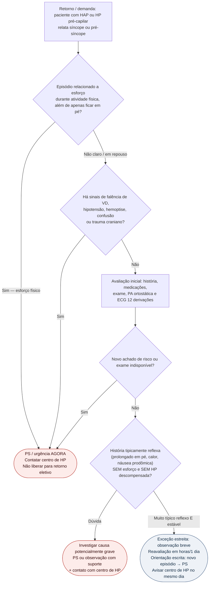

# Fluxograma ambulatorial: síncope na HAP — quando ir ao PS

Prosa de falência direita: [`sinalizadores-ambulatoriais-falencia-de-vd-na-hp`](/biblioteca/sinalizadores-ambulatoriais-falencia-de-vd-na-hp). Suspeita de CTEPH: [`sinalizadores-ambulatoriais-suspeita-de-cteph-quando-referenciar`](/biblioteca/sinalizadores-ambulatoriais-suspeita-de-cteph-quando-referenciar).

Na estratificação ESC/ERS 2022, síncope ocasional integra a categoria intermediária e síncope repetida a de alto risco no modelo de três estratos; frequência, contexto e outras variáveis devem ser integrados. No consultório, avaliar prontamente a causa e os sinais atuais, sem igualar pré-síncope a categoria prognóstica formal.

## Árvore de decisão

## Notas

- **D0**: síncope de esforço na HAP = alarme clássico de alto risco / baixo débito sob pós-carga — destino padrão é **PS**, não "marcar eco na semana que vem".
- **D1**: acopla ao checklist de falência de VD; qualquer sinal de descompensação fecha a porta da observação eletiva.
- **D2/C2**: exceção **estreita** para quadro tipicamente reflexo sem esforço; ainda assim exige contato com o centro e plano escrito de retorno ao PS. Na dúvida, escolher C0/C1.
- Este fluxograma **não** diferencia causas neurológicas/arrítmicas detalhadas — no paciente com HAP, a prioridade ambulatorial é **não subestimar** o significado prognóstico da síncope.
- Não inventa doses, titulação nem indicação de dispositivo.

## Guardrails específicos

Pós-TEP, sintomas novos/persistentes devem ser avaliados, especialmente na revisão de 3–6 meses. Não esperar três meses diante de deterioração. V/Q com mismatch persistente após tratamento adequado requer centro CTEPH; angio-TC normal isolada não exclui doença crônica. Operabilidade e combinação de EAP/BPA/fármacos dependem do centro, sem inferir causalidade a partir de comparação observacional entre operados e não operados.

Interrupção de infusão contínua IV/SC de prostaciclina por bomba/linha requer contato imediato com centro de HP e emergência para restauração segura, mesmo antes de sintomas. Não aplicar esse risco indistintamente a toda dose oral perdida. Edema, função renal/hepática, sódio, BNP e VD devem ser interpretados em tendência; não ajustar terapia específica às cegas.
