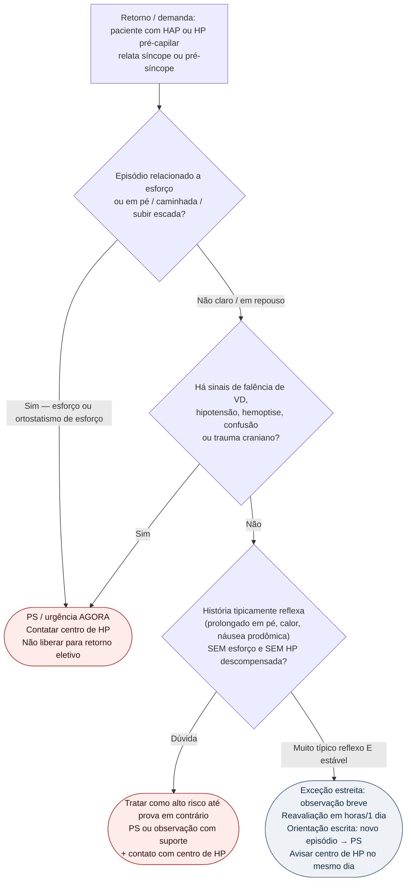

# Fluxograma ambulatorial: síncope na HAP — quando ir ao PS

Prosa de falência direita: [`sinalizadores-ambulatoriais-falencia-de-vd-na-hp`](sinalizadores-ambulatoriais-falencia-de-vd-na-hp.md). Suspeita de CTEPH: [`sinalizadores-ambulatoriais-suspeita-de-cteph-quando-referenciar`](sinalizadores-ambulatoriais-suspeita-de-cteph-quando-referenciar.md).

Na estratificação ESC/ERS 2022, **síncope** é marcador de **alto risco** na HAP. No consultório, isso quase nunca é "ajuste de agenda".

## Árvore de decisão

## Notas

- **D0**: síncope de esforço na HAP = alarme clássico de alto risco / baixo débito sob pós-carga — destino padrão é **PS**, não "marcar eco na semana que vem".
- **D1**: acopla ao checklist de falência de VD; qualquer sinal de descompensação fecha a porta da observação eletiva.
- **D2/C2**: exceção **estreita** para quadro tipicamente reflexo sem esforço; ainda assim exige contato com o centro e plano escrito de retorno ao PS. Na dúvida, escolher C0/C1.
- Este fluxograma **não** diferencia causas neurológicas/arrítmicas detalhadas — no paciente com HAP, a prioridade ambulatorial é **não subestimar** o significado prognóstico da síncope.
- Não inventa doses, titulação nem indicação de dispositivo.
