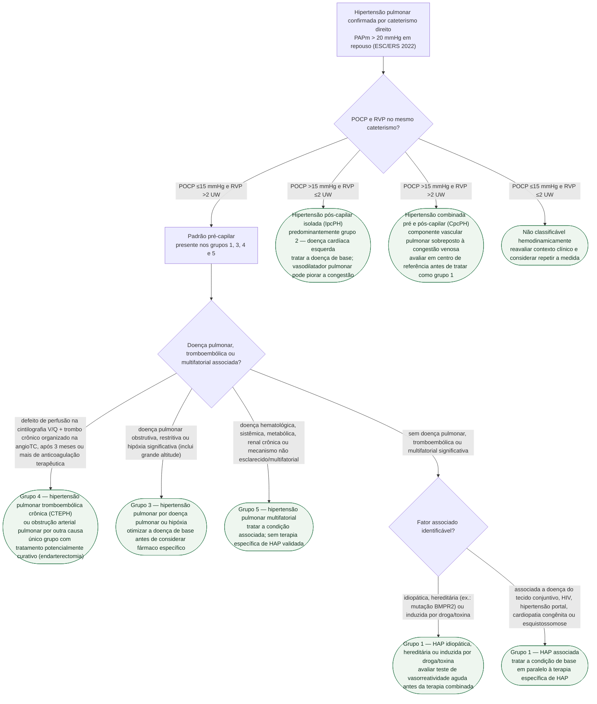

# Fluxograma: Hipertensão Pulmonar — classificação em cinco grupos clínicos (ESC/ERS 2022)

Confirmar hipertensão pulmonar por cateterismo cardíaco direito (PAPm acima de
20 mmHg em repouso) é só a metade do trabalho diagnóstico — a diretriz ESC/ERS
2022 exige, na sequência, classificar o paciente em um dos **cinco grupos
clínicos**, porque tratamento, prognóstico e o próprio risco de vasodilatador
pulmonar mudam radicalmente de um grupo para outro. Esse passo é citado pelo
fluxograma diagnóstico desta pasta ("classificar o grupo hemodinâmico") sem
ser detalhado — é o que este fluxograma resolve, a partir dos três cortes
hemodinâmicos do cateterismo (POCP e RVP) e do contexto clínico que separa,
dentro do padrão pré-capilar, os grupos 1, 3, 4 e 5.

## Árvore de decisão

Os quatro subtipos hemodinâmicos da primeira decisão não são compartimentos
estanques: o padrão pré-capilar aparece nos grupos 1, 3, 4 e 5, e é só o
contexto clínico da segunda decisão que separa esses quatro entre si. Já a
hipertensão pós-capilar isolada e a combinada apontam predominantemente para
o grupo 2 — doença cardíaca esquerda —, mas a diretriz não trata isso como
automático: a forma combinada, em particular, tem componente vascular
pulmonar sobreposto à congestão venosa e exige avaliação em centro de
referência antes de se descartar HAP concomitante.

## Os três cortes que definem o subtipo hemodinâmico

- **pré-capilar**: PAPm acima de 20 mmHg, POCP igual ou abaixo de 15 mmHg,
  RVP acima de 2 unidades Wood (UW)
- **pós-capilar isolada (IpcPH)**: PAPm acima de 20 mmHg, POCP acima de
  15 mmHg, RVP igual ou abaixo de 2 UW
- **combinada pré e pós-capilar (CpcPH)**: PAPm acima de 20 mmHg, POCP acima
  de 15 mmHg, RVP acima de 2 UW
- **não classificável**: PAPm acima de 20 mmHg, POCP igual ou abaixo de
  15 mmHg e RVP igual ou abaixo de 2 UW — combinação rara que não se encaixa
  em nenhum dos três padrões acima e pede reavaliação

## Por que a classificação em grupo muda a conduta

Tratar hipertensão pulmonar do grupo 2 como se fosse do grupo 1 é uma das
armadilhas clínicas mais citadas da diretriz: a conduta correta é tratar a
doença cardíaca esquerda de base, e um vasodilatador pulmonar específico de
HAP pode piorar a congestão em vez de ajudar. O mesmo raciocínio de
especificidade vale para os outros grupos — o grupo 4 (CTEPH) é o único com
possibilidade de cura cirúrgica pela endarterectomia pulmonar; o grupo 3 exige
otimizar a doença pulmonar antes de qualquer fármaco específico, com uso
restrito e individualizado em centro de referência; e o grupo 5 não tem
terapia específica de HAP validada, sendo o tratamento direcionado à condição
associada.

## Nota sobre o corte de acesso ao tratamento no Brasil

O corte diagnóstico de PAPm acima de 20 mmHg desta árvore é o da ESC/ERS 2022.
O Protocolo Clínico e Diretrizes Terapêuticas brasileiro (Portaria Conjunta
SAES/SECTICS nº 10/2023) reconhece esse limiar para diagnóstico, mas mantém
PAPm igual ou acima de 25 mmHg como critério para **custear** o tratamento
medicamentoso específico do grupo 1 pelo SUS — um paciente com PAPm entre 21 e
24 mmHg é hipertenso pulmonar pela definição atual, mas fica fora do critério
de acesso a esse tratamento pelo protocolo público, e deve ser monitorizado
com cautela em vez de tratado por ele. São dois limiares com propósitos
diferentes — diagnosticar e custear —, e confundir um pelo outro é o erro.
