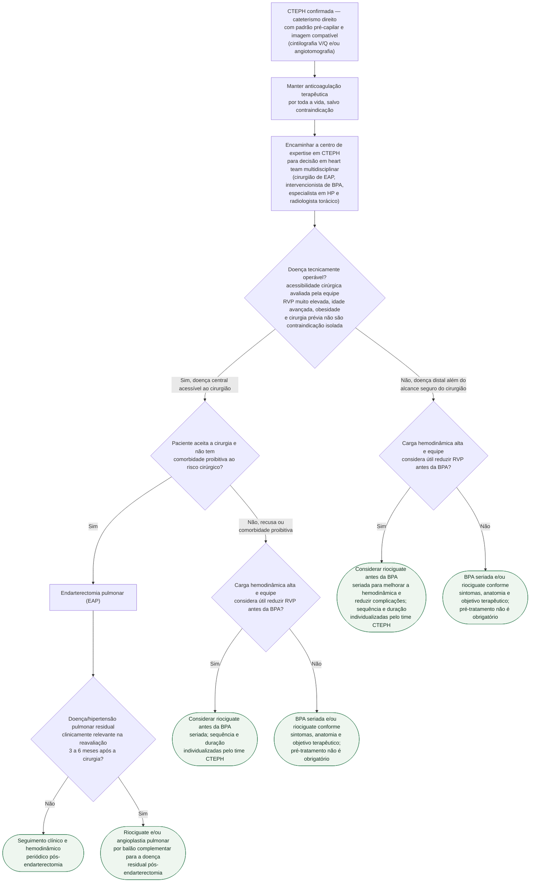

# Fluxograma: CTEPH — do diagnóstico à decisão entre endarterectomia, riociguate e angioplastia pulmonar por balão

A hipertensão pulmonar tromboembólica crônica (CTEPH, grupo 4) é a única forma de
hipertensão pulmonar com tratamento potencialmente curativo — a endarterectomia
pulmonar. Mas a decisão de quem opera, quem faz angioplastia pulmonar por balão (BPA) e
quem recebe riociguate como ponte ou tratamento definitivo depende de uma avaliação em
equipe multidisciplinar, não de um corte isolado. Este fluxograma organiza essa sequência
de decisão a partir do momento em que o diagnóstico hemodinâmico já está confirmado.

## Árvore de decisão

## O que a árvore não mostra

- **"Operabilidade" não é um corte numérico único.** A própria fonte reconhece que não
  existe hoje um escore de risco pré-operatório validado, nem evidência sobre a
  objetividade da decisão entre diferentes equipes multidisciplinares — a avaliação
  depende da expertise coletiva do centro, e é por isso que a árvore trata a decisão de
  operabilidade como um nó de equipe, não como uma regra fixa.
- **PAPm ≥38 mmHg e RVP ≥5 UW após EAP são limiares prognósticos**, associados
  a pior sobrevida, não critérios necessários para reconhecer ou tratar doença
  residual sintomática.
- **Operabilidade técnica não é o mesmo que decisão de operar.** A árvore separa duas
  situações: doença anatomicamente **inoperável**, além do alcance seguro do cirurgião, e
  doença **operável** em paciente que não segue para cirurgia por recusa ou comorbidade
  proibitiva. Em ambos os caminhos, a escolha entre BPA, riociguate ou sequência multimodal
  considera individualmente sintomas, distribuição anatômica tratável por BPA, carga
  hemodinâmica, comorbidades, risco procedimental e preferência do paciente. **RVP >4 UW
  não é um ramo binário nem pré-requisito universal** para pré-tratamento; o RACE informa a
  decisão na hemodinâmica mais grave, mas não substitui o julgamento do time CTEPH.
- **A mortalidade operatória em centros de expertise está hoje em torno de 2%, com
  centros de referência abaixo de 3%** — inclusive nas formas mais graves, com resistência
  vascular pulmonar pré-operatória acima de 1.000 dyn·s·cm⁻⁵, onde a mortalidade caiu para
  menos de 5%. Não é um ramo da árvore porque não muda a decisão de encaminhar — reforça
  por que a avaliação em centro de expertise vale mesmo em doença aparentemente grave.
- **Não há evidência de benefício em atrasar a cirurgia** de um paciente operável para
  tentar terapia-ponte, farmacológica ou por BPA — por isso a árvore não oferece esse
  desvio a quem já foi definido como candidato à endarterectomia.
- **Doença veno-oclusiva e microvasculopatia associada** não entram como ramo: quando a
  obstrução mecânica central não se correlaciona com a gravidade hemodinâmica encontrada,
  há suspeita de doença de pequenos vasos associada, que limita o benefício hemodinâmico
  esperado mesmo em doença central tecnicamente ressecável — achado que reforça a decisão
  do heart team, sem constituir um ramo separado.
- **A árvore não cobre a hipertensão pulmonar tromboembólica crônica em paciente com
  vasorreatividade positiva** (cenário distinto, sem indicação de bloqueador de canal de
  cálcio no grupo 4) nem os critérios de escolha inicial de terapia combinada na HAP do
  grupo 1 — ver o fluxograma próprio desta pasta para HAP idiopática/hereditária.
