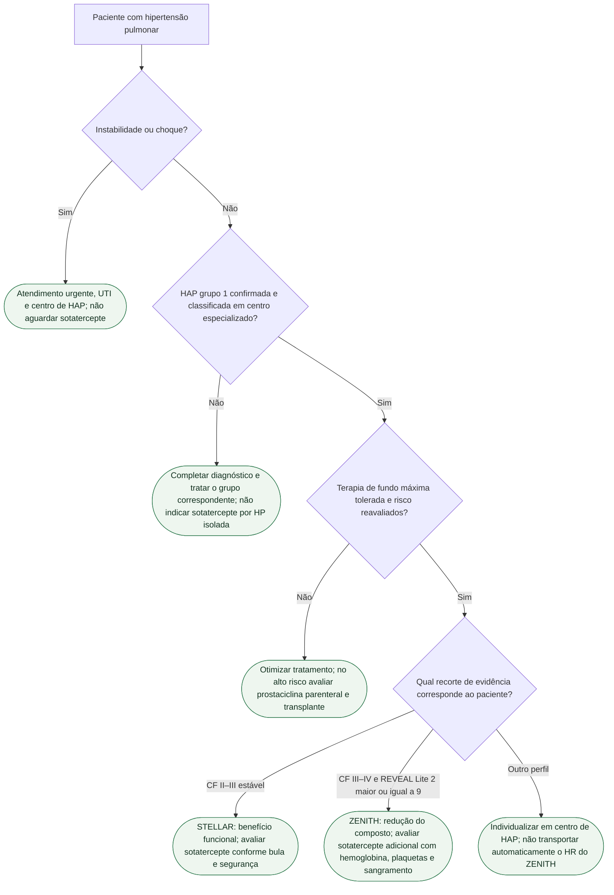

# Fluxograma: HAP de alto risco — onde entra o sotatercept

ZENITH (n=172, interrompido precocemente): composto morte / transplante / hospitalização ≥24 h por HAP **17,4% vs 54,7%**; HR **0,24** (0,13–0,43). STELLAR é outro ensaio (6MWD +40,8 m). Grupo 2 fora. O recorte do ZENITH foi CF III–IV e REVEAL Lite 2 ≥9. Esse critério de ensaio não substitui a avaliação multiparamétrica da HAP.

## Árvore de decisão

## Tudo com Tudo

- Hipertensão pulmonar
- Farmacologia
- Terapia intensiva
- Insuficiência cardíaca
- Comunicação clínica
O sotatercepte não deve retardar prostaciclina parenteral ou avaliação para transplante no alto risco. Riociguate e inibidores de PDE-5 não devem ser combinados. Para monitorização, ver `sotatercept-ativina-na-hap-o-que-mudou-em-2025`.

O benefício do ZENITH é do composto; as contagens de morte isolada não sustentam atribuir a ela o HR 0,24. A classe funcional III aparece nos dois estudos; a distinção depende também do risco, estabilidade e terapia de fundo.
