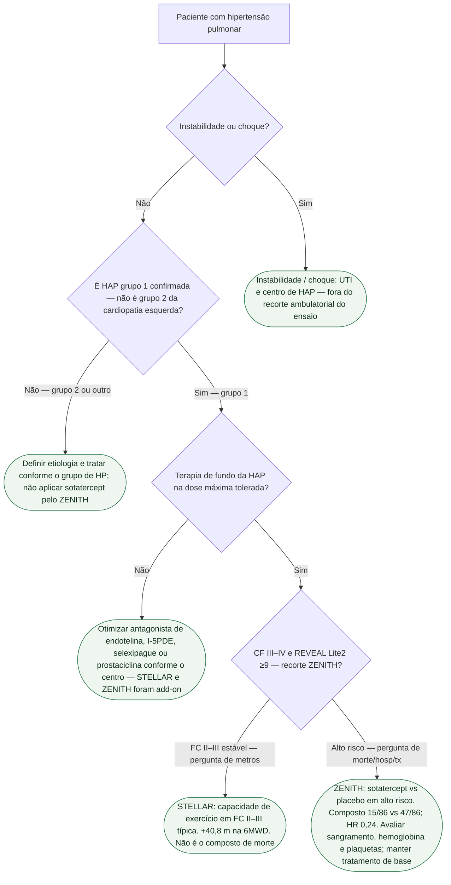

# Fluxograma: HAP de alto risco — onde entra o sotatercept

ZENITH (n=172, interrompido precocemente): composto morte / transplante / hospitalização ≥24 h por HAP **17,4% vs 54,7%**; HR **0,24** (0,13–0,43). STELLAR é outro ensaio (6MWD +40,8 m). Grupo 2 fora. O recorte ZENITH exigia CF III–IV e REVEAL Lite2 ≥9; isso não equivale a qualquer definição genérica de alto risco.

## Árvore de decisão

## Aplicação e segurança

Sotatercepte é terapia adicional da HAP em acompanhamento especializado; a Anvisa aprovou Winrevair em dezembro de 2024. Sua avaliação não deve atrasar escalonamento urgente indicado, inclusive prostaciclina parenteral em pacientes de alto risco. Não associar riociguate a inibidor de PDE5.

## Tudo com Tudo

- [ZENITH: sotatercept na HAP de alto risco de morte](/biblioteca/sotatercept-zenith-hap-alto-risco-de-morte)
- [STELLAR: sotatercept e capacidade de exercício na HAP](/biblioteca/stellar-sotatercept-capacidade-de-exercicio-na-hap)
- [BREATHE-5: bosentana na Eisenmenger não é ZENITH](/biblioteca/breathe-5-bosentana-na-eisenmenger-nao-e-zenith)
- [Depois da HAP, quais temas acendem](/biblioteca/depois-da-hap-quais-temas-acendem)
