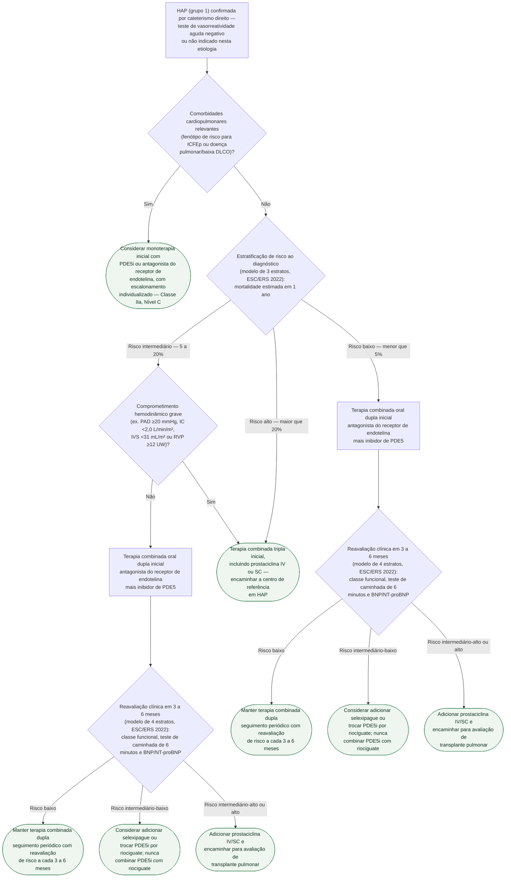

# Fluxograma: Hipertensão Arterial Pulmonar — terapia combinada inicial e escalonamento por estratificação de risco

Depois de confirmada a hipertensão arterial pulmonar (grupo 1) por cateterismo direito
e afastada — ou não indicada — a resposta ao teste de vasorreatividade aguda (ver
fluxograma próprio desta pasta sobre HAP idiopática/hereditária), a pergunta seguinte é
com que intensidade começar o tratamento farmacológico, e quando escalonar. Este
fluxograma organiza essa decisão em dois momentos: a escolha inicial pela estratificação
de risco de 3 estratos, e o escalonamento no seguimento pela estratificação de 4 estratos.

## Árvore de decisão

## O que a árvore não mostra

- **As variáveis que compõem cada estrato de risco não são ramos da árvore.** O modelo de
  3 estratos ao diagnóstico combina até 18 parâmetros (hemodinâmica incluída); o de 4
  estratos no seguimento se apoia sobretudo em classe funcional da OMS, distância no
  teste de caminhada de 6 minutos e BNP/NT-proBNP, com outras variáveis conforme
  necessário — são entradas do mesmo cálculo, não decisões sequenciais.
- **Por que existem dois modelos, e não um só.** A diretriz mudou de 3 para 4 estratos no
  seguimento porque 60 a 76% dos pacientes caíam na categoria intermediária com o modelo
  de 3 estratos — o de 4 discrimina melhor esse grupo grande e heterogêneo. O modelo de 3
  estratos continua sendo o do diagnóstico, não do seguimento.
- **A terapia tripla inicial não é a conduta padrão fora do risco alto.** O ensaio TRITON
  comparou tripla oral inicial (incluindo selexipague) contra dupla inicial em paciente
  recém-diagnosticado e não mostrou diferença na resistência vascular pulmonar em 26
  semanas — a redução foi de 54% na tripla e 52% na dupla, sem diferença estatística. Os
  sinais de possível benefício em progressão de doença e mortalidade foram exploratórios,
  em ensaio sem poder para esses desfechos. Por isso a árvore reserva a tripla inicial ao
  risco alto — onde a prostaciclina parenteral já tem indicação estabelecida
  independentemente do TRITON — e não a generaliza para risco baixo ou intermediário.
  A exceção é o risco intermediário com comprometimento hemodinâmico grave,
  em que tripla inicial com prostaciclina IV/SC também pode ser considerada.
- **REVEAL 2.0 é uma ferramenta alternativa de estratificação, não mostrada aqui.**
  Derivada do registro americano REVEAL, tem desempenho estatístico comparativamente
  superior a outras estratégias de risco em sua população de origem (ver documento
  próprio desta pasta) — a árvore segue o modelo ESC/ERS por ser o mais usado nesta
  biblioteca, mas as duas ferramentas coexistem na prática, sem uma substituir
  automaticamente a outra.
- **Comorbidades e causas secundárias tratáveis** (apneia do sono, disfunção tireoidiana,
  anemia, entre outras) devem ser investigadas e tratadas em paralelo, em qualquer estrato
  de risco — não é um ramo de decisão porque vale para todos os pacientes, não é
  exclusivo de um caminho da árvore.
- **Comorbidades cardiopulmonares mudam o algoritmo inicial.** Obesidade,
  hipertensão, diabetes, doença coronária e doença pulmonar/baixa DLCO podem
  aumentar intolerância à dupla terapia; a escalada deve ser individualizada.
- **A árvore não cobre a HAP com resposta positiva ao teste de vasorreatividade agudo**
  (candidata a bloqueador de canal de cálcio em vez de terapia combinada) nem o manejo da
  hipertensão pulmonar tromboembólica crônica — ambos têm fluxograma próprio nesta pasta.
