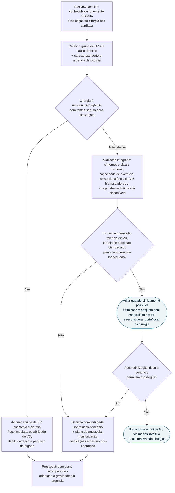
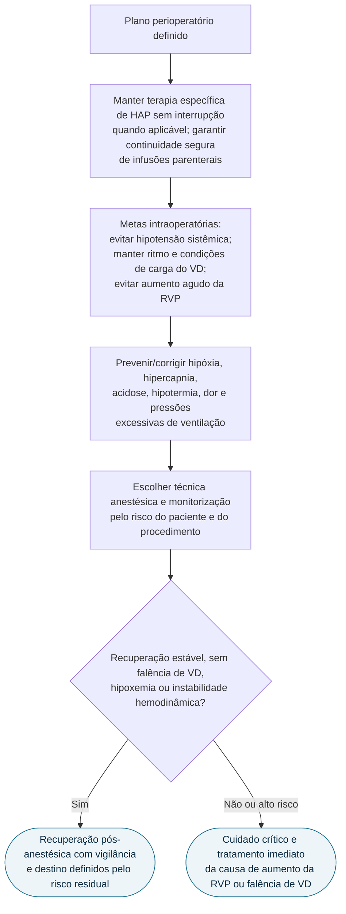

# Fluxograma: hipertensão pulmonar na cirurgia não cardíaca (AHA 2023)

O algoritmo perioperatório geral não basta para o paciente com hipertensão pulmonar (HP): o risco depende do **grupo fisiopatológico, da reserva do ventrículo direito (VD), da urgência e do estresse hemodinâmico do procedimento**. O Scientific Statement AHA propõe cinco etapas — classificar, estratificar, otimizar, proteger no intraoperatório e acompanhar a recuperação — e reconhece que a base de evidência é limitada.

## Da indicação cirúrgica ao plano

Não há exame único que autorize ou contraindique a cirurgia. Ecocardiograma atualizado, cateterismo direito ou teste funcional são escolhidos conforme mudança clínica, grupo de HP, informação disponível e se o resultado pode modificar a decisão — não repetidos automaticamente em todos.

## Durante e depois da cirurgia

RVP significa resistência vascular pulmonar. “Manter condições de carga” não quer dizer administrar volume indiscriminadamente: tanto hipovolemia quanto sobrecarga podem comprometer o VD, e a conduta deve seguir a fisiologia observada.

## Conteúdo CorVIA conectado

- [Statement AHA: risco perioperatório e estratificação](/biblioteca/hipertensao-pulmonar-e-cirurgia-nao-cardiaca-risco-perioperatorio-e-estratificacao)
- [Diretriz ESC/ERS 2022 de hipertensão pulmonar](/biblioteca/hipertensao-pulmonar-diagnostico-e-tratamento-escers-2022)
- [Fluxograma diagnóstico de hipertensão pulmonar](/biblioteca/fluxograma-hipertensao-pulmonar-diagnostico-esc-ers-2022)
- [Modificadores de risco perioperatório AHA/ACC 2024](/biblioteca/condicoes-cardiacas-agudas-e-modificadores-de-risco-aha-acc-2024-arvore)
- [Fluxograma de falência aguda do ventrículo direito](/biblioteca/fluxograma-falencia-aguda-de-ventriculo-direito)

## Limites e armadilhas

- O statement é orientação de consenso, não ensaio randomizado nem algoritmo validado.
- RCRI aparentemente baixo não neutraliza HP grave ou disfunção de VD.
- Pressão pulmonar isolada não resume a reserva do VD nem o risco do procedimento.
- Cirurgia eletiva permite otimização; na emergência, o objetivo muda para preservar VD, débito e perfusão enquanto se trata a causa.
- O destino pós-operatório é individualizado: nem todo paciente precisa de UTI, e paciente de alto risco não deve ser enviado automaticamente a uma área de baixa vigilância.
