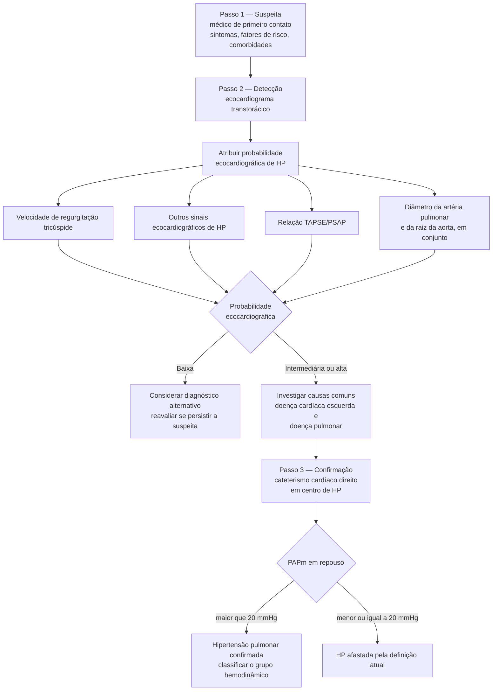

# Fluxograma: Hipertensão Pulmonar — algoritmo diagnóstico (ESC/ERS 2022)

A diretriz ESC/ERS 2022 simplificou o diagnóstico da hipertensão pulmonar em uma
abordagem de **três passos**, com divisão explícita de responsabilidade: a
suspeita nasce com o médico de primeiro contato, a detecção é ecocardiográfica, e
a confirmação é hemodinâmica em centro especializado.

## Caminho decisório

## A definição mudou

A hipertensão pulmonar passou a ser definida por **pressão arterial pulmonar
média (PAPm) acima de 20 mmHg em repouso**. É uma alteração relevante em relação
à definição usada na diretriz de 2015 e amplia a população que atende ao
critério hemodinâmico.

## O que entrou na probabilidade ecocardiográfica

A atribuição de probabilidade não se apoia em um único número. Além da
velocidade de regurgitação tricúspide, a versão de 2022 incorporou:

- a **relação TAPSE/PSAP**, como marcador de acoplamento ventrículo-arterial
  direito;
- a **avaliação combinada do diâmetro da artéria pulmonar e da raiz da aorta**.

## Por que a confirmação é centralizada

O cateterismo cardíaco direito permanece obrigatório para o diagnóstico e a
diretriz o situa em **centro de hipertensão pulmonar**. A razão é dupla: a
medida hemodinâmica exige padronização técnica para ser confiável, e a
classificação correta do grupo determina tratamentos com perfis de risco muito
distintos entre si.
