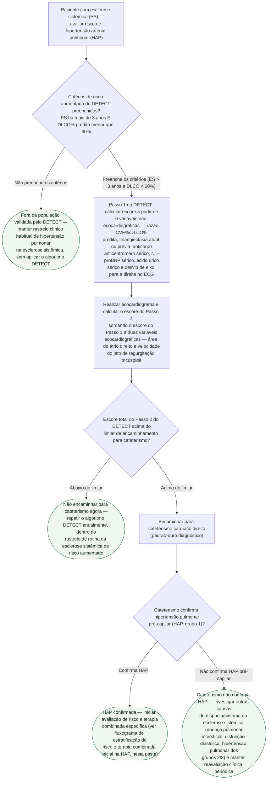

# Fluxograma: Rastreio de Hipertensão Pulmonar na Esclerose Sistêmica — Algoritmo DETECT

A hipertensão arterial pulmonar (HAP) associada à esclerose sistêmica (ES) é uma das
principais causas de morte nessa doença, e costuma se apresentar ainda pouco
sintomática — na coorte original do DETECT, 64% dos casos confirmados por cateterismo
estavam em classe funcional OMS I/II. O algoritmo diagnóstico genérico de hipertensão
pulmonar (suspeita clínica → ecocardiograma → cateterismo, ver fluxograma próprio desta
pasta) não foi desenhado para essa população específica e, aplicado a ela, perde quase
1 em cada 3 diagnósticos. O DETECT é o algoritmo de rastreio validado especificamente
para esclerose sistêmica de risco aumentado, e esta árvore organiza os dois pontos de
decisão estrutural dele — elegibilidade para o rastreio e limiar de encaminhamento para
cateterismo — sem repetir os coeficientes numéricos do escore, que não são ramos de
decisão, e sim entradas de um mesmo cálculo.

## Árvore de decisão

## O que a árvore não mostra

- **Os coeficientes exatos do escore não são ramos de decisão.** O Passo 1 combina 6
  variáveis por regressão ponderada em um único número, e o Passo 2 soma a esse número
  duas variáveis ecocardiográficas — são entradas de um mesmo cálculo, não uma sequência
  de perguntas sim/não. O artigo original disponibiliza nomogramas para uso clínico; esta
  árvore representa apenas os dois pontos em que o resultado do cálculo muda a conduta
  (fazer ou não ecocardiograma faz parte do fluxo padrão do Passo 1 para o Passo 2 — na
  prática todo paciente elegível é encaminhado ao ecocardiograma — e encaminhar ou não
  para cateterismo, que é o ramo que de fato bifurca a conduta).
- **A população de validação é estreita, e a árvore respeita esse limite.** O DETECT foi
  desenhado e validado apenas para esclerose sistêmica com mais de 3 anos de doença e
  DLCO% predita abaixo de 60% — fora desse subgrupo, a árvore não recomenda aplicar o
  algoritmo, e sim manter o rastreio clínico habitual (que não é detalhado aqui, por ser
  o padrão genérico já coberto no fluxograma de diagnóstico desta pasta).
- **O desempenho comparativo do DETECT contra o algoritmo genérico** (62% de encaminhamento
  a cateterismo com 4% de falso-negativo, contra 40% de encaminhamento e 29% de
  falso-negativo do algoritmo ESC/ERS da época aplicado à mesma coorte) está detalhado no
  documento "Hipertensão Arterial Pulmonar Associada à Esclerose Sistêmica: Algoritmo
  DETECT", já publicado nesta pasta — não repetido aqui para não duplicar conteúdo.
- **A conduta terapêutica da HAP confirmada não está nesta árvore.** Uma vez confirmada
  por cateterismo, a estratificação de risco e a escolha de terapia combinada seguem o
  mesmo caminho de qualquer HAP do grupo 1, coberto pelo fluxograma "HAP — terapia
  combinada inicial e escalonamento por estratificação de risco", já publicado nesta
  pasta.
- **Periodicidade de repetição do DETECT.** A árvore indica repetição anual para quem
  fica abaixo do limiar, refletindo a prática de rastreio periódico da doença de risco
  aumentado descrita no documento-fonte; o artigo original não define esse intervalo como
  parte do algoritmo propriamente dito, e por isso essa recomendação de intervalo carrega
  menor força de evidência do que os dois pontos de decisão do próprio DETECT.
