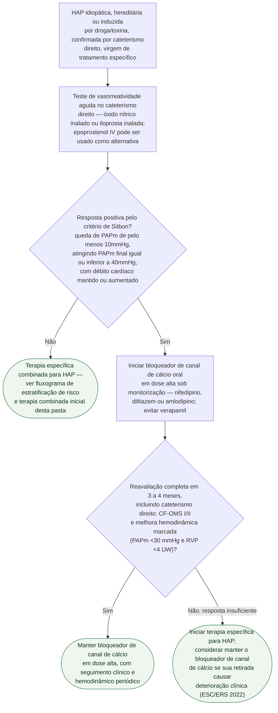

# Fluxograma: Teste de vasorreatividade aguda na HAP idiopática/hereditária e a decisão pelo bloqueador de canal de cálcio

Antes de iniciar terapia combinada específica para HAP, um pequeno subgrupo de pacientes
com HAP idiopática, hereditária ou induzida por droga/toxina — ainda sem tratamento —
pode responder a um bloqueador de canal de cálcio em dose alta em vez da terapia
padrão. Identificar esse subgrupo exige um teste específico e uma reavaliação posterior,
porque resposta aguda e resposta sustentada não são a mesma coisa.

## Árvore de decisão

## O que a árvore não mostra

- **Adenosina IV não é uma alternativa neste fluxo.** Embora apareça em séries
  e protocolos históricos, ela não integra os agentes recomendados pela
  ESC/ERS 2022 para o teste contemporâneo; não deve ser recolocada por analogia.

- **O teste só tem valor discriminativo nesta etiologia.** Ele não deve ser realizado por
  rotina em HAP associada a doença do tecido conjuntivo (resposta sustentada rara mesmo
  quando agudamente positiva), em doença veno-oclusiva pulmonar/hemangiomatose capilar
  pulmonar (risco de edema pulmonar grave) nem nos grupos 2 e 3 de hipertensão pulmonar,
  onde o vasodilatador agudo pode precipitar congestão sem orientar conduta — ver
  documento específico desta pasta sobre vasorreatividade nos grupos 2 e 3.
- **Resposta aguda é minoria, e resposta sustentada é dupla minoria.** No estudo de
  Sitbon et al. (557 pacientes com HAP idiopática), 12,6% tiveram resposta aguda positiva,
  mas só 6,8% do total — pouco mais da metade dos respondedores agudos — sustentaram a
  resposta em pelo menos 1 ano de monoterapia com bloqueador de canal de cálcio. É por
  isso que a árvore não trata resposta aguda positiva como decisão terapêutica definitiva:
  a reavaliação em 3 a 4 meses é o passo que separa as duas.
- **As doses não são ramos da árvore.** A ESC/ERS 2022 recomenda iniciar em dose baixa
  e titular progressivamente até dose alta tolerada, sob acompanhamento em centro de
  hipertensão pulmonar; hipotensão, síncope e falência de ventrículo direito são riscos
  de usar bloqueador de canal de cálcio sem resposta vasorreativa documentada. A tabela
  de doses da própria diretriz deve orientar a prescrição individual, não uma transcrição
  isolada de séries históricas.
- **A árvore não cobre a escolha de terapia combinada em quem tem teste negativo** — esse
  desdobramento (estratificação de risco de 3 e 4 estratos, mono/dupla/tripla) está no
  fluxograma próprio desta pasta sobre terapia combinada inicial na HAP.
