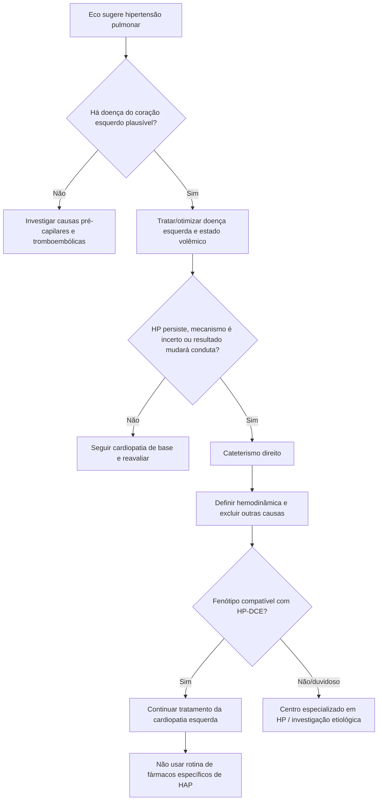

# Hipertensão pulmonar por doença do coração esquerdo — diagnóstico e tratamento

A **hipertensão pulmonar associada à doença do coração esquerdo (HP-DCE; Grupo 2)** é uma síndrome hemodinâmica secundária à elevação das pressões de enchimento do coração esquerdo. Na prática, o erro mais importante é interpretar pressão pulmonar elevada no ecocardiograma como hipertensão arterial pulmonar (HAP) e iniciar vasodilatador pulmonar específico antes de esclarecer o mecanismo.

As diretrizes JCS/JHFS 2025 de insuficiência cardíaca e JCS/JPCPHS 2025 de hipertensão pulmonar convergem em quatro princípios: **tratar primeiro a cardiopatia esquerda, usar cateterismo direito quando ele mudar a estratégia, distinguir componente pós-capilar isolado de componente combinado e não usar rotineiramente fármacos aprovados para HAP na HP-DCE.**

## 1. Quando suspeitar de HP-DCE

O contexto clínico pesa tanto quanto a estimativa ecocardiográfica da pressão pulmonar. A probabilidade de Grupo 2 aumenta quando há:

- insuficiência cardíaca com FE reduzida, levemente reduzida ou preservada;
- valvopatia esquerda significativa;
- aumento atrial esquerdo e/ou evidências de pressões de enchimento elevadas;
- hipertensão arterial, obesidade, diabetes ou fibrilação atrial compondo fenótipo de ICFEp;
- congestão pulmonar ou história recorrente de descompensação de insuficiência cardíaca.

O ecocardiograma é ferramenta de triagem e fenotipagem, mas **não substitui a hemodinâmica invasiva quando a classificação da HP é incerta ou quando o resultado modificará a conduta**.

## 2. O passo que deve vir antes do cateterismo em muitos pacientes

A JCS/JHFS 2025 recomenda que, diante de suspeita de HP-DCE, a hipertensão pulmonar seja avaliada **depois de tratar adequadamente a doença cardíaca esquerda subjacente** (Classe I, nível A). O objetivo é não classificar como doença vascular pulmonar primária um paciente simplesmente congesto ou com pressões de enchimento ainda não otimizadas.

Isso implica, conforme o fenótipo:

- descongestionar quando há sobrecarga volêmica;
- otimizar terapia da insuficiência cardíaca;
- controlar pressão arterial;
- abordar valvopatia quando indicada;
- tratar isquemia, frequência/ritmo e demais determinantes das pressões de enchimento.

## 3. Quando o cateterismo direito agrega valor

O **cateterismo cardíaco direito (CCD/RHC)** é recomendado quando a informação hemodinâmica ajuda a definir a estratégia terapêutica (Classe I, C-LD na JCS/JHFS 2025). Ele é particularmente útil quando existe discordância entre clínica e ecocardiograma, suspeita de componente pré-capilar relevante, avaliação avançada de insuficiência cardíaca ou necessidade de excluir outras causas de HP.

O CCD permite medir diretamente pressão média da artéria pulmonar, pressão de oclusão da artéria pulmonar, débito cardíaco e resistência vascular pulmonar. A interpretação deve ser integrada ao estado volêmico e ao fenótipo clínico; um único número fora de contexto não define a etiologia.

## 4. Isolada pós-capilar versus combinada pré e pós-capilar

Dentro da HP-DCE existem pacientes em que a elevação da pressão pulmonar é predominantemente consequência da transmissão retrógrada da pressão do átrio esquerdo e outros em que se desenvolve remodelamento vascular pulmonar adicional, com elevação relevante da resistência vascular pulmonar.

Essa distinção entre **HP pós-capilar isolada** e **HP combinada pré e pós-capilar** tem valor prognóstico e ajuda a explicar por que dois pacientes com pressões de enchimento semelhantes podem ter repercussões muito diferentes sobre o ventrículo direito.

Não se deve, porém, transformar a presença de componente pré-capilar em autorização automática para usar terapia específica de HAP: o diagnóstico continua sendo HP-DCE até que outra etiologia seja demonstrada.

## 5. Tratamento: a doença-alvo é o coração esquerdo

A JCS/JHFS 2025 recomenda dirigir o tratamento à doença cardíaca esquerda responsável pela HP (Classe I, C-LD). Portanto, a estratégia depende do fenótipo de base:

- **ICFEr:** terapia modificadora de prognóstico conforme diretriz e descongestão;
- **ICFEp/ICFElr:** manejo de congestão, comorbidades e terapias com benefício comprovado para o fenótipo;
- **valvopatia:** considerar correção/intervenção conforme gravidade, sintomas e critérios específicos;
- **hipertensão arterial:** controle pressórico adequado;
- **FA:** controle de frequência/ritmo e anticoagulação quando indicada.

O tratamento efetivo da cardiopatia esquerda frequentemente reduz a pressão pulmonar sem necessidade de terapia pulmonar específica.

## 6. PAH drugs: uma recomendação de não fazer

A JCS/JHFS 2025 estabelece que **fármacos específicos para HAP não são recomendados na HP-DCE** (**Classe III — sem benefício, nível A**). O problema não é apenas ausência de comprovação de benefício: vasodilatação pulmonar em um circuito com pressão atrial esquerda elevada pode aumentar fluxo para um leito venoso incapaz de acomodá-lo e agravar congestão pulmonar em alguns contextos.

Portanto, sildenafil/tadalafila, antagonistas de endotelina, estimuladores da guanilato ciclase solúvel e terapias da via da prostaciclina **não devem ser extrapolados da HAP Grupo 1 para HP Grupo 2 de rotina**.

## 7. Quando desconfiar de que não é apenas Grupo 2

A investigação deve ser ampliada quando o fenótipo parecer desproporcional à doença cardíaca esquerda ou houver elementos para outra etiologia, por exemplo:

- resistência vascular pulmonar marcadamente elevada;
- disfunção de ventrículo direito desproporcional;
- hipoxemia/doença pulmonar relevante;
- história de tromboembolismo;
- doença do tecido conjuntivo, hipertensão portal, HIV ou exposição medicamentosa associada à HAP;
- achados de imagem incompatíveis com simples congestão pós-capilar.

Nessas situações, o encaminhamento a centro com experiência em hipertensão pulmonar reduz o risco de classificar incorretamente HAP, HP-DCE e doença tromboembólica crônica.

## Árvore prática

## Armadilhas

- Diagnosticar HAP apenas porque a pressão sistólica pulmonar estimada está elevada no ecocardiograma.
- Fazer CCD em paciente francamente congesto e interpretar a hemodinâmica sem considerar o estado volêmico.
- Prescrever sildenafil ou outro fármaco de HAP por presença de “componente pré-capilar” sem redefinir corretamente a etiologia.
- Ignorar CTEPH, doença pulmonar ou HAP verdadeira em paciente com cardiopatia esquerda concomitante.
- Tratar o número da pressão pulmonar e não a doença que elevou a pressão de enchimento esquerda.

## Referências principais

Kitai T, Kohsaka S, Kato T, et al. *JCS/JHFS 2025 Guideline on Diagnosis and Treatment of Heart Failure.* Circ J. 2025;89(8):1278-1444. DOI **10.1253/circj.CJ-25-0002**. PMID **40159241**.

Tamura Y, Kusunose K, Yamashita Y, et al. *JCS/JPCPHS 2025 Guideline on Pulmonary Hypertension and Pulmonary Embolism/Deep Vein Thrombosis.* Circ J. 2026; advance online publication. DOI **10.1253/circj.CJ-25-1144**. PMID **42386545**.
