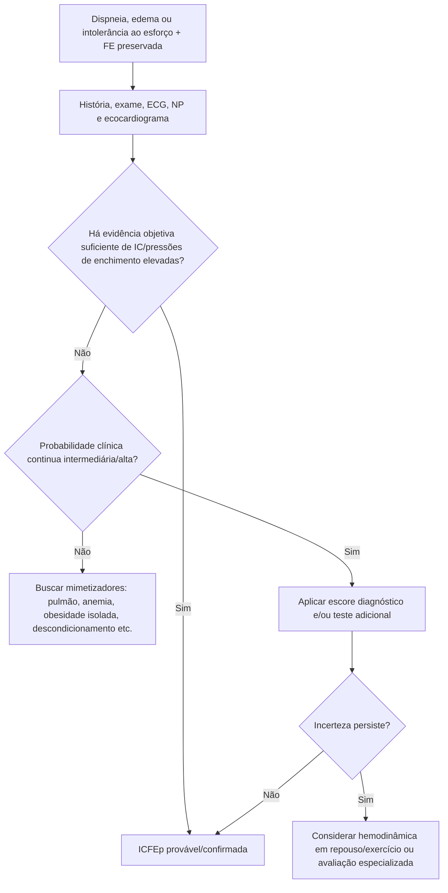
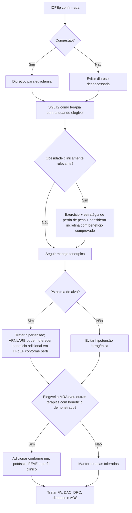

# ACC 2026 — ICFEp

O **ACC Expert Consensus Decision Pathway 2026 para insuficiência cardíaca com fração de ejeção preservada (ICFEp)**, publicado em 23 de julho de 2026, atualiza de forma substancial o documento de 2023. A mudança central é tratar ICFEp como **síndrome multissistêmica**, frequentemente ligada a adiposidade visceral, inflamação, disfunção metabólica, doença renal, hipertensão e fibrilação atrial — não como uma entidade puramente "diastólica".

## 1. Antes de tratar, confirmar que é ICFEp

Dispneia e edema não são específicos. O documento enfatiza diagnóstico estruturado, integração de dados e busca ativa de mimetizadores.

A avaliação pode incluir:

- história e exame físico;
- ECG;
- peptídeos natriuréticos;
- ecocardiograma completo;
- função renal, hemograma, tireoide e causas sistêmicas conforme contexto;
- escores diagnósticos de ICFEp quando úteis;
- hemodinâmica invasiva ou teste com exercício quando a incerteza persiste.

Obesidade pode tanto causar sintomas semelhantes a ICFEp quanto ser parte do fenótipo verdadeiro de ICFEp.

## 2. Tratamento farmacológico atual

O ECDP 2026 organiza tratamento ótimo em torno de terapias que podem melhorar sintomas e/ou reduzir hospitalizações por IC:

- **inibidores de SGLT2**;
- **antagonistas do receptor mineralocorticoide**, incluindo evidência contemporânea com MRA não esteroidal;
- **terapias baseadas em incretinas** em fenótipos apropriados, sobretudo obesidade;
- **ARNI**;
- **ARB**;
- **diuréticos** para congestão.

Betabloqueador não é um tratamento específico universal de ICFEp; deve ser usado quando existe indicação própria, como FA, DAC ou outra condição relevante.

O documento alerta para evitar **saxagliptina, alogliptina e tiazolidinedionas** em ICFEp devido à associação observada com eventos de insuficiência cardíaca.

## 3. Pressão arterial

A hipertensão está presente em grande parte dos pacientes com ICFEp.

A diretriz de hipertensão de 2025 estabelece meta geral <130/80 mmHg para pacientes com IC, mas o ECDP de ICFEp chama atenção para uma curva em J observacional: PAS ≥140 mmHg e PAS <120 mmHg foram associadas a maior risco em análises de grandes estudos de ICFEp.

O documento sugere que uma faixa prática de PAS **120–129 mmHg** pode representar alvo razoável em muitos pacientes com ICFEp, se tolerada.

Esse intervalo não deve ser interpretado como regra absoluta para paciente hipotenso, frágil ou com outra condição hemodinâmica.

## 4. Obesidade como alvo terapêutico

Obesidade pode estar presente em até grande parcela dos pacientes com ICFEp e está associada a maiores pressões de enchimento no exercício, mais sintomas e menor capacidade funcional.

O tratamento contemporâneo pode incluir:

- suporte nutricional;
- exercício;
- restrição calórica estruturada;
- terapia baseada em incretinas quando indicada;
- cirurgia bariátrica em pacientes selecionados.

Perder peso não é apenas intervenção estética: no fenótipo obesidade-ICFEp, pode ser uma intervenção fisiopatológica central.

## 5. Comorbidades precisam ser tratadas como parte da ICFEp

O ECDP integra explicitamente:

- fibrilação atrial;
- hipertensão;
- diabetes tipo 2;
- obesidade;
- doença renal crônica;
- doença coronariana;
- apneia obstrutiva do sono.

Uma prescrição de SGLT2 e diurético sem abordar essas condições é tratamento incompleto.

## Árvore de decisão — confirmar ICFEp

## Árvore de tratamento — ICFEp 2026

## Quando encaminhar para especialista em IC

Considerar avaliação especializada quando houver:

- diagnóstico incerto;
- hospitalizações recorrentes;
- peptídeos natriuréticos persistentemente elevados;
- necessidade crescente de diurético;
- NYHA III–IV;
- suspeita de infiltrativa/mimetizador;
- discordância importante entre sintomas e exames;
- necessidade de hemodinâmica invasiva ou monitor implantável de artéria pulmonar.

## Armadilhas

- Diagnosticar ICFEp apenas porque FEVE é ≥50% e o paciente tem dispneia.
- Excluir ICFEp porque BNP/NT-proBNP não está muito elevado, especialmente em obesidade.
- Prescrever betabloqueador como terapia universal de ICFEp sem indicação própria.
- Tratar obesidade como problema separado do coração.
- Baixar PAS agressivamente para <120 mmHg em todos os pacientes com ICFEp.
- Manter tiazolidinediona ou saxagliptina/alogliptina sem reavaliar risco de IC.

## Regra prática

**ICFEp em 2026 é uma síndrome de fenótipos.** Confirme a síndrome, identifique o fenótipo dominante, trate congestão e use terapias com benefício demonstrado enquanto corrige obesidade, FA, hipertensão, diabetes, DRC, DAC e AOS.