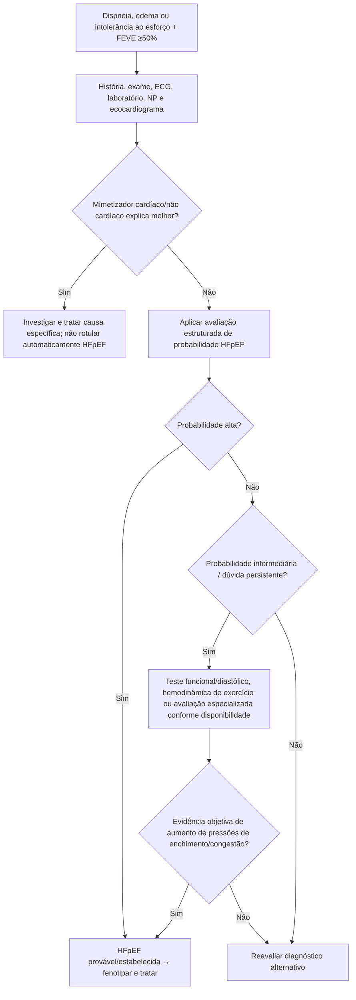
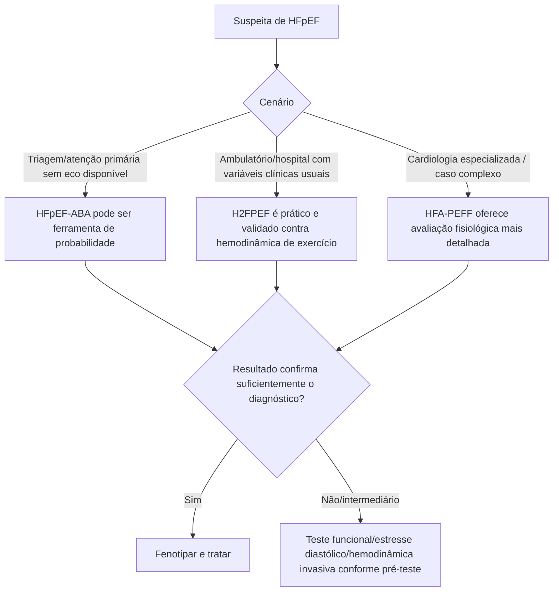
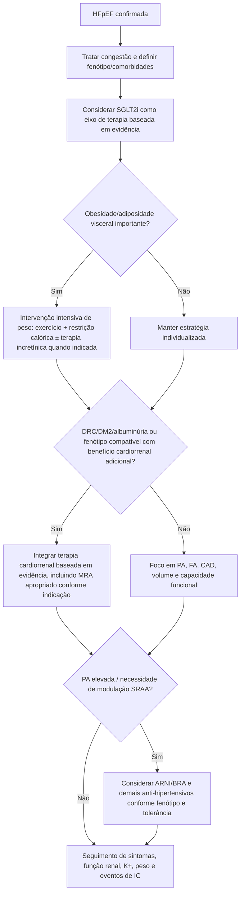

# ICFEp — ACC Expert Consensus Decision Pathway 2026

## A mudança conceitual

O ACC publicou em 23 de julho de 2026 uma atualização dedicada à insuficiência cardíaca com fração de ejeção preservada (ICFEp/HFpEF). O documento deixa claro que HFpEF não é uma única doença cardíaca: é uma **síndrome multissistêmica**, frequentemente associada a adiposidade visceral, inflamação, disfunção metabólica, DRC, hipertensão, diabetes, FA e doença coronariana.

O ponto de partida é diagnóstico correto — porque dispneia + FEVE ≥50% não é sinônimo de HFpEF.

## Critério sindrômico

O pathway adota a definição universal de IC:

- sintomas, sinais ou ambos compatíveis com IC;
- anormalidade estrutural ou funcional cardíaca;
- e pelo menos um dos seguintes:
  - peptídeo natriurético elevado, ou
  - evidência objetiva de congestão cardiogênica pulmonar/sistêmica.

Peptídeos natriuréticos podem estar **normais em HFpEF, especialmente na obesidade**, portanto um resultado baixo não exclui a síndrome em toda situação.

## Primeiro passo: excluir mimetizadores

O documento separa causas não cardíacas e cardíacas de sintomas que imitam HFpEF.

### Não cardíacas

- doença pulmonar;
- doença renal/hepática;
- obesidade isolada;
- fragilidade/descondicionamento;
- anemia e outras causas sistêmicas conforme contexto.

### Cardíacas com fisiopatologia específica

- cardiomiopatia infiltrativa;
- cardiomiopatia hipertrófica;
- valvopatia;
- doença pericárdica;
- IC de alto débito.

## Árvore diagnóstica de HFpEF

## Três metodologias diagnósticas comparadas pelo ACC 2026

### HFA-PEFF

**Pontos fortes:** base fisiológica robusta e avaliação detalhada.

**Limitações:** algoritmo mais complexo, inclui NP e pode exigir teste diastólico de estresse/hemodinâmica invasiva; estes exames nem sempre são viáveis.

**Uso ideal:** cardiologia especializada.

### H₂FPEF

**Pontos fortes:** derivado/validado contra hemodinâmica invasiva ao exercício; usa variáveis clínicas facilmente acessíveis e sistema simples de pontos.

**Limitações:** pode ter dificuldade para distinguir sintomas da obesidade de HFpEF verdadeira e deixa uma parcela de pacientes em faixa intermediária.

**Uso ideal:** atenção primária, cardiologia geral ou especializada, internação/ambulatório.

### HFpEF-ABA

**Pontos fortes:** mais simples para rastreamento populacional/atenção primária e **não exige ecocardiograma** para calcular.

**Limitações:** requer calculadora online e, segundo o ACC 2026, não possui thresholds de probabilidade estabelecidos para guiar cada etapa subsequente.

## Árvore: qual metodologia usar?

> Este documento explica as metodologias, mas **não reproduz fórmulas ou pontuações que não tenham sido novamente auditadas contra a publicação original**. Calculadoras interativas só devem ser ativadas depois dessa auditoria.

## Tratamento contemporâneo — não apenas “diurético”

O ACC 2026 organiza o tratamento em três camadas:

1. **terapia médica ótima**;
2. **intervenção não farmacológica**;
3. **manejo agressivo de comorbidades/fenótipos**.

O pathway incorpora evidências recentes para:

- inibidores de SGLT2;
- antagonistas de receptor mineralocorticoide, incluindo opções não esteroidais quando apropriado ao fenótipo/evidência;
- terapias baseadas em incretinas em pacientes selecionados com obesidade/metabolismo;
- ARNI;
- BRA;
- diuréticos para congestão;
- betabloqueadores quando existe indicação específica, em vez de como terapia universal de HFpEF.

Também enfatiza exercício, restrição calórica/perda de peso quando indicada e manejo de CAD, FA, HAS, DRC, DM2, obesidade e apneia obstrutiva do sono.

## Árvore terapêutica por fenótipo

## Dispositivos e hemodinâmica remota

O documento também incorpora o papel de monitorização hemodinâmica implantável em pacientes selecionados, reforçando que dispositivo só gera benefício quando existe uma equipe capaz de **agir sobre a informação**.

## Armadilhas

1. Não diagnosticar HFpEF só por FEVE ≥50%.
2. Não excluir HFpEF apenas por NP normal em pessoa com obesidade e alta probabilidade clínica.
3. Não aplicar um único score como verdade absoluta quando o resultado é intermediário.
4. Não usar betabloqueador como terapia universal de HFpEF sem indicação adicional.
5. Não tratar obesidade, DRC, DM2 e FA como “comorbidades periféricas”; elas fazem parte do fenótipo e da fisiopatologia.

## Fonte verificada

Kittleson MM, Panjrath GS, Bates K, et al. Management of Heart Failure With Preserved Ejection Fraction: 2026 ACC Expert Consensus Decision Pathway. *J Am Coll Cardiol.* Published online July 23, 2026. PMID **42494134**. DOI **10.1016/j.jacc.2026.06.018**.

## Status de revisão

`VERIFICAÇÃO HUMANA NECESSÁRIA`: auditar as fórmulas originais HFA-PEFF, H₂FPEF e HFpEF-ABA separadamente antes de implementar ou modificar calculadoras interativas no backend.
