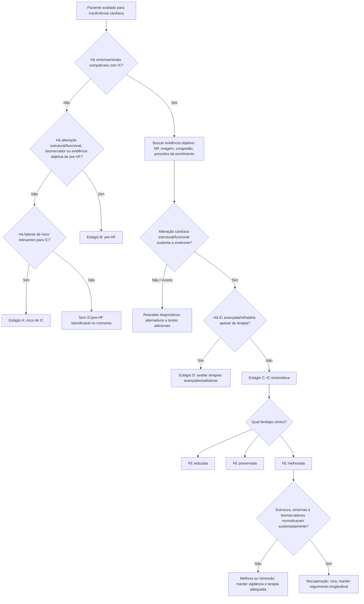

# Segunda Definição Universal de Insuficiência Cardíaca — 2026

A **Second Universal Definition of Heart Failure**, publicada em 2026 por AHA, ACC, ESC e WHF em colaboração com HFSA, HFA e JHFS, atualiza a linguagem usada para diagnosticar, classificar e acompanhar insuficiência cardíaca (IC). A principal mudança conceitual é reduzir a dependência de cortes rígidos de FEVE e tratar IC como uma síndrome dinâmica, com estágios, causas e trajetórias clínicas próprias.

## O que continua sendo insuficiência cardíaca

IC é uma **síndrome clínica** atribuível a alteração estrutural ou funcional cardíaca, caracterizada por combinação de sintomas e sinais típicos com evidência laboratorial ou de imagem compatível com congestão, alteração do débito ou elevação das pressões de enchimento.

A certeza diagnóstica aumenta com:

- BNP ou NT-proBNP elevados;
- evidência de congestão por ultrassom pulmonar, radiografia, ecocardiografia, TC ou outros métodos;
- demonstração de pressões de enchimento elevadas, inclusive em exercício quando necessário.

Nenhum teste isolado define todos os casos. Uma proporção de pacientes com IC com FE preservada pode apresentar peptídeos natriuréticos dentro da faixa de referência apesar de evidência hemodinâmica inequívoca.

## Estágios A → D

O consenso reafirma o continuum em quatro estágios.

### Estágio A — risco de desenvolver IC

Paciente sem doença estrutural/funcional cardíaca ou biomarcador indicativo de pre-HF, mas com fatores que aumentam risco futuro.

### Estágio B — pre-HF

Sem sintomas atuais ou prévios de IC, porém com alteração estrutural/funcional cardíaca, biomarcador ou outra evidência objetiva compatível com risco aumentado de progressão.

O documento de 2026 reforça este estágio como janela crítica para detecção precoce e redução individualizada de risco.

### Estágio C — IC sintomática

Doença estrutural/funcional cardíaca associada a sintomas atuais ou prévios de IC.

### Estágio D — IC avançada/refratária

Sintomas graves ou recorrentes, hospitalizações e deterioração apesar de terapia adequada, levando à avaliação de terapias avançadas, suporte circulatório, transplante e/ou cuidados paliativos conforme contexto.

## Fenótipos de IC em 2026

A nova definição propõe três categorias clinicamente acionáveis:

- **IC com FE reduzida**;
- **IC com FE preservada**;
- **IC com FE melhorada**.

A mudança busca reduzir a falsa precisão de cortes universais de FEVE, que variam conforme sexo, idade, etnia, modalidade de imagem e erro de medida.

Para o fenótipo clássico de **HFimpEF**, o documento descreve antecedente de IC com FE reduzida seguido de aumento de FEVE de pelo menos **10 pontos percentuais** para nova FEVE **>40%**. Essa melhora de FEVE, porém, não equivale automaticamente a cura.

## Trajetórias: melhora, remissão e recuperação

O consenso formaliza três conceitos diferentes:

### Melhora

Há melhora de FEVE, mas persistem alterações estruturais, clínicas ou biomarcadores anormais.

### Remissão

FEVE normalizada ou quase normal, sintomas mínimos e biomarcadores estáveis, mas permanece vulnerabilidade biológica à recaída.

### Recuperação

Normalização sustentada de estrutura, função, biomarcadores e sintomas durante seguimento prolongado. Apenas uma minoria dos pacientes atinge este estado.

**IC com FE melhorada não deve ser interpretada como doença resolvida.** O consenso reforça necessidade de terapia e seguimento longitudinal adequados porque recorrência de disfunção ventricular continua possível.

## Classificação universal das causas

O documento abandona a simplificação "isquêmica versus não isquêmica" como taxonomia suficiente e propõe identificação etiológica mais específica, incluindo causas:

- isquêmicas;
- hipertensivas;
- valvares;
- infiltrativas;
- infecciosas;
- inflamatórias;
- tóxicas;
- hereditárias;
- metabólicas;
- relacionadas à gestação;
- induzidas por estresse;
- de alto débito;
- congênitas;
- entre outras.

A etiologia deve ser registrada porque pode definir terapia específica e prognóstico.

## Worsening HF versus decompensated HF

A definição de 2026 diferencia:

- **worsening HF**: deterioração progressiva clínica, de biomarcadores e/ou imagem em paciente com IC conhecida;
- **decompensated HF**: episódio que demanda intensificação ou resgate terapêutico, independentemente de necessariamente ocorrer durante internação.

A distinção melhora comunicação clínica e padronização de desfechos em estudos.

## Árvore de decisão — classificar IC segundo a definição de 2026

## O que muda na prática

1. Não diagnosticar ou excluir IC por um único número de FEVE.
2. Reconhecer e tratar pre-HF como fase clinicamente relevante.
3. Registrar causa provável de IC de forma mais precisa.
4. Não retirar automaticamente terapia porque a FEVE melhorou.
5. Descrever trajetória do paciente: piora, melhora, remissão, recuperação ou IC refratária.
6. Integrar sintomas, biomarcadores, imagem e hemodinâmica quando houver discordância.

## Regra prática

**Definir IC em 2026 exige responder quatro perguntas:** há síndrome clínica? em qual estágio A–D? qual fenótipo funcional? qual causa e trajetória? A resposta é mais útil do que simplesmente registrar uma FEVE isolada.