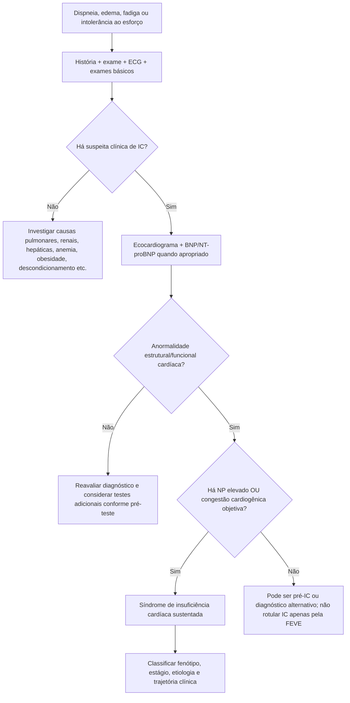
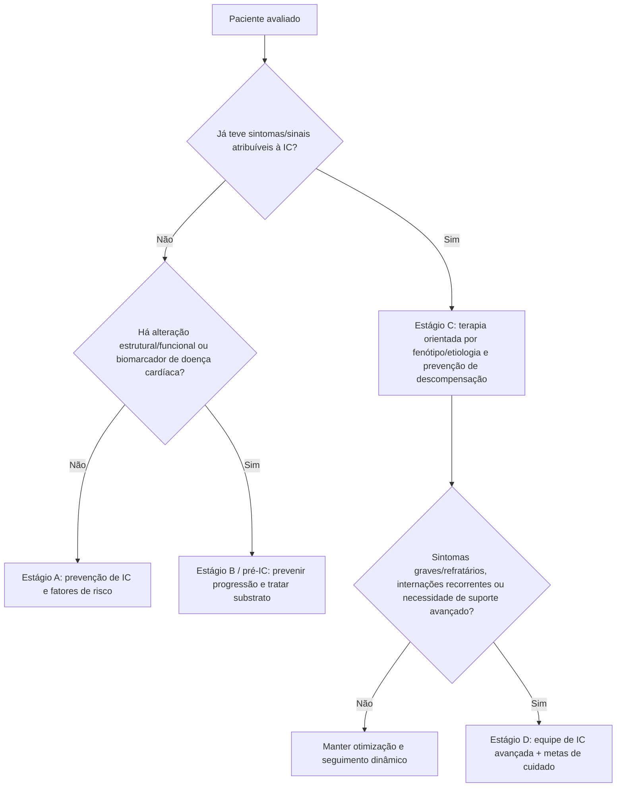
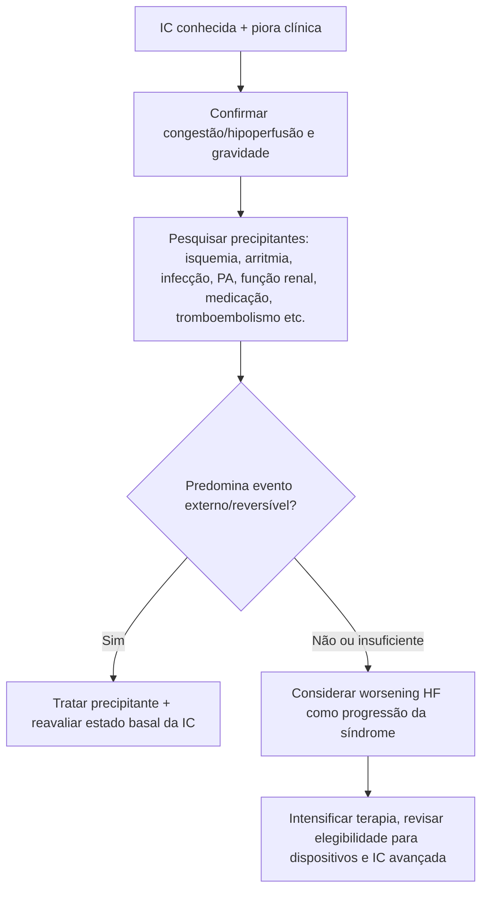

# Segunda Definição Universal de Insuficiência Cardíaca — 2026

## Definição clínica central

O consenso conjunto AHA/ACC/ESC/WHF de 2026 mantém a insuficiência cardíaca (IC) como uma **síndrome clínica** causada por anormalidade estrutural e/ou funcional cardíaca e manifestada por sintomas e/ou sinais, sustentada por pelo menos um dos seguintes:

1. **peptídeos natriuréticos elevados**, ou
2. **evidência objetiva de congestão pulmonar ou sistêmica de origem cardiogênica**.

A definição reforça que **FEVE isolada não diagnostica IC** e que dispneia/edema sem evidência cardiovascular objetiva exige diferencial amplo.

## Árvore diagnóstica

## Estágios A–D

### Estágio A — em risco de IC

Pessoa sem sintomas/sinais prévios ou atuais, sem alteração estrutural cardíaca e sem biomarcadores de doença cardíaca, porém com condições que aumentam risco, como:

- hipertensão;
- doença aterosclerótica;
- cardiopatia congênita;
- diabetes;
- obesidade;
- exposição a cardiotóxicos;
- história familiar/genética relevante.

### Estágio B — pré-IC

Pessoa sem sintomas/sinais atuais ou prévios de IC, mas com evidência de doença cardíaca subclínica, como:

- hipertrofia ventricular;
- aumento de câmaras;
- alteração segmentar;
- fibrose/cicatriz ou outra anormalidade tecidual;
- valvopatia;
- biomarcadores cardíacos anormais em contexto apropriado.

### Estágio C — IC clínica

Doença estrutural/funcional associada a sintomas e/ou sinais atuais ou prévios de IC.

### Estágio D — IC avançada

IC com sintomas graves/persistentes e/ou episódios recorrentes apesar de tratamento otimizado, requerendo consideração de estratégias avançadas, paliativas ou de suporte circulatório/transplante conforme elegibilidade.

## Árvore: estágio e próxima ação

## Trajetória clínica: “piora de IC” é um evento próprio

O consenso de 2026 destaca **worsening heart failure** como evento prognóstico importante. Refere-se a deterioração progressiva de sintomas/sinais e qualidade de vida em alguém com diagnóstico prévio de IC, exigindo intensificação do tratamento.

A definição **não inclui** novo diagnóstico de IC e procura distinguir piora do substrato da IC de sintomas explicados predominantemente por eventos externos como SCA, infecção ou baixa adesão isolada.

Marcadores de piora podem incluir:

- aumento de dispneia/edema;
- queda de capacidade funcional;
- arritmias graves;
- elevação de pressões pulmonares;
- piora de função ventricular;
- aumento de BNP/NT-proBNP e outros biomarcadores no contexto apropriado.

## Árvore: paciente com IC que piorou

## Remissão não significa cura

O consenso universal reforça a importância de reconhecer melhora/reversão fenotípica sem pressupor eliminação da doença de base. Paciente que recupera FEVE após tratamento pode manter predisposição biológica e risco de recorrência.

Assim, termos como **IC com FEVE melhorada (HFimpEF)** descrevem trajetória; não devem automaticamente levar à retirada de terapia que produziu remodelamento favorável.

## Por que esta definição é útil na prática

Ela reduz quatro erros comuns:

1. chamar qualquer dispneia + FEVE normal de HFpEF;
2. chamar FEVE reduzida assintomática de “IC clínica” sem reconhecer estágio B;
3. considerar FEVE recuperada como cura definitiva;
4. tratar hospitalização/piora como evento isolado sem reconhecer mudança prognóstica da trajetória da IC.

## Fontes verificadas

Walsh MN, Kober L, Sliwa K, et al. AHA/ACC/ESC/WHF Expert Consensus Document: Second Universal Definition of Heart Failure (2026). *J Am Coll Cardiol.* Published online June 29, 2026. PMID **42370864**. DOI **10.1016/j.jacc.2026.05.036**.

Versão de acesso aberto: *Global Heart.* 2026;21(1):51. PMCID **PMC13330914**.

## Status de revisão

`VERIFICAÇÃO HUMANA NECESSÁRIA`: antes de transformar definições em regras automáticas da plataforma, validar os critérios completos e exceções da versão final diagramada do consenso.
