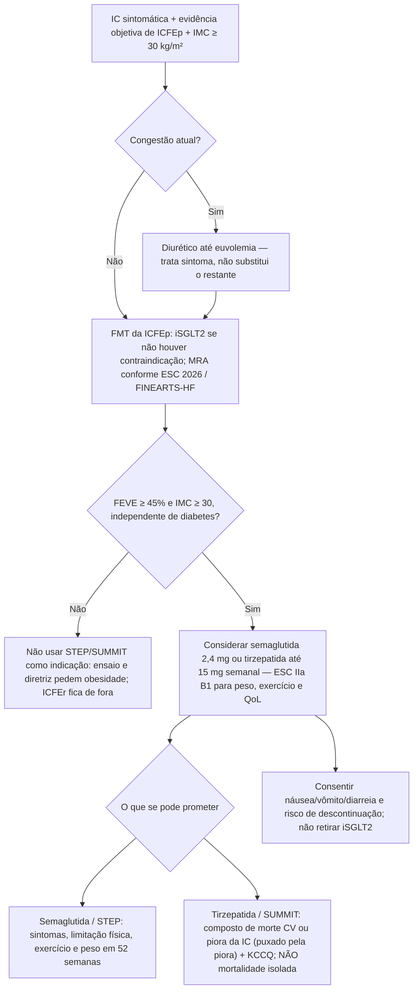

# Agonistas de Incretina na ICFEp com Obesidade: STEP-HFpEF versus SUMMIT

## A decisao que este protocolo resolve
Paciente com ICFEp e obesidade. Já tem (ou deveria ter) iSGLT2. A pergunta não é “incretina em vez de SGLT2”. É: **esta pessoa entra na indicação de semaglutida ou tirzepatida, o que cada ensaio realmente entregou, e o que a ESC 2026 autoriza a dizer ao paciente.**

Os dois ensaios **não são comparáveis cabeça a cabeça**. Moléculas diferentes, desfechos primários diferentes, duração diferente, corte de FEVE diferente. Misturar “melhorou o KCCQ” com “reduziu o composto de morte CV ou piora da IC” é o erro operacional que este texto existe para impedir.

Documentos de origem, sem reescrita:
- STEP-HFpEF — `semaglutida-na-icfep-com-obesidade-o-ensaio-step-hfpef.md` (esta pasta)
- SUMMIT — `summit-tirzepatida-icfep-com-obesidade.md` (esta pasta); versão prévia no tema Diabetes e cardiologia: `tirzepatida-e-icfep-com-obesidade-o-ensaio-summit.md`
- Braço com diabetes tipo 2 do programa STEP (não é o ensaio original) — `semaglutida-na-icfep-com-obesidade-e-diabetes-tipo-2-o-ensaio-step-hfpef-dm.md`

## O que cada ensaio perguntou

|  | **STEP-HFpEF** | **SUMMIT** |
|---|---|---|
| Molécula | Semaglutida 2,4 mg SC **1×/semana** (agonista de GLP-1) | Tirzepatida até **15 mg** SC **1×/semana** (agonista duplo GIP/GLP-1) |
| n | **529** | **731** (364 vs. 367) |
| Entrada | ICFEp + **IMC ≥ 30 kg/m²** (o abstract não informa o corte numérico de FEVE) | IC + **FEVE ≥ 50%** + **IMC ≥ 30 kg/m²** |
| Duração | **52 semanas** | **pelo menos 52 semanas**; seguimento mediano **104 semanas** |
| Primários | **Dois coprimários, nenhum de evento:** variação do **KCCQ-CSS** e variação do **peso corporal** | **Dois primários:** (1) composto de **morte CV adjudicada ou piora da IC** (tempo até o primeiro evento); (2) variação do **KCCQ-CSS** até 52 semanas |
| O que melhorou de fato | KCCQ-CSS **+16,6 vs. +8,7** (diferença **+7,8**; IC95% 4,8 a 10,9; p<0,001). Peso **−13,3% vs. −2,6%** (diferença **−10,7 pp**; IC95% −11,9 a −9,4; p<0,001). Caminhada de 6 min **+21,5 vs. +1,2 m** (diferença **+20,3 m**; IC95% 8,6 a 32,1; p<0,001). Win ratio do composto hierárquico **1,72** (IC95% 1,37 a 2,15). PCR **−43,5% vs. −7,3%** (razão 0,61). | Composto de morte CV ou piora da IC: **9,9% vs. 15,3%** (HR **0,62**; IC95% 0,41 a 0,95; p=0,026). Piora da IC: **8,0% vs. 14,2%** (HR **0,54**; IC95% 0,34 a 0,85). Morte CV: **2,2% (8) vs. 1,4% (5)** (HR **1,58**; IC95% 0,52 a 4,83). KCCQ-CSS **+19,5 vs. +12,7** (diferença **6,9**; IC95% 3,3 a 10,6; p<0,001). |
| Segurança no abstract | Eventos adversos graves **13,3% vs. 26,7%** (menos no braço ativo) | Descontinuação por evento adverso (sobretudo GI) **6,3% vs. 1,4%** |
| O que **não** demonstra | Redução de mortalidade ou de hospitalização por IC — não foram coprimários | Redução de mortalidade cardiovascular isolada — 8 vs. 5 mortes, IC que cruza 1 |
| Peso / 6 min no abstract | Sim, ambos | **Não reportados** no abstract do artigo principal. **VERIFICAÇÃO HUMANA NECESSÁRIA** se forem citados a partir do texto integral |

KCCQ-CSS subiu em magnitude parecida nos dois (diferença entre grupos 7,8 e 6,9 pontos). Isso **não** autoriza a dizer que as moléculas são equivalentes: os ensaios não se comparam, o SUMMIT acompanhou o dobro do tempo e mediu evento clínico que o STEP não mediu como primário.

## Como a esc 2026 posiciona a classe
Recommendation Table 18 (DOI 10.1093/eurheartj/ehag100):

> Semaglutide or tirzepatide should be considered for patients with symptomatic HF, LVEF ≥45%, and BMI ≥30 kg/m², regardless of diabetes status, to reduce body weight, and improve exercise capacity and QoL.

**Classe IIa, nível B1.** Terapia médica **adicional** (AMT), não fundacional (FMT).

A mesma tabela: cirurgia bariátrica **pode ser considerada** em IC com IMC ≥ 35 kg/m² quando mudanças estruturadas de estilo de vida somadas a fármaco não sustentam a perda de peso — **IIb C**.

O texto da diretriz descreve benefício de peso, QoL, sintomas e capacidade funcional nos RCTs, e trata o efeito sobre **eventos de IC** como sugestão de análises agrupadas/secundárias e do SUMMIT — não como a indicação Classe I de FMT. A frase que se diz ao paciente é a da tabela: considerar para **peso, exercício e qualidade de vida**. O composto do SUMMIT informa a conversa; **não** vira “esse remédio reduz morte”.

Dois desalinhamentos de corte que o prescritor precisa verbalizar:
- ESC usa **FEVE ≥ 45%**; SUMMIT entrou com **≥ 50%**. A faixa 45–49% é da diretriz, não deste ensaio.
- O abstract do STEP-HFpEF diz “heart failure with preserved ejection fraction” **sem** número de FEVE. Não interpolar 45% ou 50% a partir do abstract. O STEP-HFpEF DM (outro ensaio, pasta Diabetes) usou FEVE ≥ 45% — isso não é o STEP original.

## Sequencia pratica — nao e algoritmo de substituicao

iSGLT2 permanece a base — EMPEROR-Preserved e DELIVER reduziram composto com hospitalização em população **não** selecionada por obesidade. Ver `inibidores-de-sglt2-na-icfep-empagliflozina-emperor-preserved-e-dapagliflozina-deliver.md`. Finerenona é outra pergunta (FINEARTS-HF). Incretina entra **depois** de confirmar o diagnóstico (dispneia de obesidade sem ICFEp não é indicação destes ensaios) e **junto** da FMT, não no lugar dela.

## Como escolher a molecula na ausencia de ensaio direto
A ESC 2026 não prefere uma. Na prática:

- **Objetivo declarado = sintoma, capacidade funcional e peso**, e a pessoa se parece com o STEP-HFpEF: a evidência de coprimário de peso está no abstract da semaglutida; o abstract da tirzepatida **não** traz peso.
- **Objetivo declarado = reduzir o composto de morte CV ou piora da IC** nesta população: só o SUMMIT mediu isso como primário. Continua sendo composto, não mortalidade.
- Diabetes tipo 2 concomitante: o STEP original e o SUMMIT não exigem diabetes (o STEP-HFpEF DM é o braço que **só** entrou diabético — outro documento). A ESC diz **regardless of diabetes status**.
- Intolerância gastrointestinal que impede a titulação: troca de molécula é decisão clínica, não dado destes dois abstracts.
- ICFEr, IMC < 30, ou ICFEp sem evidência objetiva: **fora**.

Titulação, contraindicações de bula (incluindo a distinção brasileira vs. norte-americana para carcinoma medular de tireoide/NEM2) e manejo perioperatório do esvaziamento gástrico **não** estão nos abstracts do STEP nem do SUMMIT. Usar o rótulo e os documentos já desta base (`agonistas-de-receptor-de-glp-1-no-perioperatorio-orientacao-multissocietaria-2024.md`; checklist de início de GLP-1 no diabetes). **VERIFICAÇÃO HUMANA NECESSÁRIA** antes de transpor esquema de dose semana a semana para a indicação de ICFEp.

## O que dizer — e o que nao dizer
Dizer: *em ICFEp com obesidade, semaglutida melhorou sintomas, função e peso no STEP-HFpEF; tirzepatida reduziu o composto de morte cardiovascular ou piora da IC no SUMMIT, sobretudo por menos piora, e também melhorou o KCCQ; a ESC 2026 considera uma ou outra (IIa B1) para peso, exercício e qualidade de vida, independente de diabetes, com FEVE ≥ 45% e IMC ≥ 30.*

Não dizer: *reduz mortalidade*; *é o novo pilar da ICFEp no lugar do SGLT2*; *as duas são iguais*; *serve para ICFEr*; *serve sem obesidade*; *o win ratio 1,72 do STEP é desfecho duro*.

## Armadilhas clinicas
- **Citar STEP e SUMMIT como se respondessem a mesma pergunta** — um mediu sintoma/peso; o outro mediu composto de evento + KCCQ
- **Vender o HR 0,62 do SUMMIT como redução de morte** — morte CV 8 vs. 5
- **Usar o peso do STEP (−13,3%) como se fosse resultado do SUMMIT** — o abstract do SUMMIT não o reporta
- **Tratar FEVE 45–49% como população do SUMMIT** — o ensaio pediu ≥ 50%; o ≥ 45% é da ESC
- **Exigir diabetes para prescrever** — a diretriz é explícita no contrário; o STEP original não é o STEP-HFpEF DM
- **Atribuir toda a dispneia da pessoa com obesidade à ICFEp** — os ensaios entram com diagnóstico de IC; o ACC 2026 ECDP já adverte o inverso
- **Retirar iSGLT2 ou diurético** porque a incretina “trata a ICFEp”
- **Extrapolar para ICFEr** — ESC 2026 pede RCT dedicado
