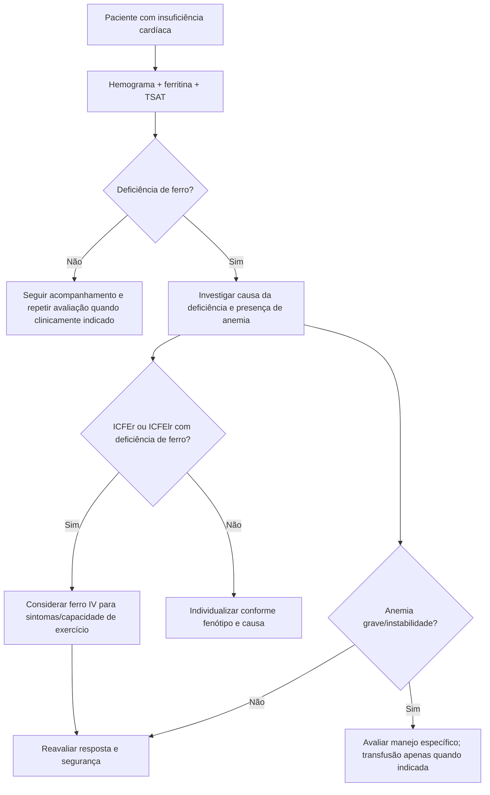

# Deficiência de ferro na insuficiência cardíaca — rastreio e ferro intravenoso JCS/JHFS 2025

Deficiência de ferro e anemia são comorbidades frequentes na insuficiência cardíaca (IC), mas representam problemas distintos. O paciente pode ter deficiência de ferro mesmo sem anemia, e a decisão terapêutica não deve ser baseada apenas na hemoglobina.

A diretriz **JCS/JHFS 2025** incorpora uma abordagem prática: rastrear sistematicamente anemia e deficiência de ferro e, em pacientes selecionados com ICFEr ou ICFElr e deficiência de ferro, considerar ferro intravenoso para melhorar sintomas e capacidade de exercício.

## 1. O que rastrear

A diretriz recomenda rastreamento de anemia e deficiência de ferro em pacientes com IC usando:

- hemograma completo;
- ferritina sérica;
- saturação de transferrina (**TSAT**).

Essa recomendação é **Classe I, nível C-EO** na JCS/JHFS 2025.

### Por que ferritina isolada pode enganar

A ferritina é reagente de fase aguda. Em estados inflamatórios crônicos, pode estar normal ou elevada apesar de disponibilidade inadequada de ferro. Por isso, a TSAT ajuda a identificar deficiência funcional e deve ser interpretada junto da ferritina e do contexto clínico.

## 2. Não confundir deficiência de ferro com anemia

- **Anemia** descreve redução da concentração de hemoglobina.
- **Deficiência de ferro** descreve estoque/disponibilidade inadequados do micronutriente.

Um paciente pode apresentar uma, ambas ou nenhuma. Investigar apenas quando a hemoglobina cai perde a oportunidade de reconhecer deficiência de ferro sintomática mais cedo.

## 3. Quem pode se beneficiar de ferro intravenoso

Na JCS/JHFS 2025, em pacientes com **ICFEr ou ICFElr e deficiência de ferro**, ferro intravenoso com **carboximaltose férrica ou isomaltosídeo de ferro** pode ser considerado para melhorar **sintomas de IC e capacidade de exercício** — **Classe IIa, nível B-R**.

A formulação dessa recomendação é importante: o benefício explicitamente respaldado aqui é clínico/funcional. Não se deve transformar essa recomendação em promessa de redução de mortalidade individual.

## 4. O que a diretriz não recomenda como substituto

A estratégia não é “corrigir hemoglobina a qualquer custo”. A JCS/JHFS 2025 classifica o uso de **agentes estimuladores da eritropoiese (ESA)** para prevenção de eventos cardiovasculares em pacientes com IC e anemia como **Classe III — sem benefício, nível B-R**.

Transfusão de concentrado de hemácias é outra intervenção, destinada a situações de anemia grave e contexto clínico apropriado; não é tratamento rotineiro da deficiência de ferro crônica estável.

## 5. Fluxo clínico sugerido

1. Paciente com IC em acompanhamento ou descompensação estabilizada.
2. Solicitar hemograma, ferritina e TSAT.
3. Confirmar se há anemia, deficiência de ferro ou ambas.
4. Procurar causa da deficiência — perdas gastrointestinais, dieta inadequada, má absorção, doença renal, uso de anticoagulante/antiagregante e outras fontes de sangramento devem ser consideradas conforme o caso.
5. Em ICFEr/ICFElr com deficiência confirmada e sintomas/limitação funcional, avaliar ferro intravenoso conforme diretriz, disponibilidade e contraindicações.
6. Reavaliar resposta clínica e parâmetros hematimétricos/ferro conforme evolução.

## Árvore prática

## Armadilhas

- Usar apenas hemoglobina para rastrear deficiência de ferro.
- Interpretar ferritina isoladamente em paciente com inflamação crônica.
- Prescrever ferro IV sem investigar fonte de perda sanguínea quando ela é plausível.
- Prometer redução de mortalidade a partir de uma recomendação cujo benefício explicitado é melhora de sintomas e capacidade funcional.
- Usar ESA rotineiramente para reduzir eventos cardiovasculares na IC com anemia.

## Referências principais

Kitai T, Kohsaka S, Kato T, et al. *JCS/JHFS 2025 Guideline on Diagnosis and Treatment of Heart Failure.* Circ J. 2025;89(8):1278-1444. DOI **10.1253/circj.CJ-25-0002**. PMID **40159241**.

*Corrigendum: JCS/JHFS 2025 Guideline on Diagnosis and Treatment of Heart Failure.* Circ J. 2025. DOI **10.1253/circj.CJ-66-0242**. PMID **40850773**.
