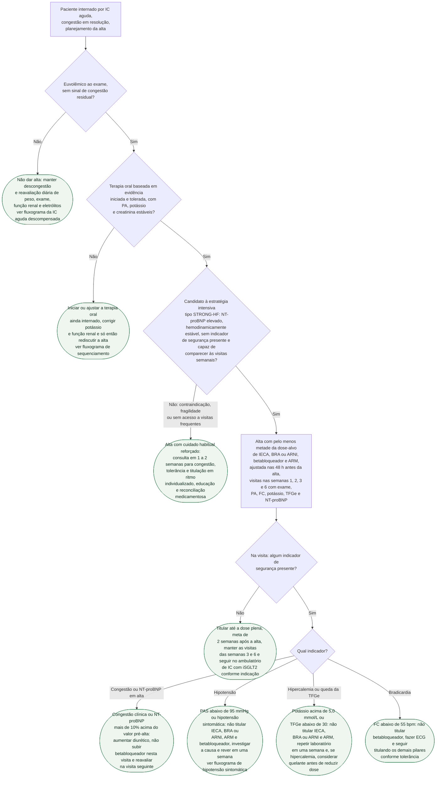

# Fluxograma: Alta hospitalar na insuficiência cardíaca aguda — critérios de alta e titulação intensiva pós-alta (ESC 2023, STRONG-HF)

O fluxograma da IC aguda descompensada, nesta pasta, termina quando a congestão foi resolvida; o de sequenciamento da terapia quádrupla decide em que ordem os pilares entram quando há barreira de segurança. Este começa no ponto entre os dois: o momento em que se decide **se o paciente pode ir embora e com que plano**. A ESC 2021 já dava classe I, nível C, para três atos que costumam ser pulados — excluir congestão residual antes da alta, testar a terapia oral ainda internado e rever o paciente em 1 a 2 semanas. A atualização focada de 2023 acrescentou, com base no STRONG-HF, uma recomendação classe I nível B: estratégia intensiva de início e titulação rápida da terapia baseada em evidência antes da alta e em visitas frequentes e cuidadosas nas primeiras 6 semanas, para reduzir reinternação por IC ou morte. No ensaio, o desfecho primário de reinternação por IC ou morte por qualquer causa em 180 dias caiu de 23,3% para 15,2%. A decisão que este fluxograma organiza é quem recebe essa estratégia, o que precisa estar pronto antes da alta e o que fazer quando uma visita mostra um indicador de segurança.

## Árvore de decisão

## Antes da alta: o que precisa estar pronto

Os dois primeiros nós vêm da ESC 2021, que recomenda em classe I, nível C, excluir cuidadosamente sobrecarga de volume antes da alta e testar a terapia oral guiada por diretriz ainda no hospital. Congestão residual na alta é o cenário em que a titulação rápida vira problema, não solução: o STRONG-HF só randomizou pacientes hemodinamicamente estáveis, com NT-proBNP acima de 2.500 pg/mL na triagem e queda de mais de 10% entre triagem e randomização, ou seja, pacientes que estavam de fato descongestionando. Quem não está euvolêmico volta ao fluxograma da IC aguda descompensada; quem está euvolêmico mas ainda não iniciou a terapia oral, ou tem potássio e creatinina instáveis, resolve isso internado, na ordem que o fluxograma de sequenciamento da terapia quádrupla propõe.

## Quem entra na estratégia intensiva

A recomendação da ESC 2023 é classe I nível B para todos os internados por IC, mas a evidência vem de uma população definida. Na atualização focada, o STRONG-HF é descrito assim: 1.078 pacientes hospitalizados por IC aguda, estáveis, com NT-proBNP elevado, ainda sem doses plenas de terapia baseada em evidência, randomizados para cuidado habitual ou cuidado de alta intensidade. Os critérios que o nó D3 pede são os que o ensaio usou para entrar e para titular. O registro do ensaio (NCT03412201) e o resumo do Lancet trazem critérios explícitos: idade de 18 a 85 anos; PAS de 100 mmHg ou mais, FC de 60 bpm ou mais e potássio de 5,0 mmol/L ou menos nas 24 h antes da randomização; NT-proBNP acima de 1.500 pg/mL na randomização; exclusão de TFGe abaixo de 30 mL/min/1,73 m2 na triagem ou diálise, intolerância documentada a doses altas de betabloqueador ou de bloqueador do SRAA, expectativa de vida abaixo de 6 meses, alta prevista para instituição de longa permanência e incapacidade de cumprir o seguimento por comorbidade, condição social ou histórico de não adesão. Fragilidade em si não é critério nominal do protocolo; o que o ramo de cuidado habitual traduz é essa combinação de idade acima de 85 anos, intolerância documentada, TFGe abaixo de 30 e inviabilidade de quatro visitas com laboratório em seis semanas.

O ramo de cuidado habitual não é abandono: mantém a consulta em 1 a 2 semanas da ESC 2021 para avaliar congestão, tolerância e iniciar ou titular a terapia, em ritmo individualizado. É também o momento de reconciliação medicamentosa e educação, cobertos em Comunicação clínica.

## O protocolo do STRONG-HF

| Elemento | O que o ensaio fez | Fonte lida |
|---|---|---|
| Primeira visita de titulação | Nas 48 h antes da alta, meta de pelo menos metade das doses-alvo de IECA ou BRA ou ARNI, betabloqueador e ARM | ESC 2023, texto integral |
| Dose plena | Tentada em até 2 semanas após a alta | ESC 2023, resumo do Lancet |
| Visitas | Semanas 1, 2, 3 e 6 após a randomização, com exame físico e laboratório incluindo NT-proBNP; quatro visitas ambulatoriais em 2 meses | ESC 2023, resumo do Lancet |
| O que vigiar | Sintomas e sinais de congestão, PA, FC, NT-proBNP, potássio e TFGe | ESC 2023 |
| iSGLT2 | Não exigido pelo protocolo | ESC 2023 |
| Desfecho primário em 180 dias | Reinternação por IC ou morte: 15,2% vs 23,3%; diferença ajustada 8,1%, IC 95% 2,9 a 13,2; p igual a 0,0021; RR ajustado 0,66, IC 95% 0,50 a 0,86 | Resumo do Lancet, ESC 2023 |
| Dose plena atingida | SRAA 55% vs 2%, betabloqueador 49% vs 4%, ARM 84% vs 46% | ESC 2023 |
| Eventos adversos aos 90 dias | Qualquer: 41% vs 29%; graves: 16% vs 17%; fatais: 5% vs 6% | Resumo do Lancet, ESC 2023 |
| Interrupção | Precoce, por recomendação do comitê de segurança, por diferença maior que a esperada entre os grupos | Resumo do Lancet |

Aos 90 dias, PA, pulso, classe NYHA, peso e NT-proBNP caíram mais no grupo intensivo, com melhora de qualidade de vida. A leitura prática: a estratégia é mais trabalhosa e gera mais eventos adversos não graves, sem aumentar os graves, e o que compra é cerca de um em cada doze pacientes a menos reinternado ou morto em seis meses (diferença absoluta ajustada de 8,1%).

## Indicadores de segurança na visita

Os cinco indicadores do protocolo, conforme a análise de Tomasoni e colaboradores, foram: TFGe abaixo de 30 mL/min/1,73 m2, potássio acima de 5,0 mmol/L, PAS abaixo de 95 mmHg, FC abaixo de 55 bpm e NT-proBNP mais de 10% acima do valor pré-alta. Eles apareceram em 57,7% dos pacientes do braço intensivo em alguma visita, e, quando tratados conforme o protocolo, não se associaram a aumento significativo do desfecho primário composto; isoladamente, TFGe abaixo de 30 associou-se a mais reinternações por IC (HR ajustado 3,60, IC 95% 1,22 a 10,60) e PAS abaixo de 95 mmHg a tendência de maior mortalidade (HR ajustado 2,68, IC 95% 0,94 a 7,64, p igual a 0,065). Isso muda a interpretação do nó D4: o indicador não é falha da estratégia, é o gatilho de pausa que a torna segura. O artigo de desenho descreve a regra geral: a titulação é adiada diante de piora da congestão, hipercalemia, hipotensão, bradicardia, piora da função renal ou aumento significativo do NT-proBNP entre visitas.

| Indicador | Conduta no diagrama |
|---|---|
| Congestão ou NT-proBNP mais de 10% acima do pré-alta | Aumentar diurético, não subir betabloqueador nesta visita |
| PAS abaixo de 95 mmHg | Não titular IECA, BRA ou ARNI, ARM nem betabloqueador |
| Potássio acima de 5,0 mmol/L ou TFGe abaixo de 30 | Não titular IECA, BRA ou ARNI nem ARM |
| FC abaixo de 55 bpm | Não titular betabloqueador |

A atribuição de cada indicador a fármacos específicos, tal como aparece nas condutas C5 a C8, foi conferida no protocolo completo do STRONG-HF: IECA/BRA/ARNI e ARM não são titulados com PAS abaixo de 95 mmHg, potássio acima de 5,0 mmol/L ou TFGe abaixo de 30 mL/min/1,73 m²; betabloqueador não é titulado com frequência abaixo de 55 bpm ou PAS abaixo de 95 mmHg. Pausar a titulação não é retirar a dose atual. Hipotensão sintomática persistente e hipercalemia têm fluxogramas próprios.

## O que vale para todos os ramos

Quatro pontos não estão no diagrama porque se aplicam a qualquer alta por IC: iSGLT2 iniciado conforme a indicação por fração de ejeção, independentemente da estratégia de titulação, porque não exige titulação nem foi parte do protocolo do STRONG-HF; plano diurético oral por escrito, com peso-alvo e instrução de quando ligar; reconciliação medicamentosa e educação com teach-back na alta; e retorno imediato ao hospital diante de congestão franca, que reabre o fluxograma da IC aguda descompensada em qualquer ponto desta árvore.

## Limitações e o que confirmar

- **Critérios de inclusão e exclusão do STRONG-HF** foram conferidos no registro NCT03412201 e no resumo do Lancet (idade 18 a 85 anos, TFGe abaixo de 30 excluída na triagem, intolerância documentada a doses altas, incapacidade de cumprir o seguimento); fragilidade não é critério nominal e o ramo de cuidado habitual continua sendo julgamento clínico. Não houve exclusão por fração de ejeção; a randomização foi estratificada por FEVE de 40% ou menos versus acima de 40%.
- **Regra por fármaco diante de cada indicador de segurança:** conferida no protocolo completo do STRONG-HF (Cotter et al., Eur J Heart Fail. 2019; DOI 10.1002/ejhf.1575).
- **Recomendações pré-alta da ESC 2021**: classe I, nível C, conferidas na tabela da seção 11.3.11 do texto integral em academic.oup.com.
- **Taxas específicas de hipotensão, hipercalemia e piora renal** por braço não constam do resumo nem do texto da ESC 2023 lidos; só os totais de eventos adversos estão na tabela.
- O ensaio foi aberto, interrompido precocemente e o grupo controle recebeu doses baixas: a magnitude do efeito pode estar superestimada, como a própria atualização focada registra ao notar que a maioria do controle recebeu menos da metade das doses plenas.
- Este fluxograma não define doses por fármaco nem cobre a alta de pacientes em choque, com suporte inotrópico ou candidatos a terapia avançada, que têm fluxogramas próprios nesta pasta.

## Tudo com Tudo

- [Insuficiência cardíaca aguda descompensada](/biblioteca/fluxograma-insuficiencia-cardiaca-aguda-descompensada)
- [Fluxograma: Sequenciamento e Titulação da Terapia Quádrupla na ICFEr](/biblioteca/fluxograma-sequenciamento-titulacao-terapia-quadrupla-icfer)
- [Fluxograma: Manejo da Hipotensão Sintomática Limitando a Titulação de IECA/BRA/ARNI na ICFEr](/biblioteca/fluxograma-hipotensao-sintomatica-titulacao-ieca-arni-icfer)
- [Safety, Tolerability and Efficacy of Up-titration of Guideline-Directed Medical Therapies for Acute Heart Failure (STRONG-HF)](/biblioteca/safety-tolerability-and-efficacy-of-up-titration-of-guideline-directed-medical-therapies-for-acute-heart-failure-strong-hf)
- [Atualização Focada 2023 das Diretrizes ESC 2021 de Insuficiência Cardíaca](/biblioteca/atualizacao-focada-2023-das-diretrizes-esc-2021-de-insuficiencia-cardiaca)
- [Transição Hospital-Domicílio na Insuficiência Cardíaca: o Ensaio PACT-HF](/biblioteca/transicao-hospital-domicilio-na-ic-o-ensaio-pact-hf)
- [Fluxograma: Reconciliação Medicamentosa na Transição de Cuidado](/biblioteca/fluxograma-reconciliacao-medicamentosa-na-transicao-de-cuidado)
