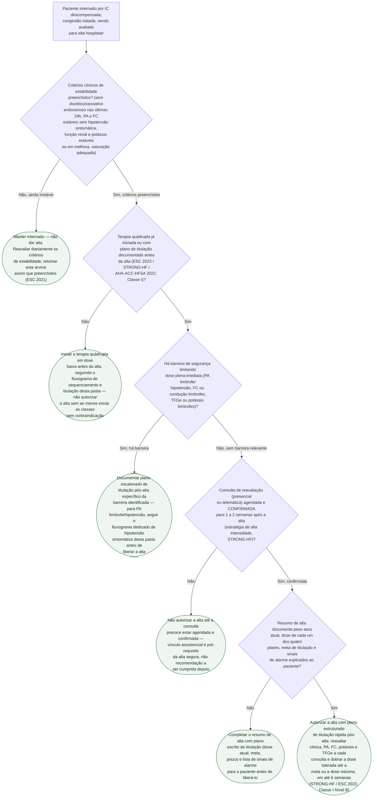

# Fluxograma: Critérios de Segurança para Alta e Titulação Pós-Alta na Insuficiência Cardíaca Descompensada

A alta hospitalar por IC descompensada é o ponto de maior risco de todo o curso da
doença — parte relevante das reinternações e óbitos precoces acontece nas
primeiras semanas após a saída do hospital. O STRONG-HF e a atualização focada
2023 da ESC mudaram o que se espera desse momento: não basta o paciente estar
sem congestão — a alta segura exige terapia quádrupla iniciada (ou com plano
escrito de titulação), consulta de reavaliação precoce **já agendada e
confirmada antes de sair do hospital**, e um resumo de alta que funcione como
protocolo de titulação, não como relato do que foi feito durante a internação.
Este fluxograma trata exatamente desse recorte: os critérios de segurança para
liberar a alta e a estrutura mínima do acompanhamento pós-alta — não o
sequenciamento farmacológico em si (ver `fluxograma-sequenciamento-titulacao-terapia-quadrupla-icfer.md`,
nesta mesma pasta) nem o manejo específico da hipotensão sintomática (ver
`fluxograma-hipotensao-sintomatica-titulacao-ieca-arni-icfer.md`).

## Árvore de decisão

## O que a árvore não mostra

**Não há corte numérico validado** de PA, FC, TFGe ou potássio que defina
"limítrofe" no nó D3 — nenhuma das quatro fontes citadas define esse número de
forma isolada e generalizável; a decisão é clínica, apoiada no julgamento à
beira do leito. Onde a fonte define um prazo (o intervalo de 1-2 semanas do
STRONG-HF, a janela de 6 semanas da recomendação Classe I/Nível B da ESC 2023),
isso está registrado no nó correspondente.

**A janela de 1-2 semanas do nó D4 vem do desenho do STRONG-HF** (visitas
quinzenais, média de 4,8 consultas no braço de alta intensidade) e da
recomendação da ESC 2023, que fala em consultas "frequentes e cuidadosas nas
primeiras 6 semanas" — não é um número único fixo por todas as diretrizes, e o
fluxograma o usa como referência prática, não como limite absoluto.

**Organizar a transição de cuidado não substitui titular a terapia.** O ensaio
PACT-HF (`transicao-hospital-domicilio-na-ic-o-ensaio-pact-hf.md`, nesta mesma
pasta) testou visitas domiciliares e acompanhamento estruturado sem exigir
mudança de prescrição, e teve resultado neutro (HR 0,92 para o desfecho composto
em 3 anos) — os próprios autores atribuem isso à ausência de diferença real na
adoção de terapia guiada por diretriz entre os grupos. É por isso que este
fluxograma amarra a consulta precoce (D4) a um resumo de alta com plano de
titulação explícito (D5): agendar a consulta sem o plano de dose repete o
mecanismo que fez o PACT-HF não funcionar.

**Doses exatas e esquemas de titulação por fármaco** não são objeto deste
fluxograma — consulte `fluxograma-sequenciamento-titulacao-terapia-quadrupla-icfer.md`
e os documentos de cada pilar nesta pasta.

**Reavaliação de intercorrência aguda fora dos pontos marcados na árvore** —
nova descompensação, evento clínico ou mudança de fármaco concomitante reabre o
processo de decisão a qualquer momento, inclusive depois da alta já autorizada.
