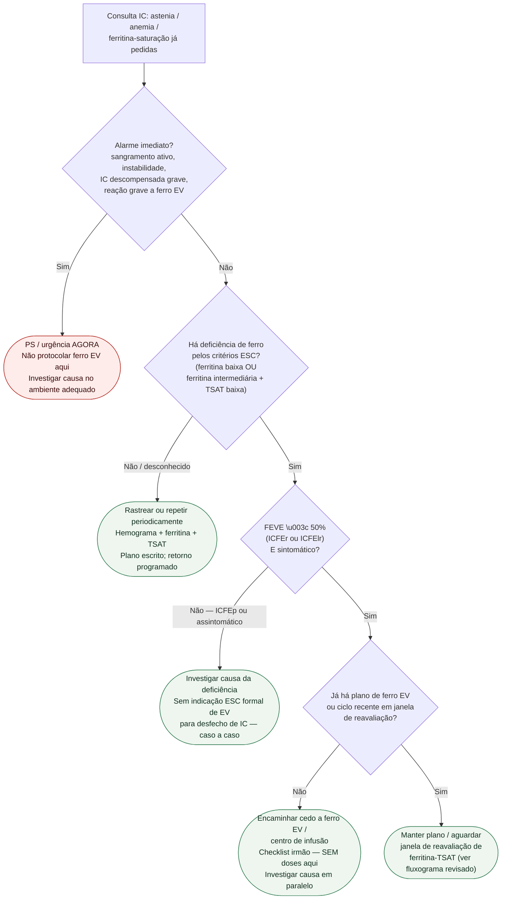

# Fluxograma ambulatorial: deficiência de ferro na IC — destino

Prosa: [`sinalizadores-ambulatoriais-deficiencia-de-ferro-na-ic-quando-escalar`](sinalizadores-ambulatoriais-deficiencia-de-ferro-na-ic-quando-escalar.md). Encaminhar: [`checklist-ambulatorial-encaminhar-ferro-endovenoso-na-ic`](checklist-ambulatorial-encaminhar-ferro-endovenoso-na-ic.md). Indicação/doses: [`fluxograma-deficiencia-de-ferro-na-insuficiencia-cardiaca-rastreio-e-reposicao-endovenosa-esc-2023`](fluxograma-deficiencia-de-ferro-na-insuficiencia-cardiaca-rastreio-e-reposicao-endovenosa-esc-2023.md).

## Árvore de decisão

## Notas

- **D1** = gate de segurança (sangramento/instabilidade ≠ “só ferro”).
- **D2** = critérios laboratoriais no fluxograma ESC 2023 **já revisado** — não redefinir cortes neste desenho.
- **D3** = escopo da recomendação 2023 (ICFEr/ICFElr sintomática).
- **C4** = destino operacional; miligramas e formulação ficam no documento revisado.
- Não decide congestão (#842) nem encaminhamento de IC avançada (#878).
