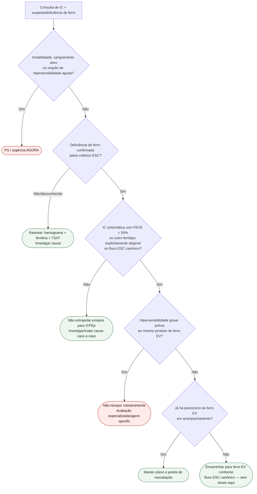

# Fluxograma ambulatorial: deficiência de ferro na IC — destino

## Pós-alta
O contexto AFFIRM-AHF não é um ramo independente para qualquer IC: exige população compatível, incluindo **FEVE <50%**. FEVE >=50% não deve ser enviada automaticamente a ferro EV com base nesse ensaio.

Sem doses ou formulações neste fluxograma.
