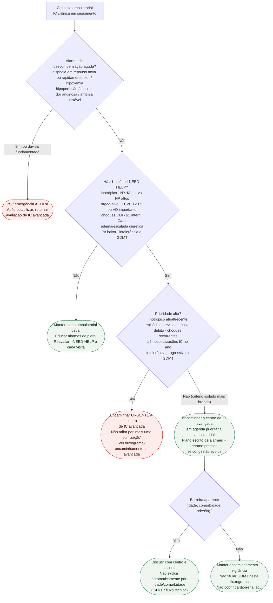

# Fluxograma ambulatorial: IC avançada — destino ao centro especializado

Prosa: [`sinalizadores-ambulatoriais-de-ic-avancada-quando-encaminhar-centro-lvad-transplante`](/biblioteca/sinalizadores-ambulatoriais-de-ic-avancada-quando-encaminhar-centro-lvad-transplante). Checklist: [`checklist-ambulatorial-i-need-help-encaminhamento-ic-avancada`](/biblioteca/checklist-ambulatorial-i-need-help-encaminhamento-ic-avancada). Árvore técnica / TCPE: [`fluxograma-encaminhamento-ic-avancada-lvad-transplante`](/biblioteca/fluxograma-encaminhamento-ic-avancada-lvad-transplante). Descompensação aguda: [`sinalizadores-ambulatoriais-de-descompensacao-de-ic-quando-encaminhar`](/biblioteca/sinalizadores-ambulatoriais-de-descompensacao-de-ic-quando-encaminhar).

## Árvore de decisão

## Notas

- **D1** = gate de segurança (descompensação aguda).
- **D2** = triagem I-NEED-HELP (Baumwol / HELP-HF / AHA / HFA-ESC).
- **D3** = priorização de urgência de encaminhamento (não decide LVAD vs. transplante).
- **D4** = barreira aparente não fecha a porta ao centro.
- Não decide doses de GDMT, diurético IV, ultrafiltração, listagem nem manejo cardiorrenal.

## Interpretação do reconhecimento

I-NEED-HELP é triagem para referência, não diagnóstico formal nem elegibilidade LVAD/transplante. Um item contextualizado pode motivar contato com programa de IC avançada; não esperar completar critérios HFA ou obter TCPE/RHC/escores. O centro considera otimização, valvas/arritmias/dispositivos, terapias avançadas e cuidados de suporte/paliativos. Idade, fragilidade e comorbidades não bloqueiam automaticamente a referência.

NP varia com idade, FA, DRC e obesidade; rim/fígado exigem atribuição e tendência, separando doença prévia. FEVE baixa isolada não define IC avançada. PAS 90–100 é faixa de alerta contextual, não corte diagnóstico. Contar internações realmente por IC; distinguir intolerância a GDMT de subutilização/adesão. Choque único estável de CDI pede via de dispositivo/EP; recorrência, IC importante ou instabilidade aumentam urgência.
### Variações entre documentos

Os limiares do mnemônico variam: o statementAHA2021 apresenta FEVE≤25% e pelo menos uma internação porIC nos12meses anteriores; versões usadas peloHELP-HF/HFA destacam FEVE<20% e mais de uma internação. Os critérios da tabela são sinalizadores operacionais, não barreiras obrigatórias. Não esperar a segunda internação nem FEVE<20% diante de trajetória preocupante. A referência deve considerar objetivos do paciente; doença não cardíaca terminal ou recusa informada de terapias complexas pede decisão compartilhada e suporte/paliação, sem abandono de cuidado.
