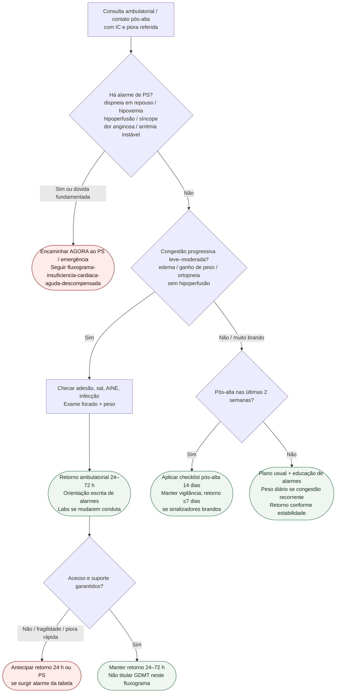

# Fluxograma ambulatorial: IC com piora progressiva — destino

Prosa: [`sinalizadores-ambulatoriais-de-descompensacao-de-ic-quando-encaminhar`](sinalizadores-ambulatoriais-de-descompensacao-de-ic-quando-encaminhar.md). Pós-alta 14 dias: [`pos-alta-de-ic-checklist-de-alarme-nas-duas-primeiras-semanas`](pos-alta-de-ic-checklist-de-alarme-nas-duas-primeiras-semanas.md). Aguda hospitalar: [`fluxograma-insuficiencia-cardiaca-aguda-descompensada`](fluxograma-insuficiencia-cardiaca-aguda-descompensada.md).

## Árvore de decisão

## Notas

- **D1** = gate de segurança (perfil de IC aguda / ESC 2021).
- **D2** = congestão ambulatorial sem hipoperfusão → destino clínico precoce.
- **D3** = janela pós-alta alinhada à vigilância das primeiras semanas (ESC 2023 / STRONG-HF).
- Não decide doses de GDMT, diurético IV, ultrafiltração nem manejo cardiorrenal.
