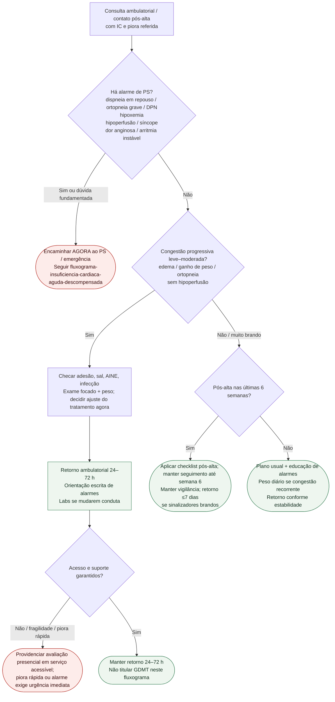

# Fluxograma ambulatorial: IC com piora progressiva — destino

Prosa: [[sinalizadores-ambulatoriais-de-descompensacao-de-ic-quando-encaminhar](/biblioteca/sinalizadores-ambulatoriais-de-descompensacao-de-ic-quando-encaminhar)](/biblioteca/sinalizadores-ambulatoriais-de-descompensacao-de-ic-quando-encaminhar). Pós-alta 14 dias: [[pos-alta-de-ic-checklist-de-alarme-nas-duas-primeiras-semanas](/biblioteca/pos-alta-de-ic-checklist-de-alarme-nas-duas-primeiras-semanas)](/biblioteca/pos-alta-de-ic-checklist-de-alarme-nas-duas-primeiras-semanas). Aguda hospitalar: [[fluxograma-insuficiencia-cardiaca-aguda-descompensada](/biblioteca/fluxograma-insuficiencia-cardiaca-aguda-descompensada)](/biblioteca/fluxograma-insuficiencia-cardiaca-aguda-descompensada).

## Árvore de decisão

## Notas

- **D1** = gate de segurança (perfil de IC aguda / ESC 2021).
- **D2** = congestão ambulatorial sem hipoperfusão → destino clínico precoce.
- **D3** = janela pós-alta alinhada à vigilância das primeiras semanas (ESC 2023 / STRONG-HF).
- Não decide doses de GDMT, diurético IV, ultrafiltração nem manejo cardiorrenal.

## Limites e segurança do seguimento

Peso isolado não define congestão nem PS; interpretar com sintomas, perfusão e peso basal. Prazos são operacionais e dependem da rede. Avaliar SCA, arritmia, TEP, infecção, anemia, DRC/LRA, fármacos e valvopatia como alternativas/precipitantes; não atribuir todo edema à IC. Após ajuste terapêutico, programar creatinina/TFGe e potássio conforme o fármaco, além dos exames motivados pela clínica. STRONG-HF não validou cortes de peso nem vigilância isolada.
