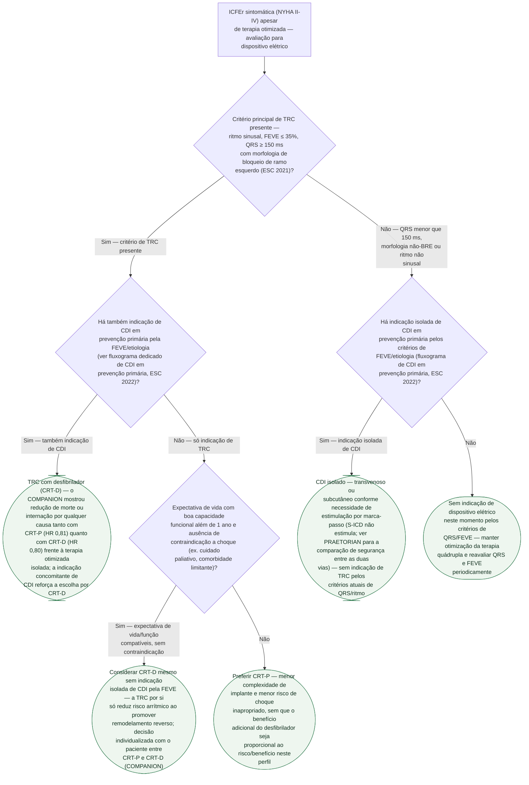

# Fluxograma: Decisão entre Terapia de Ressincronização Cardíaca (CRT) e CDI Isolado na ICFEr

A decisão de dispositivo elétrico na ICFEr tem duas perguntas encadeadas, não
uma só: **o paciente tem critério de terapia de ressincronização (TRC)?** — que
depende de ritmo, QRS e morfologia, não só de FEVE — e, se tiver, **a TRC deve
vir com desfibrilador (CRT-D) ou apenas com marca-passo (CRT-P)?** O COMPANION
é o único grande ensaio que randomizou terapia otimizada isolada, CRT-P e
CRT-D ao mesmo tempo, e por isso é a base direta dessa segunda decisão.

## Árvore de decisão

## O que a árvore não mostra

**Subcritérios de QRS 130-149 ms com BRE, ou QRS ≥150 ms sem morfologia de
BRE** — a diretriz completa ESC 2021 trata essas faixas com recomendação de
classe diferente (geralmente IIa) da do critério principal usado nesta árvore
(QRS ≥150 ms com BRE). `VERIFICAÇÃO HUMANA NECESSÁRIA`: consulte o texto
integral da diretriz para esses subcritérios antes de excluir um paciente só
por não se encaixar no critério principal aqui representado.

**Fibrilação atrial concomitante** muda a discussão de TRC — a diretriz exige
garantia de captura biventricular quase completa nesse cenário, frequentemente
com ablação do nó AV associada. Este fluxograma pressupõe ritmo sinusal, como
o próprio critério principal já explicita.

**Estimulação do sistema de conducão (feixe de His ou ramo esquerdo)** como
alternativa à TRC biventricular clássica não está representada — é decisão de
centro especializado, coberta em outros documentos desta biblioteca em
Dispositivos (`estimulacao-do-feixe-de-his-versus-biventricular-o-ensaio-his-sync.md`,
`estimulacao-do-ramo-esquerdo-versus-biventricular-o-ensaio-lbbp-resync.md`).

**Escolha entre CDI transvenoso e subcutâneo (S-ICD)**, quando a indicação é
de CDI isolado, depende da necessidade de estimulação por marca-passo e não é
detalhada em profundidade nesta árvore — ver o documento dedicado em
Dispositivos, que traz os números completos do PRAETORIAN.