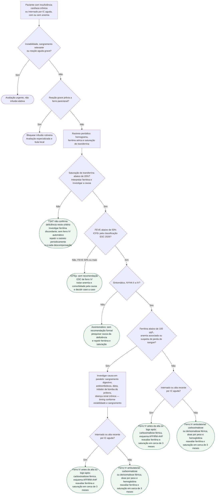

# Fluxograma: Deficiência de ferro na insuficiência cardíaca — rastreio e reposição endovenosa (ESC 2026)

## Atualização clínica ESC 2026

A seção 10.4 apoia TSAT <20% para identificar deficiência de ferro na IC; ferritina continua útil na investigação. Ferritina baixa isolada com TSAT ≥20% não aciona automaticamente infusão. A Recommendation Table 19 indica ferro IV para sintomas e qualidade de vida na ICFEr sintomática (FEVE <50%; I B1), e considera seu uso para reduzir hospitalizações (IIa B1). Os critérios de entrada dos ensaios permanecem históricos e não são ampliados por mudança de nomenclatura. Reação grave prévia a qualquer ferro parenteral bloqueia encaminhamento rotineiro e exige revisão especializada/bula local; recursos de emergência não eliminam contraindicações.

Fonte: Køber L, Adamo M et al. ESC 2026, DOI 10.1093/eurheartj/ehag100, seção 10.4 e tabela 19; EMA intravenous iron referral.

A deficiência de ferro pode existir sem anemia. Esta árvore organiza a identificação da deficiência e a elegibilidade para reposição IV, com investigação da causa e avaliação de segurança antes da infusão. A evidência dos ensaios é descrita abaixo com seus critérios originais.

## Árvore de decisão

## Rastreio: em todo paciente, periodicamente

A ESC 2021 recomenda que todo paciente com IC seja rastreado periodicamente para anemia e deficiência de ferro com hemograma completo, ferritina sérica e saturação de transferrina — Classe I, nível C. O rastreio vale independentemente de anemia: nos ensaios que sustentam a recomendação, a deficiência foi definida pelos dois marcadores de ferro, e boa parte dos incluídos não era anêmica. A periodicidade exata não é fixada pela diretriz; o momento de uma internação por IC aguda é um ponto natural de rastreio, porque é a população do AFFIRM-AHF. Um resultado normal não encerra a questão: a deficiência pode recorrer, e por isso a folha C1 manda repetir.

## Definição operacional da deficiência

| Contexto | Interpretação prática |
|---|---|
| TSAT <20% | Critério apoiado pela ESC 2026; avaliar ferritina, causa e elegibilidade clínica antes de infundir |
| TSAT ≥20% com ferritina baixa | Investigar o achado; não acionar ferro IV automaticamente pelo critério histórico |
| Ferritina elevada | Interpretar inflamação e causas alternativas; não excluir deficiência apenas por ferritina ≥300 |

Historicamente, CONFIRM-HF e AFFIRM-AHF usaram ferritina <100 μg/L ou ferritina 100–299 μg/L com TSAT <20%. IRONMAN usou TSAT <20% ou ferritina <100 μg/L. Esses critérios de inclusão não são a definição operacional atual desta árvore. A ferritina, reagente de fase aguda, permanece útil na investigação.

## Quem recebe ferro endovenoso: fração de ejeção e sintoma

A Recommendation Table 19 da ESC 2026 recomenda ferro IV para sintomas e qualidade de vida na ICFEr sintomática com deficiência (I B1) e considera seu uso para reduzir hospitalizações por IC (IIa B1). A classificação atual de ICFEr usa FEVE <50%; isso não altera retrospectivamente os cortes dos ensaios nem amplia esquemas de bula.

ICFEp e ausência de sintomas não têm indicação rotineira de ferro IV por esta recomendação. Deficiência ou anemia ainda exigem investigação e tratamento conforme a causa, inclusive por outras indicações específicas.

## Por que a evidência sustenta Classe I para sintoma e IIa para hospitalização

| Ensaio | População | Desfecho primário | Resultado |
|---|---|---|---|
| CONFIRM-HF (2015) | IC sintomática, FEVE ≤ 45%, ambulatorial | Distância no teste de caminhada de 6 minutos na semana 24 | +33 ± 11 m com carboximaltose férrica, p = 0,002 |
| AFFIRM-AHF (2020) | Internado por IC aguda, FEVE < 50%, reposição antes da alta | Hospitalizações totais por IC e morte CV em 52 semanas | RR 0,79, IC95% 0,62–1,01, p = 0,059; hospitalizações por IC isoladas RR 0,74, p = 0,013 |
| IRONMAN (2022) | IC, FEVE ≤ 45%, derisomaltose férrica, seguimento mediano 2,7 anos | Hospitalizações recorrentes por IC e morte CV | RR 0,82, IC95% 0,66–1,02, p = 0,070; análise pré-COVID RR 0,76, p = 0,047 |
| HEART-FID (2023) | ICFEr ambulatorial, FEVE ≤ 40% | Composto hierárquico morte, hospitalização por IC, caminhada de 6 minutos | Win ratio 1,10, p = 0,02 com alfa pré-especificado de 0,01 — não significativo |

Nos ensaios resumidos, há benefício sintomático e sinais de redução de hospitalizações, com resultados primários neutros em AFFIRM-AHF e IRONMAN e sem redução demonstrada de mortalidade. Não se deve generalizar neutralidade do desfecho primário a todos os ensaios de ferro IV. A atualização de 2023 apoia a Classe IIa para hospitalização na metanálise de Graham et al. (10 ensaios, 3.373 pacientes: hospitalizações totais por IC e morte CV RR 0,75, IC95% 0,61–0,93), sem efeito sobre mortalidade cardiovascular ou total. Os números por ensaio estão em ferro-endovenoso-na-insuficiencia-cardiaca-confirm-hf-affirm-ahf-e-ironman e heart-fid-carboximaltose-ferrica-icfer-deficiencia-ferro.

## Ferro oral não substitui, e o agente estimulador da eritropoiese não entra

O IRONOUT-HF testou ferro polissacarídeo oral 150 mg duas vezes ao dia por 16 semanas contra placebo em ICFEr com deficiência de ferro: o VO2 de pico não mudou (diferença 21 mL/min, p = 0,46) e todos os desfechos secundários foram neutros. A orientação prática de Sindone et al. registra que, por isso, a diretriz ESC 2021 não recomenda ferro oral na IC. Para a anemia em si, o tratamento com agente estimulador da eritropoiese não é recomendado na ausência de outra indicação (ESC 2021, Classe III) — o RED-HF mostrou neutralidade com mais tromboembolismo. Ver ferro-oral-nao-substitui-o-endovenoso-na-icfer-o-ensaio-ironout-hf e anemia-na-insuficiencia-cardiaca-por-que-nao-tratar-com-agente-estimulador-da-eritropoiese-red-hf.

## Investigar a causa e definir o momento seguro da reposição

O ramo D4 destaca ferritina baixa, anemia ou suspeita de perda; o valor isolado de ferritina não classifica de forma infalível deficiência absoluta ou funcional. Nesses casos, a pergunta "por que este paciente perdeu ferro?" é obrigatória: sangramento digestivo oculto sob antiagregante ou anticoagulante, ingestão reduzida, inibidor de bomba de prótons e doença renal crônica são contribuintes possíveis. A investigação pode ocorrer em paralelo no paciente estável; sangramento relevante ou instabilidade exigem atendimento e definição do momento seguro antes de infusão eletiva. Indicação de endoscopia depende de idade, sintomas, anemia, perdas e risco clínico; a diretriz não fornece um corte de ferritina para encaminhamento.

## Doses e reavaliação

| Formulação | Esquema de bula (DailyMed) | Observação |
|---|---|---|
| Carboximaltose férrica, IC NYHA II–III | Dia 1: 1.000 mg se Hb até 14 g/dL, 500 mg se Hb acima de 14 e abaixo de 15 g/dL; semana 6: 500 mg (< 70 kg) ou 1.000 mg (≥ 70 kg) se Hb < 10, 500 mg se Hb 10–14 e ≥ 70 kg, nenhuma dose se Hb > 14; semanas 12, 24 e 36: 500 mg se ferritina < 100 ou 100–300 μg/L com saturação < 20% | Esquema de bula específico para IC NYHA II–III; sem dose prevista com Hb ≥ 15 g/dL |
| Derisomaltose férrica | 1.000 mg em dose única em infusão de pelo menos 20 minutos se peso ≥ 50 kg; 20 mg/kg se < 50 kg; repetir se a deficiência recorrer | Bula de anemia ferropriva; não atribuído ao protocolo do IRONMAN |

Segurança da infusão, pela bula DailyMed lida: hipersensibilidade ao produto contraindica sua administração; a EMA também contraindica ferro parenteral após reação grave a outro produto parenteral, exigindo avaliação especializada e conferência da bula local; a bula pede observação por pelo menos 30 minutos após cada administração, alerta para hipertensão transitória e traz, na versão de agosto de 2026, advertência em destaque para hipofosfatemia sintomática — dosar fosfato antes de repetir o ciclo em paciente de risco (doença renal, má nutrição, uso prolongado). A hipofosfatemia é mais frequente com a carboximaltose do que com a derisomaltose, o que pesa na escolha entre as duas quando o paciente precisará de ciclos repetidos.

A reavaliação de ferritina e saturação de transferrina deve ocorrer cerca de 3 meses após a reposição, evitando dosagem nas primeiras 4 semanas, quando a ferritina ainda reflete a infusão recente. A repetição da dose segue os mesmos critérios de deficiência. No IRONMAN, pacientes com hemoglobina acima de 13 g/dL (mulheres) ou 14 g/dL (homens) foram excluídos; a bula da carboximaltose não prevê dose com hemoglobina de 15 g/dL ou mais — na prática, hemoglobina alta exige reavaliação da indicação.

## Limitações e o que confirmar

- A árvore foi harmonizada com ESC 2026: ICFEr com FEVE <50% e TSAT <20%; os cortes próprios dos ensaios e esquemas de bula não mudam por renomeação de fenótipo.
- A recomendação atual e seu nível foram conferidos diretamente na tabela 19 da ESC 2026; os resultados de 2021/2023 abaixo têm contexto histórico.
- Seção 13.5 da ESC 2021 (deficiência de ferro e anemia) não lida na íntegra: a menção à investigação de sangramento gastrointestinal e à contraindicação do ferro oral vem de fonte secundária (Sindone et al.) e da tabela de novas recomendações.
- Intervalo de reavaliação: 3 meses está documentado; 6 meses não foi confirmado.
- Esquema de dose da derisomaltose no IRONMAN não conferido; a bula lida é a de anemia ferropriva.
- Nenhum ensaio mostrou redução de mortalidade; o HEART-FID não atingiu o alfa pré-especificado. A árvore não promete desfecho duro.
- ICFEp: ausência de recomendação não é recomendação contra; é ausência de ensaio de desfecho.

## Tudo com Tudo

- [Ferro Endovenoso na Insuficiência Cardíaca: CONFIRM-HF, AFFIRM-AHF e IRONMAN](/biblioteca/ferro-endovenoso-na-insuficiencia-cardiaca-confirm-hf-affirm-ahf-e-ironman)
- [Ferro Oral Não Substitui o Endovenoso na ICFEr: o Ensaio IRONOUT-HF](/biblioteca/ferro-oral-nao-substitui-o-endovenoso-na-icfer-o-ensaio-ironout-hf)
- [HEART-FID: carboximaltose férrica na ICFER ambulatorial com deficiência de ferro](/biblioteca/heart-fid-carboximaltose-ferrica-icfer-deficiencia-ferro)
- [Atualização Focada 2023 das Diretrizes ESC 2021 de Insuficiência Cardíaca](/biblioteca/atualizacao-focada-2023-das-diretrizes-esc-2021-de-insuficiencia-cardiaca)
- [Anemia na Insuficiência Cardíaca: Por que Não Tratar com Agente Estimulador da Eritropoiese (RED-HF)](/biblioteca/anemia-na-insuficiencia-cardiaca-por-que-nao-tratar-com-agente-estimulador-da-eritropoiese-red-hf)
- [Fluxograma: Insuficiência Cardíaca crônica — conduta por fração de ejeção (ESC 2021 / atualização 2023)](/biblioteca/fluxograma-insuficiencia-cardiaca-cronica-por-fracao-de-ejecao-esc-2023)
- [Anemia e Deficiência de Ferro na Insuficiência Cardíaca do Idoso: Reposição Intravenosa, o que os Ensaios Realmente Mostraram](/biblioteca/anemia-e-deficiencia-de-ferro-na-insuficiencia-cardiaca-do-idoso)
