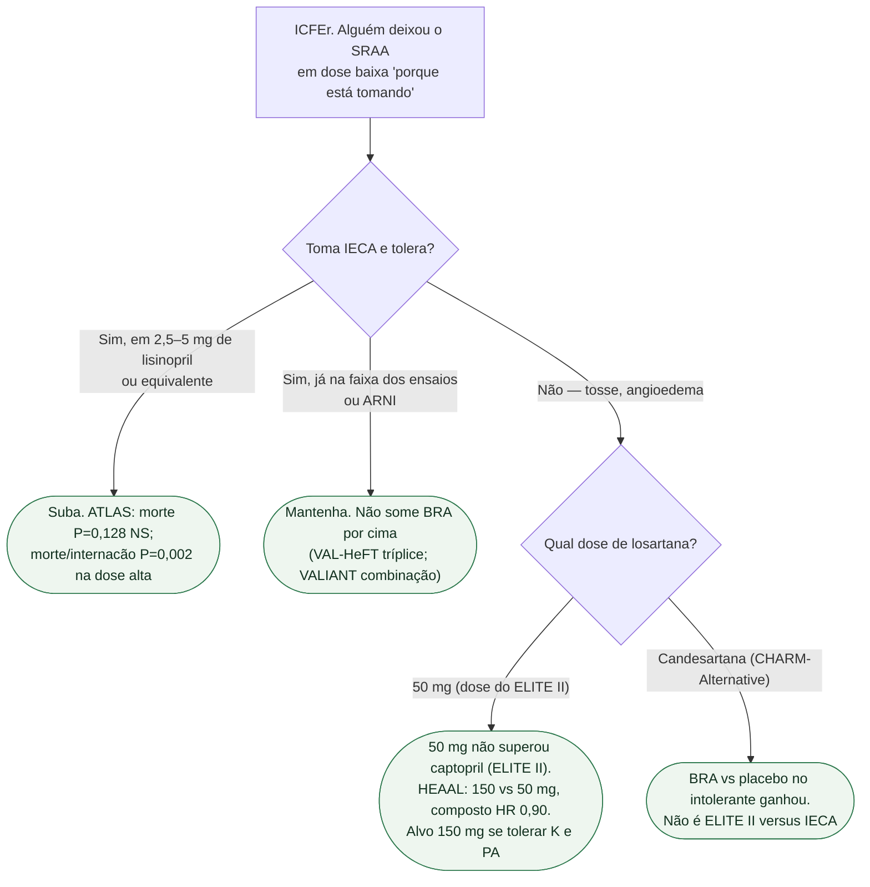

# Fluxograma: dose de IECA e BRA na ICFEr

```mermaid
flowchart TD
  R0["ICFEr. Alguém deixou o SRAA<br/>em dose baixa 'porque está tomando'"] --> D1{"Toma IECA e tolera?"}

  D1 -->|"Sim, em 2,5–5 mg de lisinopril<br/>ou equivalente"| C1(["Suba. ATLAS: morte P=0,128 NS;<br/>morte/internacão P=0,002 na dose alta"])

  D1 -->|"Sim, já na faixa dos ensaios<br/>ou ARNI"| C2(["Mantenha. Não some BRA por cima<br/>(VAL-HeFT tríplice; VALIANT combinação)"])

  D1 -->|"Não — tosse, angioedema"| D2{"Qual dose de losartana?"}

  D2 -->|"50 mg (dose do ELITE II)"| C3(["50 mg não superou captopril (ELITE II).<br/>HEAAL: 150 vs 50 mg, composto HR 0,90.<br/>Alvo 150 mg se tolerar K e PA"])

  D2 -->|"Candesartana (CHARM-Alternative)"| C4(["BRA vs placebo no intolerante ganhou.<br/>Não é ELITE II versus IECA"])

  classDef conduta fill:#eef6ef,stroke:#2f7a4f,color:#12301f;
  class C1,C2,C3,C4 conduta;
```

## Mensagem prática

**Dose de ensaio, não dose de “já está na receita”.** IECA primeiro. BRA 150 mg no intolerante. Não tríplice SRAA.
