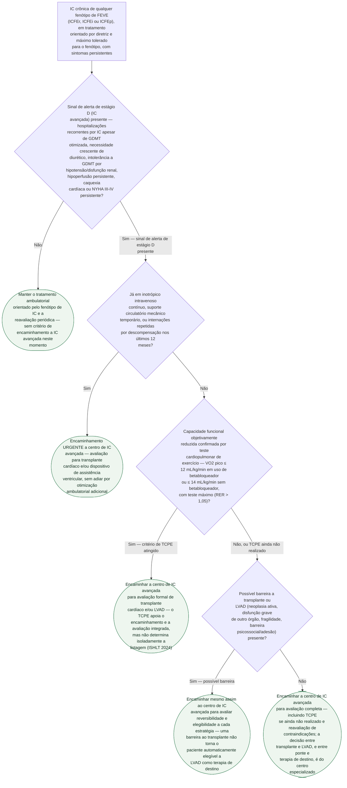

# Fluxograma: Quando Encaminhar para IC Avançada — LVAD e Transplante Cardíaco

Encaminhar tarde demais é o erro mais caro na IC avançada: sobrevida e
elegibilidade a transplante caem quanto mais disfunção de outros órgãos o
paciente acumula esperando. Este fluxograma não decide entre LVAD e
transplante — essa é decisão do centro especializado, que pesa contraindicação,
suporte social e disponibilidade de órgão — mas organiza **quando encaminhar**,
a partir dos sinais de estágio D já reconhecidos pela Segunda Definição
Universal de IC (2026). O teste cardiopulmonar de exercício refina a seleção
de candidatos ambulatoriais, mas não é requisito para iniciar o encaminhamento.

## Árvore de decisão

## O que a árvore não mostra

**IC avançada não é sinônimo de ICFEr.** Sintomas refratários, eventos
recorrentes, hipoperfusão ou intolerância ao tratamento podem justificar o
encaminhamento em ICFEr, ICFEi ou ICFEp. A elegibilidade posterior para LVAD
depende da anatomia e da fisiologia de cada paciente, mas essa seleção não
deve restringir a porta de entrada no centro de IC avançada.

**Critérios completos de listagem para transplante** (gradiente transpulmonar,
resistência vascular pulmonar, Seattle Heart Failure Model, idade) não são
repetidos aqui — estão detalhados, com a fonte primária de 2016 e a diretriz
sucessora de 2024, em
`transplante-cardiaco-sobrevida-do-enxerto-retransplante-e-fatores-de-risco-registro-ishlt.md`,
nesta mesma pasta.

**Escolha entre LVAD de ponte para transplante e LVAD como terapia de
destino** depende de elegibilidade a transplante, idade, comorbidade e
preferência do paciente — decisão do centro especializado, não representada
como ramo desta árvore.

**Escolha entre modelos de LVAD** (fluxo centrífugo versus axial) não é objeto
deste fluxograma — ver `lvad-de-fluxo-centrifugo-versus-axial-o-ensaio-momentum-3.md`.

**Sobrevida do enxerto e risco de retransplante pós-operatórios** também não
estão aqui — são desfechos posteriores à decisão de encaminhar, cobertos no
documento do Registro ISHLT já citado acima.
