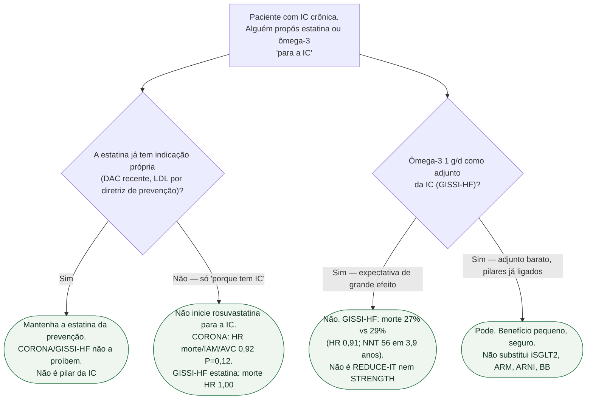

# Fluxograma: estatina e ômega-3 na IC

```mermaid
flowchart TD
  R0["Paciente com IC crônica.<br/>Alguém propôs estatina ou ômega-3<br/>'para a IC'"] --> D1{"A estatina já tem indicação própria<br/>(DAC recente, LDL por diretriz de prevenção)?"}

  D1 -->|"Sim"| C1(["Mantenha a estatina da prevenção.<br/>CORONA/GISSI-HF não a proíbem.<br/>Não é pilar da IC"])

  D1 -->|"Não — só 'porque tem IC'"| C2(["Não inicie rosuvastatina para a IC.<br/>CORONA: HR morte/IAM/AVC 0,92 P=0,12.<br/>GISSI-HF estatina: morte HR 1,00"])

  R0 --> D2{"Ômega-3 1 g/d como adjunto<br/>da IC (GISSI-HF)?"}

  D2 -->|"Sim — expectativa de grande efeito"| C3(["Não. GISSI-HF: morte 27% vs 29%<br/>(HR 0,91; NNT 56 em 3,9 anos).<br/>Não é REDUCE-IT nem STRENGTH"])

  D2 -->|"Sim — adjunto barato, pilares já ligados"| C4(["Pode. Benefício pequeno, seguro.<br/>Não substitui iSGLT2, ARM, ARNI, BB"])

  classDef conduta fill:#eef6ef,stroke:#2f7a4f,color:#12301f;
  class C1,C2,C3,C4 conduta;
```

## Mensagem prática

**Estatina trata placa, não IC. Ômega-3 1 g na IC é NNT 56 — adjunto, não pilar.**
