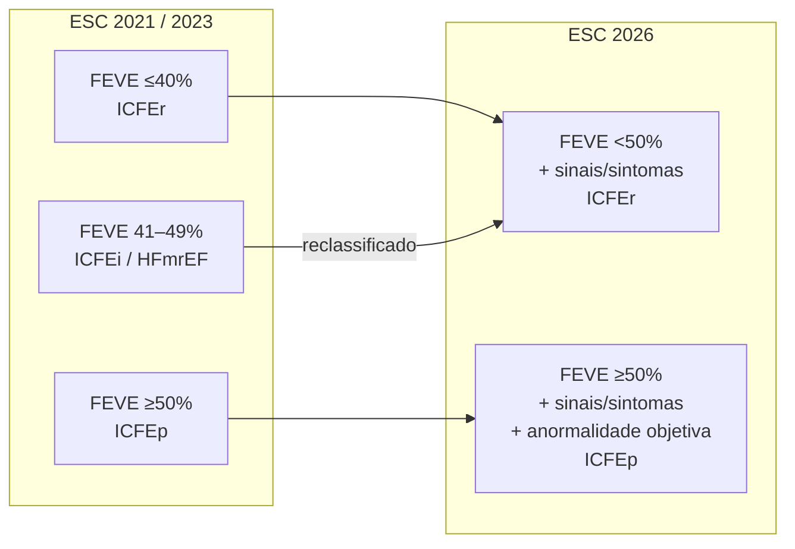

# Fluxograma: FEVE — ESC 2021/2023 versus ESC 2026

A ESC 2026 não criou um terceiro corte. Ela **apagou o do meio**. Quem estava em 41–49% deixa de ser um fenótipo e passa a ser ICFEr — **se tiver sinais e/ou sintomas de IC**. Quem está em ≥50% continua ICFEp, mas só com evidência objetiva estrutural/funcional.

Este fluxograma é a árvore do paciente **já rotulado ICFEi**. O mapa geral da diretriz 2026 está em outro documento. O fluxograma histórico de 2023 (`fluxograma-insuficiencia-cardiaca-cronica-por-fracao-de-ejecao-esc-2023`) permanece no acervo como registro da era de três fenótipos; não foi editado.

## O mapa dos cortes, lado a lado

A seta do meio é a única novidade diagnóstica que muda o prontuário. Ela **não** arrasta CDI, TRC, ivabradina, digoxina nem o PCDT do SUS.

## Árvore de decisão — paciente rotulado ICFEi hoje

```mermaid
flowchart TD
  R0["Paciente no prontuário como<br/>ICFEi / ICFElr / HFmrEF<br/>FEVE 41–49%"]
  D1{"FEVE 41–49% confirmada<br/>em exame recente,<br/>preferencialmente pelo mesmo método?"}
  C1(["Não reclassificar ainda.<br/>Repetir a imagem.<br/>FEVE de um único laudo antigo<br/>não autoriza troca de rótulo"])
  D2{"Há sinais e/ou sintomas atuais<br/>ou prévios de insuficiência cardíaca?"}
  C2(["Não é ICFEr 2026.<br/>Pode ser estágio B / pré-IC.<br/>Não aplicar FMT da ICFEr<br/>só pelo número da FEVE"])
  D3{"Qual é a trajetória da FEVE?"}
  C3(["HFimpEF: ICFEr prévia ≤40%<br/>que subiu para 41–49%.<br/>Manter FMT na maior dose tolerada.<br/>Classe I C. Não desescalonar"])
  C4(["Queda a partir de FEVE ≥50%.<br/>Tratar como ICFEr 2026<br/>e investigar a causa da deterioração"])
  P1["Trajetória estável em 41–49%<br/>com IC sintomática:<br/>ESC 2026 reclassifica como ICFEr"]
  D4{"iSGLT2 já em uso?"}
  C5(["Iniciar dapagliflozina ou empagliflozina.<br/>Ensaio usou FEVE >40%<br/>EMPEROR-Preserved e DELIVER.<br/>Classe I A independente da FEVE.<br/>Já era Classe I A na ESC 2023"])
  D5{"MRA já em uso?"}
  C6(["Indicação 2026: MRA Classe I A<br/>independente da FEVE.<br/>Na ICFEr, usar sMRA<br/>espironolactona/eplerenona.<br/>FINEARTS-HF contextualiza finerenona,<br/>mas a tabela a atribui à ICFEp"])
  D6{"Betabloqueador e IECA ou ARNI<br/>já em uso?"}
  C7(["Diretriz 2026: Classe I A na ICFEr<br/>agora FEVE <50%.<br/>Ensaios clássicos usaram FEVE ≤40%.<br/>PARAGON-HF FEVE ≥45% foi neutro.<br/>Iniciar/manter pela diretriz;<br/>não citar como RCT novo nesta faixa"])
  D7{"FEVE ≤35% após ≥3 meses de FMT<br/>e NYHA II–III, expectativa >1 ano?"}
  C8(["Não implantar CDI nem TRC<br/>só porque o rótulo agora é ICFEr.<br/>Tabelas 6 e 7 mantêm FEVE ≤35%"])
  C9(["Seguir o algoritmo de CDI/TRC.<br/>O corte de dispositivo<br/>não acompanhou a reclassificação"])
  D8{"Cortes de AMT que fatiam 41–49%"}
  C10(["Ivabradina: ≤35% — fora.<br/>Digoxina/hidralazina: ≤40% — fora.<br/>Vericiguat: <45% — só 41–44%.<br/>Semaglutida/tirzepatida: ≥45%<br/>e IMC ≥30 — só 45–49% obeso"])
  N1["Anotar no prontuário os dois rótulos:<br/>histórico ICFEi ESC 2021/2023<br/>e ICFEr ESC 2026. PCDT/SUS e SBC<br/>ainda usam os cortes antigos"]

  R0 --> D1
  D1 -->|"Não"| C1
  D1 -->|"Sim"| D2
  D2 -->|"Não"| C2
  D2 -->|"Sim"| D3
  D3 -->|"Melhorada a partir de ≤40%"| C3
  D3 -->|"Queda a partir de ≥50%"| C4
  D3 -->|"Estável em 41–49%"| P1
  C3 --> D4
  C4 --> D4
  P1 --> D4
  D4 -->|"Não"| C5
  D4 -->|"Sim"| D5
  C5 --> D5
  D5 -->|"Não"| C6
  D5 -->|"Sim"| D6
  C6 --> D6
  D6 -->|"Não"| C7
  D6 -->|"Sim"| D7
  C7 --> D7
  D7 -->|"Não"| C8
  D7 -->|"Sim"| C9
  C8 --> D8
  C9 --> D8
  D8 --> C10
  C10 --> N1

  classDef conduta fill:#eef5f8,stroke:#1c7293,color:#0b2e45;
  classDef alerta fill:#f8eef0,stroke:#9b3b4a,color:#3a1018;
  class C1,C2,C3,C4,C5,C7 conduta;
  class C6,C8,C10 alerta;
```

## Comparação terapêutica da faixa 41–49%

| Intervenção | ESC 2021 | ESC 2023 | ESC 2026 (faixa agora dentro da ICFEr) | O ensaio randomizou 41–49%? |
|---|---|---|---|---|
| iSGLT2 | sem recomendação nesta faixa | Classe I A | Classe I A, independente da FEVE | **Sim.** EMPEROR-Preserved e DELIVER: FEVE >40%. Subgrupo 41–49% do EMPEROR-Preserved: HR 0,71 (IC95% 0,57–0,88), PMID 36471037. |
| MRA | Classe IIb C | IIb C (inalterado) | Classe I A independente da FEVE; sMRA para ICFEr | **Parcial.** RALES/EMPHASIS: ≤35%. FINEARTS-HF: ≥40% com finerenona. TOPCAT: ≥45%, primário neutro. A escolha ESC 2026 em 41–49% é sMRA pela reclassificação como ICFEr. |
| Betabloqueador | Classe IIb C | IIb C | Classe I A na ICFEr | **Não como ensaio dedicado.** CIBIS-II / MERIT-HF / COPERNICUS: ≤25–40%. Reclassificação, não RCT novo. |
| IECA / ARNI | Classe IIb C | IIb C | Classe I A na ICFEr; troca para ARNI I B1 | **Não como ensaio dedicado positivo.** PARADIGM-HF: ≤40%. PARAGON-HF: ≥45%, p=0,06. |
| Diurético se congestão | Classe I C | I C | Classe I A, dose dinâmica | Conduta clínica; não depende do fenótipo. |
| CDI prevenção primária | sem indicação nesta faixa | sem | **continua FEVE ≤35%** | Ensaios: ≤30–35%. A reclassificação **não** abre a porta. |
| TRC | sem | sem | **continua FEVE ≤35%** + QRS | Idem. |
| Ferro IV | — | I / IIa em ICFEr e ICFEi | I B1 para sintomas/qualidade de vida; IIa B1 para hospitalização na ICFEr | AFFIRM-AHF usou FEVE <50%; CONFIRM-HF/IRONMAN ≤45%. A Tabela 19 de 2026 inclui a faixa 41–49% pela nova definição de ICFEr. |
| Acesso SUS (PCDT 2024) | FEVE <40% dapagliflozina; ≤35% sacubitril-valsartana | igual | **não mudou** | Reclassificar o prontuário ESC não libera o fármaco no SUS. |

## O que a árvore recusa fazer

**Converter o rótulo em indicação de dispositivo.** ICFEr 2026 ≠ FEVE ≤35%. As duas frases podem ser verdadeiras no mesmo paciente só se a FEVE tiver caído.

**Tratar 41–49% como um bloco de AMT.** Vericiguat corta em <45%. Incretinas cortam em ≥45% com obesidade. Digoxina e hidralazina cortam em ≤40%. Ivabradina corta em ≤35%. A faixa histórica é atravessada por quatro cortes diferentes.

**Apagar o rótulo antigo.** Laudos, autorizações e ensaios de 2021–2025 ainda falam ICFEi. O prontuário precisa dos dois nomes.

**Assumir que SBC e PCDT acompanharam.** Não acompanharam, nesta revisão editorial. Conduta ESC 2026 e elegibilidade SUS podem divergir no mesmo paciente.

## Leitura cruzada

- Protocolo da reclassificação, com a distinção ensaio versus diretriz: `icfei-historica-e-a-reclassificacao-esc-2026`
- Síntese da ESC 2026 (não repetida aqui): `esc-2026-insuficiencia-cardiaca-mudancas-chave-e-recomendacoes`
- Fluxograma histórico de três fenótipos: `fluxograma-insuficiencia-cardiaca-cronica-por-fracao-de-ejecao-esc-2023`
- HFimpEF / TRED-HF: `fluxograma-icfer-com-fracao-de-ejecao-melhorada-manter-ou-retirar-a-terapia-tred-hf`
- CDI versus TRC: `fluxograma-decisao-crt-versus-cdi-isolado-icfer`
