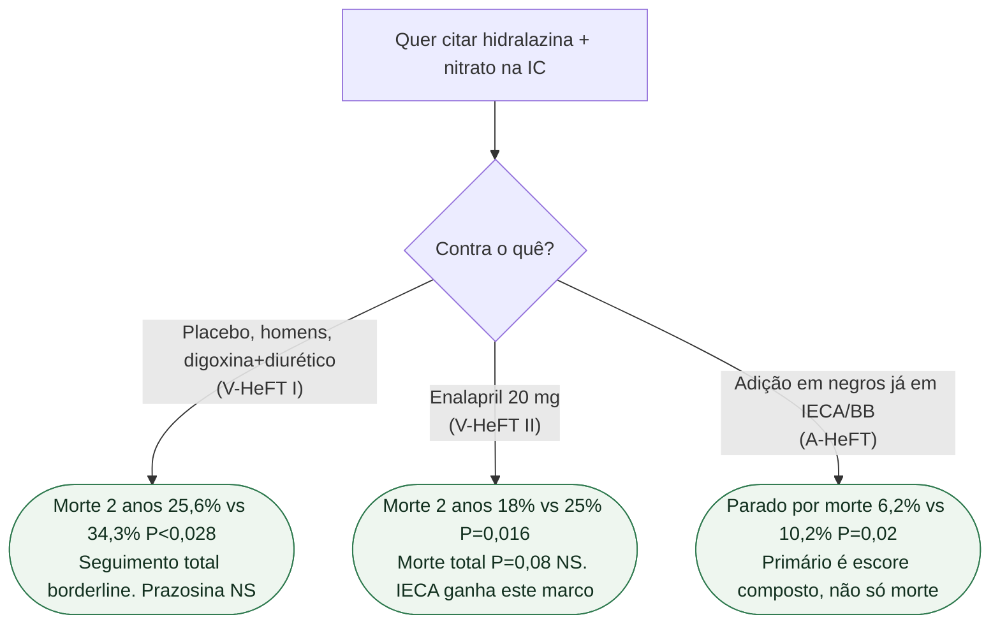

# Fluxograma: qual ensaio da hidralazina+nitrato?

## Mensagem prática

**V-HeFT I não é V-HeFT II não é A-HeFT.** Enalapril ganhou o 2.º ano contra H-ISDN. A-HeFT é adição, não substituição do IECA.
