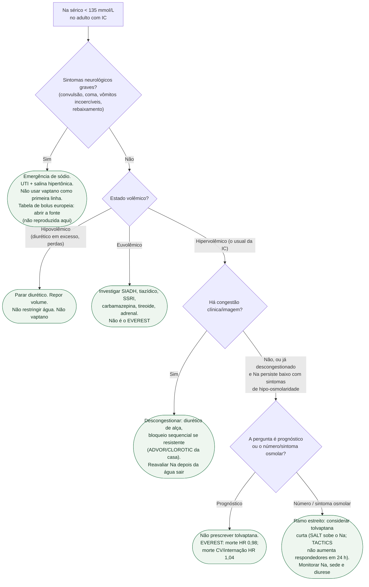

# Fluxograma: hiponatremia no adulto com insuficiência cardíaca

## O que a árvore não mostra

**SODIUM-HF** restringe sódio **na dieta** e não trata hiponatremia. **Piora renal no TACTICS** não autoriza abandonar o diurético de alça — autoriza não somar vaptano achando que o congesto vai “responder” mais em 24 h.

## Mensagem prática

Cérebro primeiro. Volume depois. Congestão em seguida. Vaptano por último, e só para o número — nunca para a sobrevida.
