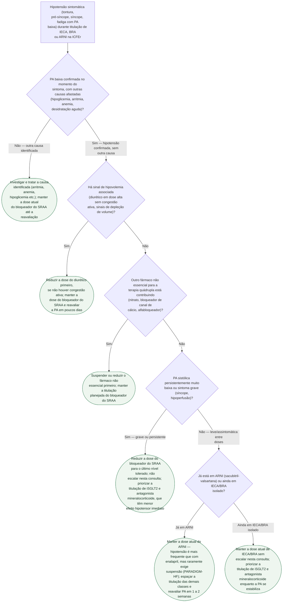

# Fluxograma: Manejo da Hipotensão Sintomática Limitando a Titulação de IECA/BRA/ARNI na ICFEr

Hipotensão é a razão mais comum de intolerância à titulação do bloqueio do
SRAA na ICFEr — mais frequente com sacubitril-valsartana que com enalapril no
PARADIGM-HF, sem que isso tenha exigido excesso de suspensão do fármaco. O
erro mais caro na prática não é a hipotensão em si: é **reduzir ou suspender
um pilar de sobrevida por um sintoma que, investigado, tinha outra causa**, ou
**reduzir o bloqueador do SRAA quando outro fármaco não essencial poderia ter
sido retirado primeiro**.

## Árvore de decisão

## O que a árvore não mostra

**Não há corte numérico único e validado** de PA sistólica que defina
"persistentemente muito baixa" na titulação de GDMT — as fontes revisadas não
oferecem esse número, e a decisão em D4 é clínica (sintoma, tolerância
funcional, tendência), não um limiar fixo.

**Início da terapia após iniciação recente na internação** (PIONEER-HF) tem
perfil de segurança próprio, sem diferença significativa de hipotensão
sintomática frente ao enalapril nesse cenário específico — cenário distinto do
paciente ambulatorial em titulação crônica, que é o foco desta árvore. Ver
`sacubitril-valsartana-iniciada-na-internacao-o-ensaio-pioneer-hf.md` para a
hipotensão na iniciação hospitalar.

**Manejo de hipercalemia concomitante** não é o objeto deste fluxograma — ver
`hipercalemia-como-barreira-ao-bloqueio-do-sraa-o-ensaio-diamond-com-patiromer.md`
nesta pasta.

**Medida não farmacológica** (elevação da cabeceira, meias de compressão,
hidratação oral quando não há congestão) é parte do cuidado geral do paciente
com hipotensão ortostática e não aparece como ramo próprio — é conduta
complementar em qualquer ponto da árvore, não uma decisão que altera o
próximo passo farmacológico.