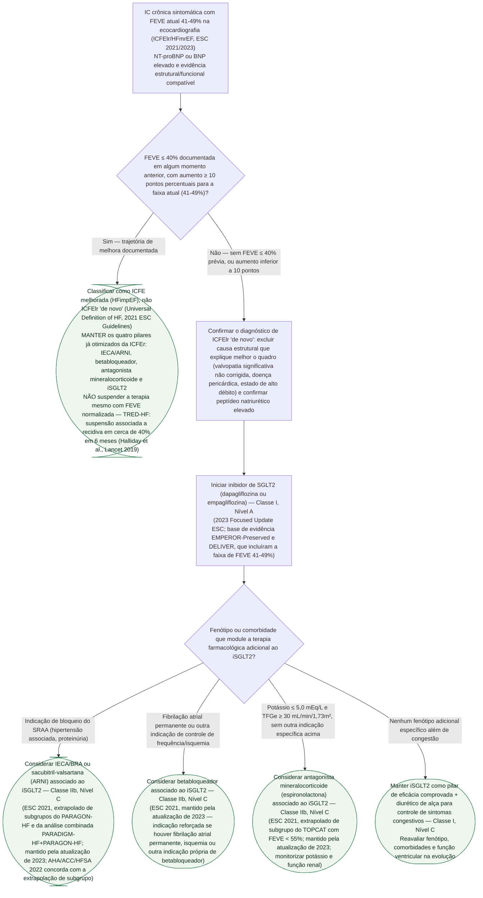

# Fluxograma: ICFElr (FEVE 41-49%) — diagnóstico diferencial e escolha terapêutica farmacológica

A insuficiência cardíaca com fração de ejeção levemente reduzida (ICFElr, HFmrEF, FEVE
41-49%) não é uma categoria homogênea. A Universal Definition of Heart Failure (2021) e as
Diretrizes ESC 2021 formalizaram uma distinção que muda diretamente a conduta: parte dos
pacientes com FEVE hoje entre 41 e 49% teve, no passado, ICFEr (FEVE ≤ 40%) e melhorou sob
tratamento — é a IC com fração de ejeção melhorada (ICFE melhorada, HFimpEF) —, enquanto
outra parte nunca teve FEVE ≤ 40% documentada, sendo ICFElr "de novo". O ensaio TRED-HF
mostrou que suspender a terapia médica otimizada em quem melhorou a FEVE não é seguro: a
recidiva foi próxima de 40% em 6 meses no grupo que teve a medicação retirada. Por isso, a
primeira pergunta antes de escalonar terapia numa FEVE de 41-49% é se esse paciente já foi
ICFEr — a resposta muda a base do tratamento antes mesmo de discutir qual classe adicionar.

## Árvore de decisão

Duas armadilhas clínicas que este fluxograma resolve explicitamente. A primeira é tratar
toda FEVE de 41-49% como uma única entidade: um paciente que já foi ICFEr e melhorou não
deve ter a terapia desescalonada só porque a fração de ejeção normalizou — o TRED-HF mostrou
que a melhora depende da manutenção do tratamento, não é uma cura estrutural. A segunda é
esperar, na ICFElr "de novo", o mesmo nível de evidência da ICFEr: só o iSGLT2 tem ensaio
randomizado dedicado a essa faixa (recomendação Classe I); IECA/BRA, ARNI, betabloqueador e
antagonista mineralocorticoide seguem em Classe IIb, Nível C, apoiados em subgrupos de
ensaios desenhados para ICFEr ou ICFEp — a decisão de associá-los deve ser individualizada
pelo fenótipo do paciente, não automática.