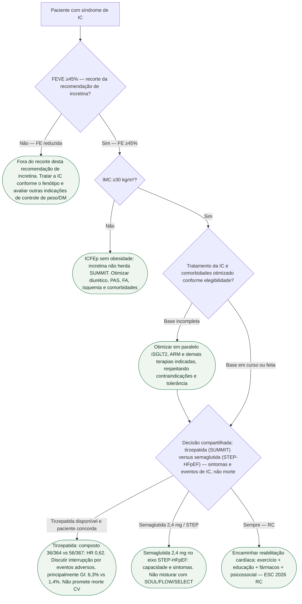

# Fluxograma: ICFEp com obesidade — onde entra a incretina após SUMMIT

ESC 2026: classe **IIa B1** para semaglutida ou tirzepatida na IC sintomática, **FEVE ≥45% e IMC ≥30 kg/m²**, para peso, capacidade de exercício e qualidade de vida, com ou sem diabetes. STEP-HFpEF incluiu FEVE ≥45%; SUMMIT incluiu FEVE ≥50%. SUMMIT: composto 9,9% vs 15,3%; HR 0,62; puxado por piora de IC, **não** por morte CV (HR 1,58; IC atravessa 1). KCCQ +6,9. Não é SURPASS-CVOT.

## Árvore de decisão

## Tudo com Tudo

- [Incretinas na ICFEp com obesidade: ESC 2026 Classe IIa](/biblioteca/incretinas-na-icfep-com-obesidade-esc-2026-classe-iia)
- [SUMMIT: tirzepatida na ICFEp com obesidade](/biblioteca/summit-tirzepatida-icfep-com-obesidade)
- [STEP-HFpEF: semaglutida 2,4 mg — sintomas, não o SUMMIT](/biblioteca/step-hfpef-semaglutida-24-sintomas-nao-e-summit)
- [Fluxograma: ARM independente da FEVE — ESC 2026](/biblioteca/fluxograma-mra-independente-da-feve-esc-2026)
