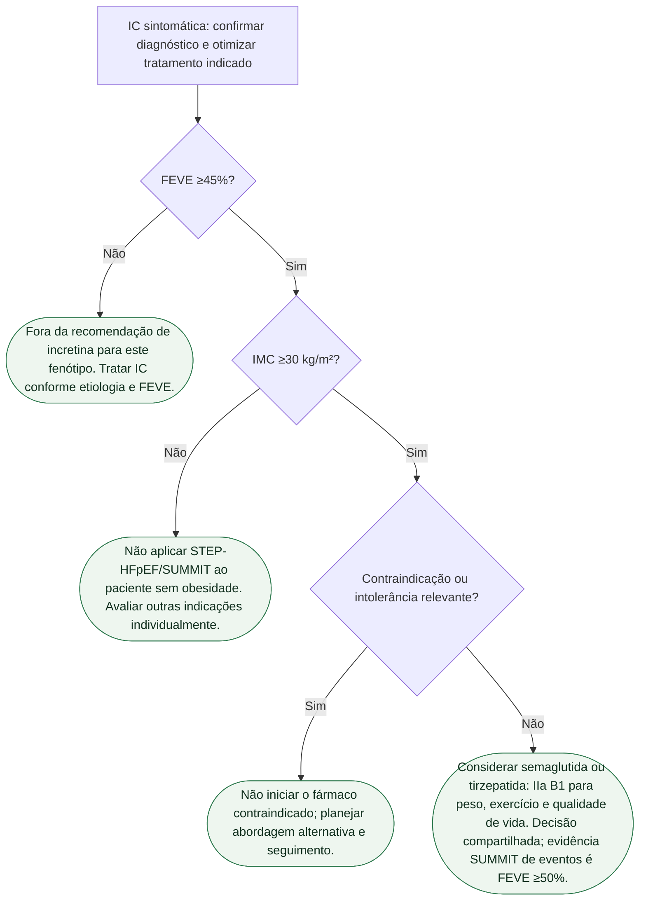

# Fluxograma: ICFEp com obesidade — onde entra a incretina após SUMMIT

ESC 2026: classe **IIa** para semaglutida/tirzepatida na ICFEp com obesidade. SUMMIT: composto 9,9% vs 15,3%; HR 0,62; puxado por piora de IC, **não** por morte CV (HR 1,58; IC atravessa 1). KCCQ +6,9. Não é SURPASS-CVOT.

Otimizar iSGLT2, ARM, diurético e demais tratamentos conforme indicação e tolerância, em paralelo. Não há pré-requisito de completar toda titulação antes de avaliar incretina. Reabilitação e cuidados psicossociais acompanham os ramos elegíveis; não são alternativa mutuamente exclusiva ao medicamento.

## Árvore de decisão

## Tudo com Tudo

- Insuficiência cardíaca
- Diabetes e cardiologia
- Reabilitação cardíaca
- Farmacologia
- Comunicação clínica
- Prevenção e lipídios
