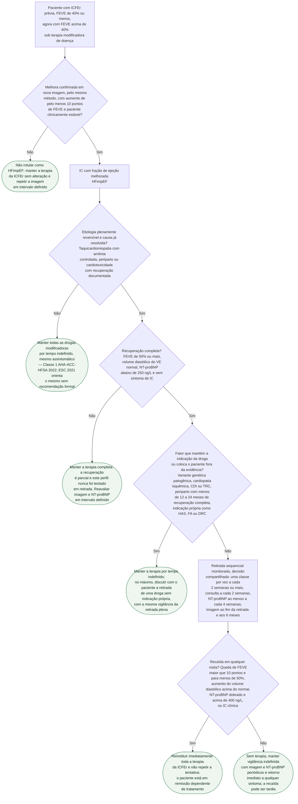

# Fluxograma: ICFEr com fração de ejeção melhorada (HFimpEF) — manter ou retirar a terapia

A fração de ejeção que sobe de 40% ou menos para acima de 40% sob os quatro pilares é o melhor resultado que a terapia da ICFEr pode entregar — e é exatamente nesse momento que o paciente assintomático pergunta se pode parar os remédios. A resposta das diretrizes é a mesma nos dois lados do Atlântico: **melhora de FEVE é remissão sob tratamento, não cura**. A AHA/ACC/HFSA 2022 incorporou em diretriz a categoria HFimpEF, cunhada pela Definição Universal de 2021, e fez da manutenção da terapia uma recomendação Classe 1; a ESC 2021 orienta o mesmo, sem entrada formal em tabela de recomendação. A evidência que sustenta as duas é um único ensaio pequeno, o TRED-HF, cujo resultado é difícil de esquecer: **44% dos pacientes que retiraram a terapia recaíram em 6 meses, contra nenhum dos que a mantiveram**.

Este fluxograma cobre a decisão que vem depois da classificação por FEVE — não repete a classificação nem os pilares, que estão em `fluxograma-insuficiencia-cardiaca-cronica-por-fracao-de-ejecao-esc-2023` e em `icfer-classificacao-diagnostico-quatro-pilares`.

## Árvore de decisão

## O que é HFimpEF e por que a confirmação vem antes do rótulo

A AHA/ACC/HFSA 2022 define HFimpEF como **FEVE prévia de 40% ou menos com medida de seguimento acima de 40%**. A Definição Universal de 2021, mantida na Segunda Definição de 2026 (AHA/ACC/ESC/WHF, documento de definição, não de tratamento), exige ainda o critério de **aumento de pelo menos 10 pontos percentuais** em relação à basal, para que a variação de método não transforme 38% em 41% e crie uma categoria nova sem mudança biológica — ver `segunda-definicao-universal-insuficiencia-cardiaca-2026`. Na ESC 2021 a classificação continua sendo ICFEr (40% ou menos), ICFEml (41 a 49%) e ICFEp (50% ou mais); a diretriz reconhece, na seção 3.2.3, que alguns pacientes recuperam a função ventricular por completo (cardiomiopatia alcoólica, miocardite viral, Takotsubo, periparto, taquicardiomiopatia) e que outros recuperam substancialmente sob drogas e dispositivos. A atualização focada de 2023 não trata do tema.

Por isso o primeiro nó da árvore é a confirmação: mesma modalidade de imagem, paciente compensado, aumento real. Quem não preenche isso continua sendo tratado como ICFEr e repete a imagem — nada a decidir ainda.

## A regra: manter tudo

Na AHA/ACC/HFSA 2022: **"recomenda-se que a GDMT seja continuada em pacientes com HFimpEF, incluindo os assintomáticos, para prevenir recaída de IC e de disfunção do VE"** — Classe 1 (texto da recomendação no resumo oficial da ACC, que não informa classe; Classe I confirmada na comparação de Behnoush et al., ESC Heart Fail 2023). O nível de evidência atribuído é B-R (VERIFICAÇÃO HUMANA NECESSÁRIA: lido em fonte secundária de educação continuada; o texto da Circulation bloqueou o acesso nesta sessão e nenhuma fonte aberta informa o nível). A ESC 2021 orienta a manutenção da terapia citando o TRED-HF, mas sem entrada em tabela de recomendação com classe e nível — leitura da comparação de diretrizes de MacDonald et al. (CJC Open 2023); a redação literal do parágrafo da ESC não foi lida (VERIFICAÇÃO HUMANA NECESSÁRIA).

A lógica é a do TRED-HF: FEVE normalizada sob tratamento é, na maioria, **remissão dependente de tratamento**, e não há hoje preditor confiável que separe quem está curado de quem está em remissão. Isso vale também para o paciente assintomático, para o que "se sente ótimo" e para o que quer reduzir comprimidos.

## O TRED-HF, em números

Ensaio piloto, aberto, monocêntrico (Royal Brompton, Londres), em cardiomiopatia dilatada não isquêmica recuperada.

| Item | TRED-HF |
|---|---|
| Inclusão | FEVE prévia de 40% ou menos, atual de 50% ou mais, volume diastólico indexado do VE normal, NT-proBNP abaixo de 250 ng/L, sem sintoma de IC; tempo mínimo de disfunção prévia não exigido |
| Randomizados | 51 (25 retirada, 26 manutenção) |
| Terapia basal | IECA ou BRA 100%, betabloqueador 88%, antagonista mineralocorticoide 47%, diurético de alça 12% — sem sacubitril-valsartana nem iSGLT2 no esquema |
| Ordem de retirada | diurético de alça, depois AMR, depois betabloqueador, por último IECA ou BRA; ajuste a cada 2 semanas, até 16 semanas |
| Vigilância | consulta a cada 2 semanas, NT-proBNP ao menos a cada 4 semanas, ressonância em 16 semanas e 6 meses |
| Desfecho primário: recaída | queda de FEVE maior que 10 pontos e para menos de 50%, ou aumento do volume diastólico maior que 10% e acima do normal, ou NT-proBNP dobrado e acima de 400 ng/L, ou IC clínica |
| Recaída em 6 meses | 11 de 25 no braço de retirada — **44%** (IC 95% 28,5 a 67,2) vs. 0 de 26 mantidos |
| Fase de crossover | 9 de 25 do braço mantido recaíram ao retirar — 36% |
| Total | 20 de 50 — 40% |
| FEVE no braço de retirada aos 6 meses | queda média de 9,5 pontos (IC 95% 4,9 a 14,0) |
| Após reinstituir | 17 de 20 voltaram a FEVE acima de 50% na visita seguinte, todos assintomáticos |

Os critérios de recaída do ensaio são os do nó D5: são o que se monitora quando se decide retirar. O fato de 85% recuperarem de novo ao reinstituir a terapia é o que torna a retirada monitorada defensável na exceção — mas é um argumento a favor da vigilância, não a favor de retirar.

## A exceção: etiologia reversível resolvida, com recuperação completa

A árvore só chega a P2 quando três filtros foram passados: causa plenamente reversível e já tratada (D2), recuperação completa pelos critérios do TRED-HF (D3) e nenhum fator que mantenha a indicação da droga (D4). As três etiologias do nó D2 têm evidência própria e desigual.

| Etiologia | O que a fonte lida diz | Consequência na árvore |
|---|---|---|
| Taquicardiomiopatia | recuperação da FEVE confirma o diagnóstico após controle da arritmia, mas há relatos de morte súbita com FEVE já normalizada e de declínio rápido se a arritmia recorre — ver `cardiomiopatia-induzida-por-taquicardia-reversibilidade-apos-controle-da-arritmia` | retirada só com controle de ritmo documentado e vigilância indefinida |
| Periparto | HFA/ESC 2019: manter o esquema completo **por pelo menos 12 a 24 meses após recuperação completa**; se decidida a retirada, ordem AMR, depois IECA/BRA/ARNI, depois betabloqueador, com imagem e biomarcador seriados; pequena coorte sem piora após parar, "não é evidência definitiva de segurança"; **variante genética identificada: terapia indefinida** (VERIFICAÇÃO HUMANA NECESSÁRIA: ordem de retirada, citação e regra genética não reconferidas na auditoria, que não conseguiu abrir o texto da Wiley; o prazo de 12 a 24 meses foi corroborado em revisão aberta) — ver `cardiomiopatia-periparto-criterios-diagnosticos-recuperacao-e-manejo` | entra em D4 como fator de manutenção até completar o prazo |
| Cardiotoxicidade | a ESC 2022 de cardio-oncologia tem recomendações específicas para a terapia de longo prazo após CTRCD recuperada, que não foram lidas nesta sessão (VERIFICAÇÃO HUMANA NECESSÁRIA); a conduta durante o tratamento oncológico está em `fluxograma-disfuncao-cardiaca-por-antraciclina-e-anti-her2-esc-2022` | decisão conjunta com cardio-oncologia; nunca retirar durante exposição ativa |

Os fatores do nó D4 que colocam o paciente fora da evidência — cardiopatia isquêmica, dispositivo implantado, variante genética patogênica — são extrapolação de julgamento clínico a partir dos critérios do TRED-HF (só cardiomiopatia dilatada não isquêmica) e da recomendação da HFA para periparto genética, não regras numéricas de diretriz. O mesmo vale para a indicação própria: um IECA que trata hipertensão, um betabloqueador que controla fibrilação atrial e um iSGLT2 indicado por doença renal crônica não são candidatos à retirada por causa da FEVE.

## Como retirar, quando se retira

O nó P2 reproduz o protocolo do TRED-HF porque é o único testado: **uma classe por vez**, intervalo mínimo de 2 semanas, consulta a cada 2 semanas, NT-proBNP ao menos a cada 4 semanas, imagem ao fim da retirada e aos 6 meses. A ordem do ensaio (diurético, AMR, betabloqueador, IECA/BRA) e a da HFA para periparto (AMR, IECA/BRA/ARNI, betabloqueador) divergem na posição do betabloqueador; nenhuma das duas foi comparada à outra. Qualquer critério de recaída de D5 interrompe a tentativa: reinstituir tudo, e não tentar de novo. Quem chega ao nó C6 sem recair não recebeu alta — o próprio TRED-HF pede que trabalhos futuros identifiquem quem tem recuperação permanente, e até lá a vigilância é indefinida.

## Limitações e o que confirmar

- Nível de evidência B-R da recomendação Classe 1 da AHA/ACC/HFSA 2022: VERIFICAÇÃO HUMANA NECESSÁRIA na tabela de recomendação da Circulation 2022;145:e895 (acesso bloqueado nesta sessão; o texto da recomendação está no resumo oficial da ACC, que não informa classe nem nível; a Classe I foi confirmada na comparação de Behnoush et al., ESC Heart Fail 2023, PMC10192289).
- Ordem de retirada da HFA/ESC 2019 para periparto (AMR, depois IECA/BRA/ARNI, depois betabloqueador), a citação sobre a coorte sem piora e a regra de terapia indefinida com variante genética: VERIFICAÇÃO HUMANA NECESSÁRIA — a auditoria não conseguiu abrir o texto integral da Wiley; só o prazo de 12 a 24 meses após recuperação completa foi corroborado em fonte aberta.
- Redação literal da ESC 2021 sobre continuar a terapia após recuperação da FEVE: VERIFICAÇÃO HUMANA NECESSÁRIA — a orientação "sem recomendação formal, citando o TRED-HF" vem da comparação de MacDonald et al. (CJC Open 2023); o texto da OUP veio truncado antes das seções de tratamento.
- Recomendações da ESC 2022 de cardio-oncologia sobre retirada da terapia de IC após CTRCD recuperada: VERIFICAÇÃO HUMANA NECESSÁRIA — não lidas; a linha de cardiotoxicidade da árvore é conduta de princípio, sem classe.
- O TRED-HF é piloto, aberto, monocêntrico, com 51 pacientes e 6 meses de seguimento, sem ARNI nem iSGLT2 no esquema retirado; os critérios de D3 e D5 são os do ensaio, não cortes de diretriz.
- Os fatores de exclusão do nó D4 (isquêmico, dispositivo, variante genética fora do contexto periparto) são julgamento clínico declarado, não recomendação numerada.

## Tudo com Tudo

- [Fluxograma: Insuficiência Cardíaca crônica — conduta por fração de ejeção (ESC 2021 / atualização 2023)](/biblioteca/fluxograma-insuficiencia-cardiaca-cronica-por-fracao-de-ejecao-esc-2023)
- [Insuficiência Cardíaca com Fração de Ejeção Reduzida — Classificação, Diagnóstico e os Quatro Pilares Terapêuticos](/biblioteca/icfer-classificacao-diagnostico-quatro-pilares)
- [Segunda Definição Universal de Insuficiência Cardíaca — Consenso AHA/ACC/ESC/WHF 2026](/biblioteca/segunda-definicao-universal-insuficiencia-cardiaca-2026)
- [Cardiomiopatia Induzida por Taquicardia (Arritmia): Reversibilidade Após Controle da Arritmia Culpada](/biblioteca/cardiomiopatia-induzida-por-taquicardia-reversibilidade-apos-controle-da-arritmia)
- [Cardiomiopatia Periparto: Critérios Diagnósticos, Recuperação e Manejo Atual](/biblioteca/cardiomiopatia-periparto-criterios-diagnosticos-recuperacao-e-manejo)
- [Fluxograma: Disfunção cardíaca relacionada ao tratamento oncológico — antraciclina e terapia anti-HER2 (ESC 2022)](/biblioteca/fluxograma-disfuncao-cardiaca-por-antraciclina-e-anti-her2-esc-2022)
- [Fluxograma: Sequenciamento e Titulação da Terapia Quádrupla na ICFEr](/biblioteca/fluxograma-sequenciamento-titulacao-terapia-quadrupla-icfer)
