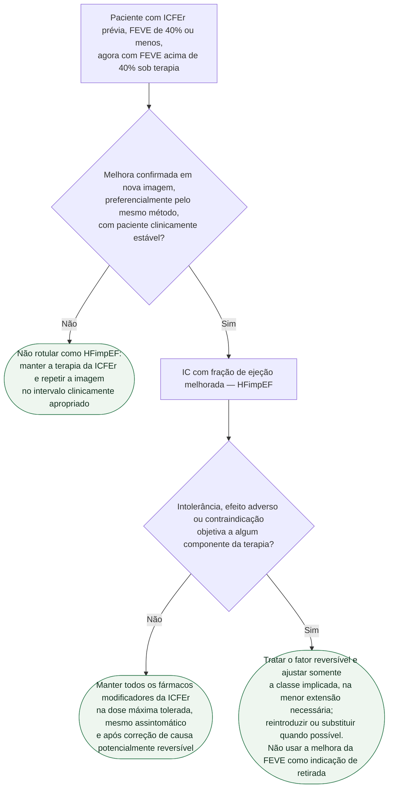

# Fluxograma: ICFEr com fração de ejeção melhorada (HFimpEF) — manter ou retirar a terapia

A melhora da fração de ejeção sob tratamento representa remissão, não cura demonstrada. A AHA/ACC/HFSA 2022 recomenda continuar a terapia da ICFEr em pacientes com HFimpEF, inclusive assintomáticos, para prevenir recaída de insuficiência cardíaca e disfunção ventricular. Nenhuma diretriz ou ensaio definiu uma etiologia “reversível” em que seja seguro suspender rotineiramente os fármacos modificadores de doença.

## Árvore de decisão

## O que é HFimpEF

A AHA/ACC/HFSA 2022 define HFimpEF como FEVE prévia de 40% ou menos e medida de seguimento acima de 40%. A Definição Universal acrescenta aumento de pelo menos 10 pontos percentuais. Quando a diferença é pequena, convém confirmar pelo mesmo método de imagem e em condição clínica estável antes de mudar o rótulo — sem alterar a terapia enquanto isso.

## A regra: manter a terapia

A recomendação da AHA/ACC/HFSA 2022 é continuar o tratamento da ICFEr em pacientes com HFimpEF, inclusive assintomáticos, para prevenir recaída. Isso inclui os fármacos modificadores de doença que o paciente tolera. Taquicardiomiopatia controlada, cardiomiopatia periparto recuperada, miocardite e cardiotoxicidade tratada não constituem, por si sós, autorização para retirada: esses grupos não foram validados como subgrupos de baixo risco em ensaio de suspensão.

Se surgir hipotensão sintomática, disfunção renal aguda, hipercalemia, bradicardia ou outro evento adverso, a conduta é corrigir a causa e ajustar temporariamente a classe responsável, de modo individualizado. Essa decisão é diferente de retirar toda a terapia por considerar o coração “curado”. Indicações independentes — hipertensão, fibrilação atrial, doença renal crônica ou diabetes — também permanecem válidas.

## O que o TRED-HF mostrou

O TRED-HF foi um ensaio piloto, aberto e monocêntrico em cardiomiopatia dilatada não isquêmica recuperada. Incluiu 51 pacientes com FEVE prévia de 40% ou menos, FEVE atual de 50% ou mais, volume diastólico do VE normal, NT-proBNP abaixo de 250 ng/L e ausência de sintomas.

| Resultado | TRED-HF |
|---|---|
| Recaída em 6 meses | 11 de 25 após retirada — 44% — versus 0 de 26 com manutenção |
| Fase de crossover | 9 de 25 recaíram ao retirar a terapia |
| Total com recaída | 20 de 50 — 40% |
| Critério de recaída | queda de FEVE maior que 10 pontos para menos de 50%; aumento do volume diastólico acima do normal; NT-proBNP dobrado e acima de 400 ng/L; ou insuficiência cardíaca clínica |

O protocolo de retirada do estudo não deve ser usado como autorização clínica para suspender tratamento. Ele serviu para testar a hipótese e revelou taxa alta de recaída; não identificou um perfil confiável de “cura”. Além disso, o esquema basal era anterior ao uso contemporâneo de ARNI e iSGLT2.

## Limitações

- O TRED-HF tinha amostra pequena, seguimento inicial de 6 meses e população selecionada com cardiomiopatia dilatada não isquêmica.
- Não existe marcador isolado que demonstre segurança para retirar terapia em HFimpEF.
- Ajustes por contraindicação ou intolerância devem ser feitos classe a classe e não equivalem a suspensão por melhora da FEVE.

## Tudo com Tudo

- [Fluxograma: Insuficiência Cardíaca crônica — conduta por fração de ejeção (ESC 2021 / atualização 2023)](/biblioteca/fluxograma-insuficiencia-cardiaca-cronica-por-fracao-de-ejecao-esc-2023)
- [Insuficiência Cardíaca com Fração de Ejeção Reduzida — Classificação, Diagnóstico e os Quatro Pilares Terapêuticos](/biblioteca/icfer-classificacao-diagnostico-quatro-pilares)
- [Segunda Definição Universal de Insuficiência Cardíaca — Consenso AHA/ACC/ESC/WHF 2026](/biblioteca/segunda-definicao-universal-insuficiencia-cardiaca-2026)
- [Cardiomiopatia Induzida por Taquicardia: reversibilidade após controle da arritmia](/biblioteca/cardiomiopatia-induzida-por-taquicardia-reversibilidade-apos-controle-da-arritmia)
- [Cardiomiopatia Periparto: critérios diagnósticos, recuperação e manejo](/biblioteca/cardiomiopatia-periparto-criterios-diagnosticos-recuperacao-e-manejo)
- [Fluxograma: Sequenciamento e Titulação da Terapia Quádrupla na ICFEr](/biblioteca/fluxograma-sequenciamento-titulacao-terapia-quadrupla-icfer)
