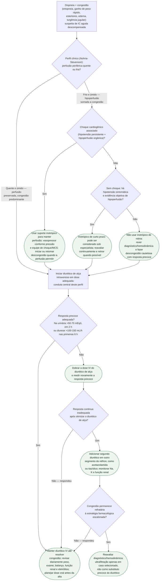

# Insuficiência cardíaca aguda descompensada

Gatilho: dispneia, congestão (ortopneia, edema, turgência jugular, estertores)
e ganho de peso rápido. Antes de tratar, classifique o perfil clínico
(Nohria-Stevenson) — ele separa quem trata só com diurético de quem pode
precisar de suporte hemodinâmico antes ou junto do diurético. Dentro do ramo
diurético, a pergunta que decide o próximo passo é sempre a mesma: a resposta
ao diurético inicial foi adequada?

## Árvore de decisão

## O que se repete em todo ramo, e por isso não está no diagrama

**Reavaliação precoce e diária.** Nas primeiras horas, diurese e sódio urinário
identificam rapidamente resposta insuficiente; depois, peso, exame de congestão,
balanço, função renal e eletrólitos mostram a trajetória até a euvolemia.

**Investigar e tratar o fator precipitante** (síndrome coronariana aguda,
arritmia, infecção, má adesão, crise hipertensiva) em paralelo ao tratamento
da congestão, não depois dele.

**Suporte geral**: oxigênio quando há hipoxemia (ESC: SpO2 <90% ou PaO2
<60 mmHg), monitorização proporcional à gravidade e tratamento simultâneo do
fator precipitante.

## Como escalonar a estratégia diurética quando a resposta é inadequada

A escalada não é um único passo, é uma sequência, na ordem em que a evidência
sustenta:

1. **Medir cedo e otimizar o diurético de alça primeiro.** A ESC propõe como
   resposta satisfatória sódio urinário >50-70 mEq/L em 2 horas e/ou diurese
   >100-150 mL/h nas primeiras 6 horas. Se insuficiente, dobrar a dose IV e
   medir novamente. O DOSE-AHF (PMID 21366472) não mostrou superioridade de
   infusão contínua sobre bolus; por isso, infusão não é degrau obrigatório
   antes de associar outro fármaco.
2. **Associar um segundo agente** quando o diurético de alça otimizado ainda
   não é suficiente: acetazolamida (ADVOR, Mullens W et al., 2022, PMID
   36027559 — descongestão bem-sucedida em 42,2% vs. 30,5% com placebo, sem
   diferença em morte ou re-hospitalização) ou um tiazídico associado, no
   bloqueio sequencial do néfron (CLOROTIC, Trullàs JC et al., 2023, PMID
   36423214 — mais perda de peso e mais diurese, à custa de piora renal
   significativamente mais frequente: 46,5% vs. 17,2%).
3. **Ultrafiltração como último recurso**, não como alternativa antecipada à
   falta de resposta: o CARRESS-HF (Bart BA et al., 2012, PMID 23131078)
   mostrou que a ultrafiltração foi inferior à terapia farmacológica
   escalonada, com maior piora da função renal e mais eventos adversos
   graves, sem descongestionar melhor.

Os números completos de cada ensaio estão em
`estrategia-diuretica-na-insuficiencia-cardiaca-aguda-descompensada.md` e em
`resistencia-diuretica-na-insuficiencia-cardiaca-aguda-mecanismos-e-bloqueio-sequencial-do-nefron.md`,
nesta mesma pasta — não duplicados aqui.

## Suporte hemodinâmico no perfil frio e úmido

Quando há hipoperfusão associada à congestão, o diurético isolado pode não
ser suficiente ou pode precisar de suporte associado para ser tolerado. Dois
pontos vindos da evidência revisada nesta pasta:

- **Se há choque cardiogênico franco** (hipotensão persistente com
  hipoperfusão orgânica), a prioridade muda para suporte hemodinâmico e
  avaliação de suporte circulatório mecânico — cenário já coberto pelo
  fluxograma de choque cardiogênico (estágios SCAI), que também traz o
  resultado negativo do ECLS-SHOCK para ECMO venoarterial precoce de rotina.
- **Sem choque franco**, “frio e úmido” não autoriza inotrópico por si só. A
  ESC desaconselha uso rotineiro, exceto quando coexistem hipotensão sintomática
  e hipoperfusão. O OPTIME-CHF (PMID 11911756) reforça a cautela: milrinone de
  rotina não melhorou o desfecho primário e aumentou hipotensão sustentada e
  arritmia atrial nova. Na subanálise (PMID 12651048), a etiologia isquêmica
  apresentou sinal de pior desfecho.

**Escolha e dose exatas de vasopressor/inotrópico** não são detalhadas aqui.
AHA/ACC/HFSA recomenda suporte inotrópico no choque para manter perfusão e
preservar órgãos, mas não demonstra superioridade robusta de um agente. Pressão,
arritmias, etiologia e disponibilidade orientam a escolha. Consulte o fluxo de
choque cardiogênico e o documento específico de suporte inotrópico ligados
abaixo; este fluxograma não deve ser usado como prescrição.

## O que este fluxograma não cobre

**Vasodilatadores intravenosos na fase aguda** — não cobertos pelo
documento-fonte da estratégia diurética, que já registra essa lacuna.

**Critério numérico de quando escalar de farmacológico para ultrafiltração**
— a hierarquia (farmacológico antes de mecânico) está estabelecida, o
gatilho exato não.

**Doses completas dos esquemas de diurético e da hidroclorotiazida do
CLOROTIC** — ficam no protocolo farmacológico/institucional; este fluxo define
a sequência e os critérios de resposta, não substitui prescrição.

## Tudo com Tudo

- [Estratégia diurética na IC aguda descompensada](estrategia-diuretica-na-insuficiencia-cardiaca-aguda-descompensada.md)
- [Fluxograma de resistência diurética e congestão refratária](fluxograma-resistencia-diuretica-e-congestao-refrataria-na-ic-aguda.md)
- [Resistência diurética e bloqueio sequencial do néfron](resistencia-diuretica-na-insuficiencia-cardiaca-aguda-mecanismos-e-bloqueio-sequencial-do-nefron.md)
- [Suporte inotrópico na IC aguda e OPTIME-CHF](suporte-inotropico-na-ic-aguda-descompensada-optime-chf-e-o-sinal-na-etiologia-isquemica.md)
- [Fluxograma de choque cardiogênico — estágios SCAI](../Terapia_intensiva/fluxograma-choque-cardiogenico-estagios-scai.md)
