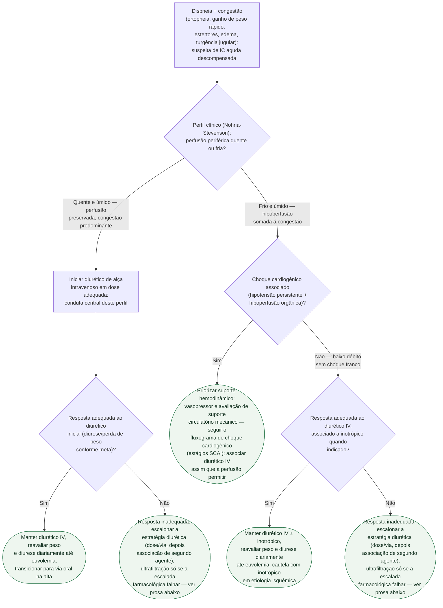

# Insuficiência cardíaca aguda descompensada

Gatilho: dispneia, congestão (ortopneia, edema, turgência jugular, estertores)
e ganho de peso rápido. Antes de tratar, classifique o perfil clínico
(Nohria-Stevenson) — ele separa quem trata só com diurético de quem pode
precisar de suporte hemodinâmico antes ou junto do diurético. Dentro do ramo
diurético, a pergunta que decide o próximo passo é sempre a mesma: a resposta
ao diurético inicial foi adequada?

## Árvore de decisão

## O que se repete em todo ramo, e por isso não está no diagrama

**Reavaliação diária** de peso, balanço hídrico, diurese, função renal e
eletrólitos — em qualquer perfil e em qualquer ponto da árvore, é o que
decide se o paciente segue no mesmo passo ou precisa reclassificar.

**Investigar e tratar o fator precipitante** (síndrome coronariana aguda,
arritmia, infecção, má adesão, crise hipertensiva) em paralelo ao tratamento
da congestão, não depois dele.

**Suporte geral**: oxigênio se saturação baixa, monitorização contínua,
via de administração intravenosa desde a admissão.

## Como escalonar a estratégia diurética quando a resposta é inadequada

A escalada não é um único passo, é uma sequência, na ordem em que a evidência
sustenta:

1. **Otimizar o próprio diurético de alça primeiro** — aumentar a dose e
   considerar infusão contínua antes de acrescentar qualquer outro fármaco. O
   DOSE-AHF (Felker GM et al., 2011, PMID 21366472) não mostrou diferença
   significativa entre bolus e infusão contínua, nem entre dose baixa e dose
   alta (2,5× a dose oral prévia) nos desfechos coprimários — mas a dose alta
   produziu maior diurese, à custa de piora transitória e não significativa da
   creatinina.
2. **Associar um segundo agente** quando o diurético de alça otimizado ainda
   não é suficiente: acetazolamida (ADVOR, Mullens W et al., 2022, PMID
   36027559 — descongestão bem-sucedida em 42,2% vs. 30,5% com placebo, sem
   diferença em morte ou re-hospitalização) ou um tiazídico associado, no
   bloqueio sequencial do néfron (CLOROTIC, Trullàs JC et al., 2023, PMID
   36423214 — mais perda de peso e mais diurese, à custa de piora renal
   significativamente mais frequente: 46,5% vs. 17,2%).
3. **Ultrafiltração como último recurso**, não como alternativa antecipada à
   falta de resposta: o CARRESS-HF (Bart BA et al., 2012, PMID 23131078)
   mostrou que a ultrafiltração foi inferior à terapia farmacológica
   escalonada, com maior piora da função renal e mais eventos adversos
   graves, sem descongestionar melhor.

Os números completos de cada ensaio estão em
`estrategia-diuretica-na-insuficiencia-cardiaca-aguda-descompensada.md` e em
`resistencia-diuretica-na-insuficiencia-cardiaca-aguda-mecanismos-e-bloqueio-sequencial-do-nefron.md`,
nesta mesma pasta — não duplicados aqui.

## Suporte hemodinâmico no perfil frio e úmido

Quando há hipoperfusão associada à congestão, o diurético isolado pode não
ser suficiente ou pode precisar de suporte associado para ser tolerado. Dois
pontos vindos da evidência revisada nesta pasta:

- **Se há choque cardiogênico franco** (hipotensão persistente com
  hipoperfusão orgânica), a prioridade muda para suporte hemodinâmico e
  avaliação de suporte circulatório mecânico — cenário já coberto pelo
  fluxograma de choque cardiogênico (estágios SCAI), que também traz o
  resultado negativo do ECLS-SHOCK para ECMO venoarterial precoce de rotina.
- **Sem choque franco**, o inotrópico pode ser associado ao diurético para
  baixo débito persistente, mas o OPTIME-CHF (Cuffe MS et al., 2002, PMID
  11911756) não sustenta o uso rotineiro de milrinone: sem diferença no
  desfecho primário frente a placebo, e mais hipotensão sustentada e
  arritmia atrial nova. A subanálise por etiologia (Felker GM et al., 2003,
  PMID 12651048) é o que mais pesa na decisão: em cardiomiopatia
  **isquêmica**, milrinone associou-se a pior desfecho (interação
  significativa); em **não isquêmica**, o efeito foi neutro a favorável.

**Escolha e dose exatas de vasopressor/inotrópico** no choque cardiogênico
não são detalhadas aqui — não são o tema do documento-fonte deste
fluxograma. `VERIFICAÇÃO HUMANA NECESSÁRIA` antes de prescrever; consulte o
fluxograma de choque cardiogênico e o documento de suporte inotrópico
(`suporte-inotropico-na-ic-aguda-descompensada-optime-chf-e-o-sinal-na-etiologia-isquemica.md`)
nesta pasta.

## O que este fluxograma não cobre

**Vasodilatadores intravenosos na fase aguda** — não cobertos pelo
documento-fonte da estratégia diurética, que já registra essa lacuna.

**Critério numérico de quando escalar de farmacológico para ultrafiltração**
— a hierarquia (farmacológico antes de mecânico) está estabelecida, o
gatilho exato não.

**Dose exata do algoritmo escalonado de diurético e da hidroclorotiazida do
CLOROTIC** — protocolo completo não lido nas revisões que sustentam este
fluxograma; ver as lacunas já registradas nos documentos de origem.
