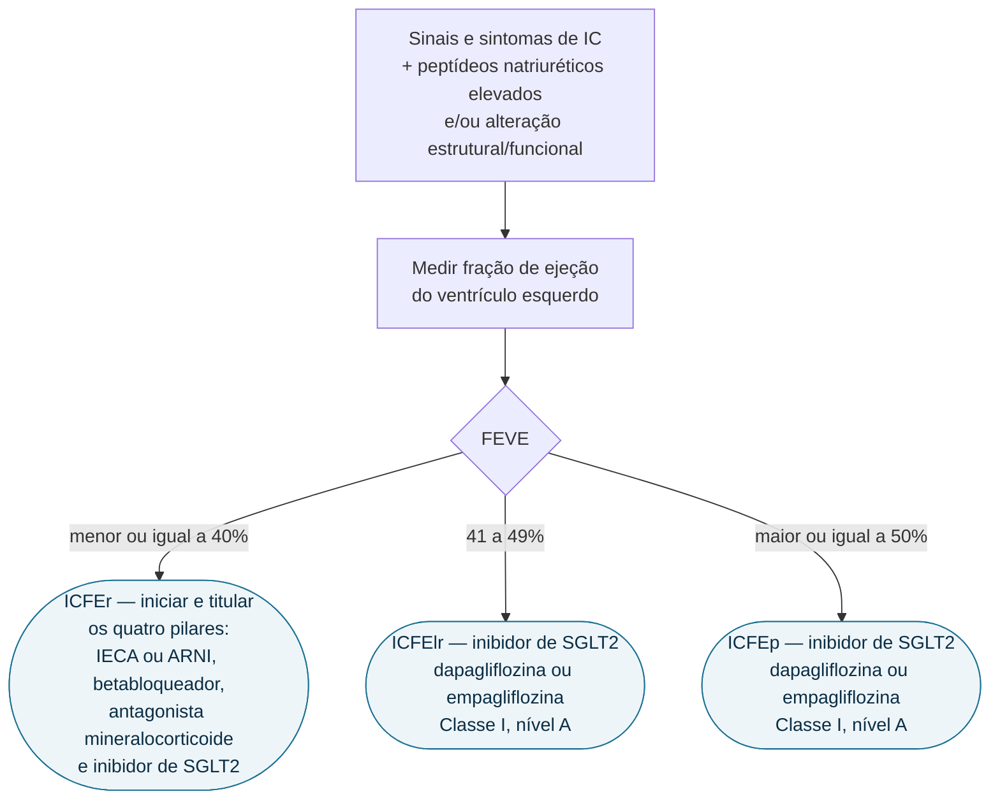

# Fluxograma: Insuficiência Cardíaca crônica — conduta por fração de ejeção

A fração de ejeção continua sendo o eixo que organiza o tratamento da IC crônica,
mas a atualização de 2023 reduziu a distância entre os fenótipos: o inibidor de
SGLT2 passou a ser recomendação **Classe I, nível de evidência A** também na IC
com fração de ejeção levemente reduzida e na preservada — faixas que, na diretriz
de 2021, não tinham nenhuma recomendação de iSGLT2 porque ainda não havia ensaio
conduzido nesses grupos.

## Árvore de decisão

Qualquer que seja a faixa de fração de ejeção, o tratamento das comorbidades e
da congestão e a reavaliação periódica são parte do manejo — não são um ramo
alternativo do algoritmo, e por isso não aparecem como folha da árvore.

## Os quatro pilares na ICFEr

A terapia de base da IC com fração de ejeção reduzida combina quatro classes,
usadas em conjunto e não em sequência escalonada:

- **inibição do sistema renina-angiotensina** — IECA ou, na forma de inibição da
  neprilisina associada ao bloqueio do receptor de angiotensina, sacubitril/valsartana
- **betabloqueador**
- **antagonista do receptor mineralocorticoide**
- **inibidor de SGLT2**

## O que mudou em 2023

| Faixa de FEVE | Diretriz 2021 | Atualização 2023 |
|---|---|---|
| ICFElr (41–49%) | sem recomendação de iSGLT2 | iSGLT2 Classe I, nível A |
| ICFEp (≥ 50%) | sem recomendação de iSGLT2 | iSGLT2 Classe I, nível A |

A mudança apoia-se nos ensaios EMPEROR-Preserved (empagliflozina) e DELIVER
(dapagliflozina), que forneceram a evidência ausente em 2021. O desfecho alvo da
recomendação é a redução de hospitalização por IC ou morte cardiovascular.

## Diagnóstico da ICFEp

O diagnóstico exige sinais e sintomas de IC acompanhados de evidência de
alteração estrutural e/ou funcional cardíaca e/ou peptídeos natriuréticos
elevados, com FEVE ≥ 50%. Não há teste isolado que confirme: **quanto maior o
número de alterações presentes, maior a probabilidade de ICFEp**.
