# Fluxograma: Hipercalemia Induzida pelo Bloqueio do SRAA na ICFEr — Ajustar Dose, Quelante de Potássio ou Suspender

Dois dos quatro pilares da ICFEr — IECA/BRA/ARNI e antagonista mineralocorticoide — elevam o potássio sérico, e a hipercalemia é o motivo mais frequente pelo qual essas classes acabam em dose subótima ou suspensas na prática, mesmo tendo benefício de mortalidade comprovado. O DIAMOND (patiromer) e o REALIZE-K (ciclossilicato de zircônio sódico) testaram se um quelante de potássio permite manter essas doses em vez de reduzi-las ou suspendê-las, e os dois documentos desta pasta já registram os resultados de cada ensaio isoladamente. Faltava a árvore de decisão que organiza os três caminhos possíveis diante de um potássio elevado: ajustar dose, iniciar quelante, ou suspender — este documento cobre esse recorte.

**Fora do escopo desta árvore**: emergência hipercalêmica aguda (alteração eletrocardiográfica, potássio muito elevado com risco de vida imediato), que exige estabilização de terapia intensiva e não foi objeto do DIAMOND nem do REALIZE-K.

## Árvore de decisão

```mermaid
flowchart TD
  A["ICFEr em uso de IECA/BRA/ARNI associado a antagonista mineralocorticoide, com potássio sérico elevado no seguimento ambulatorial (fora de emergência hipercalêmica aguda)"]
  D1{"Hipercalemia relacionada ao bloqueio do SRAA confirmada? Critério do DIAMOND: potássio maior que 5,0 mmol/L em duas dosagens, OU histórico de redução/suspensão do bloqueio do SRAA por hipercalemia nos últimos 12 meses"}
  C1(["Manter IECA/BRA/ARNI e antagonista mineralocorticoide nas doses atuais<br/>Monitorizar potássio sérico e função renal periodicamente, sem intervenção adicional"])
  B1["Verificar se as doses já estão no alvo testado nos ensaios: antagonista mineralocorticoide 50 mg/dia; IECA/BRA/ARNI em pelo menos 50% da dose recomendada"]
  D2{"Paciente já está em uso de quelante de potássio (patiromer ou ciclossilicato de zircônio sódico)?"}
  B2["Iniciar quelante de potássio (patiromer ou ciclossilicato de zircônio sódico), mantendo o bloqueio do SRAA e o antagonista mineralocorticoide na dose já tolerada, em vez de reduzir ou suspender de imediato — racional testado no DIAMOND e no REALIZE-K"]
  D3{"Quelante já em uso está na dose máxima da bula (patiromer até 3 envelopes de 8,4 g/dia) e a hipercalemia é recorrente mesmo assim?"}
  C3(["Otimizar a dose do quelante de potássio até o máximo preconizado em bula<br/>Manter bloqueio do SRAA e antagonista mineralocorticoide nas doses atuais<br/>Reavaliar potássio sérico em 1 a 2 semanas"])
  C4(["Reduzir a dose do antagonista mineralocorticoide como primeira medida, mantendo IECA/BRA/ARNI quando possível; se hipercalemia grave ou refratária, suspender temporariamente o agente com maior contribuição para o potássio<br/>Ajuste de dose do bloqueio do SRAA é decisão do médico assistente — no DIAMOND essa conduta pós-randomização foi explicitamente deixada a critério do investigador, sem algoritmo numérico único publicado<br/>Reavaliar potássio sérico em 1 a 2 semanas após qualquer ajuste"])
  D4{"Potássio normalizou (normocalemia 3,5-5,0 mEq/L, definição do REALIZE-K) na reavaliação após 2 a 4 semanas de quelante?"}
  C2(["Manter o quelante de potássio associado ao antagonista mineralocorticoide<br/>Titular IECA/BRA/ARNI e antagonista mineralocorticoide até a dose-alvo conforme tolerância<br/>Reavaliar potássio sérico periodicamente, de mensal a trimestral"])
  D5{"Quelante já está na dose máxima da bula e a hipercalemia persiste mesmo assim?"}
  C5(["Aumentar a dose do quelante de potássio até o máximo preconizado em bula<br/>Manter bloqueio do SRAA e antagonista mineralocorticoide nas doses já toleradas<br/>Reavaliar potássio sérico em 1 a 2 semanas"])
  C6(["Reduzir a dose do antagonista mineralocorticoide como primeira medida, mantendo IECA/BRA/ARNI quando possível; se hipercalemia grave ou refratária, suspender temporariamente o agente com maior contribuição para o potássio<br/>Ajuste de dose do bloqueio do SRAA é decisão do médico assistente — no DIAMOND essa conduta pós-randomização foi explicitamente deixada a critério do investigador, sem algoritmo numérico único publicado<br/>Reavaliar potássio sérico em 1 a 2 semanas após qualquer ajuste"])
  A --> D1
  D1 -->|"Não preenche o critério: potássio menor ou igual a 5,0 mmol/L nas duas dosagens e sem histórico recente"| C1
  D1 -->|"Preenche o critério de hipercalemia relacionada ao SRAA"| B1
  B1 --> D2
  D2 -->|"Ainda não está em uso de quelante"| B2
  D2 -->|"Já está em uso de quelante de potássio"| D3
  D3 -->|"Ainda há margem para aumentar a dose do quelante"| C3
  D3 -->|"Quelante em dose máxima e hipercalemia recorrente confirmada"| C4
  B2 --> D4
  D4 -->|"Sim, normocalemia atingida"| C2
  D4 -->|"Não, hipercalemia persiste apesar do quelante recém-iniciado"| D5
  D5 -->|"Ainda há margem para aumentar a dose do quelante"| C5
  D5 -->|"Quelante em dose máxima e hipercalemia persistente confirmada"| C6
  classDef conduta fill:#eef6ef,stroke:#2f7a4f,color:#12301f;
  class C1,C2,C3,C4,C5,C6 conduta;
```

## O que a árvore não mostra

**Não existe, nas duas fontes revisadas, um corte numérico único para decidir entre reduzir a dose do antagonista mineralocorticoide e suspender temporariamente o agente com maior contribuição para o potássio.** O texto integral do DIAMOND registra que, após a randomização, os agentes e as doses do bloqueio do SRAA foram mantidos ou ajustados a critério do investigador ao longo do ensaio — não há algoritmo publicado que amarre um valor específico de potássio a essa decisão. Os nós C4 e C6 refletem essa discricionariedade em vez de inventar um limiar.

**A emergência hipercalêmica aguda não está nesta árvore.** Alteração eletrocardiográfica ou potássio muito elevado com risco de vida imediato exigem estabilização de terapia intensiva (gluconato de cálcio, insulina/glicose, medidas de eliminação), que é protocolo distinto e não foi objeto do DIAMOND nem do REALIZE-K.

**O critério de hipercalemia relacionada ao SRAA usado em D1 é o de elegibilidade do DIAMOND**, não uma definição universal de hipercalemia — outras diretrizes podem usar cortes diferentes. Ele foi escolhido por ser o único critério numérico verificado em texto integral entre as fontes deste recorte.

**Diferença de desenho entre os dois ensaios**: o DIAMOND testou o quelante junto do bloqueio do SRAA como um todo (IECA/BRA/ARNI e antagonista mineralocorticoide), com potássio já elevado ou histórico de hipercalemia; o REALIZE-K testou o quelante especificamente durante a titulação da espironolactona. A árvore trata os dois cenários de forma unificada (hipercalemia relacionada ao SRAA, já instalada ou surgindo durante titulação), porque a conduta prática — manter o quelante e titular, em vez de reduzir — é a mesma nos dois ensaios. Ver `hipercalemia-como-barreira-ao-bloqueio-do-sraa-o-ensaio-diamond-com-patiromer.md` e `realize-k-quelante-de-potassio-sodio-zirconio-ciclosilicato-na-otimizacao-da-espironolactona.md`, nesta mesma pasta, para os números completos de cada ensaio, incluindo o sinal de segurança do REALIZE-K (mais eventos de piora da IC no braço com o quelante, achado exploratório e não reproduzido no DIAMOND).

**Manejo da hipotensão concomitante não é o objeto deste fluxograma** — ver `fluxograma-hipotensao-sintomatica-titulacao-ieca-arni-icfer.md`, nesta mesma pasta.
