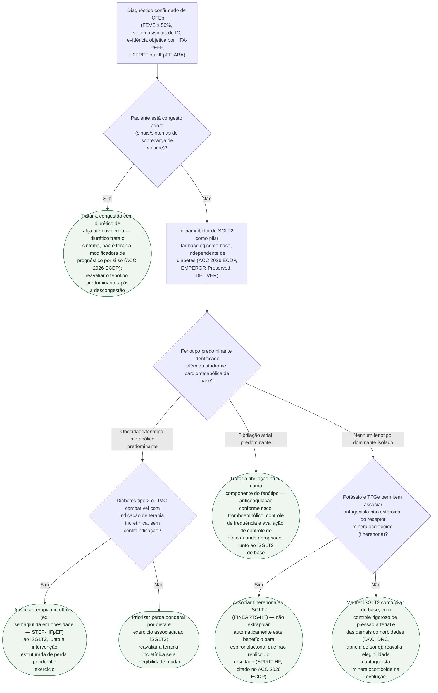

# Fluxograma: Manejo Fenótipo-dirigido da ICFEp (ACC 2026 Expert Consensus Decision Pathway)

O ACC 2026 abandona formalmente a visão da ICFEp como "FEVE normal +
diurético" e organiza o tratamento em torno do fenótipo dominante — obesidade,
fibrilação atrial, ou nenhum fenótipo isolado além da síndrome cardiometabólica
de base. O inibidor de SGLT2 é pilar farmacológico para **todos**,
independente de diabetes; o que muda por fenótipo é o que se soma a ele.

## Árvore de decisão

## O que a árvore não mostra

**O algoritmo diagnóstico completo (HFA-PEFF, H2FPEF, HFpEF-ABA)** — a
probabilidade pré-teste, os domínios ecocardiográficos e o teste funcional para
casos indeterminados — não é repetido aqui; a árvore assume diagnóstico já
confirmado. Ver `hfa-peff-algoritmo-diagnostico-para-icfep-esc-2019.md`.

**Fenótipos concomitantes** (ex. obesidade **e** fibrilação atrial no mesmo
paciente) não são resolvidos por um único ramo — a árvore trata cada fenótipo
isoladamente; na prática, condutas de mais de um ramo costumam ser combinadas,
sempre com o iSGLT2 de base comum aos dois.

**ARNI e BRA na ICFEp** são posicionados pelo próprio ACC 2026 ECDP como
terapia individualizada, dependente de pressão arterial, função renal,
potássio e congestão — não como terapia universal com benefício homogêneo, e
por isso não aparecem como ramo próprio desta árvore, que segue a hierarquia
de prioridade explícita do consenso (iSGLT2 primeiro, depois fenótipo).

**Investigação de imitadores cardíacos e não cardíacos de ICFEp** (amiloidose
cardíaca, doença pericárdica, obesidade sem ICFEp verdadeira) é etapa
diagnóstica prévia a esta árvore, não coberta aqui — ver o documento de
diferenciação de amiloidose nesta pasta quando a suspeita existir.