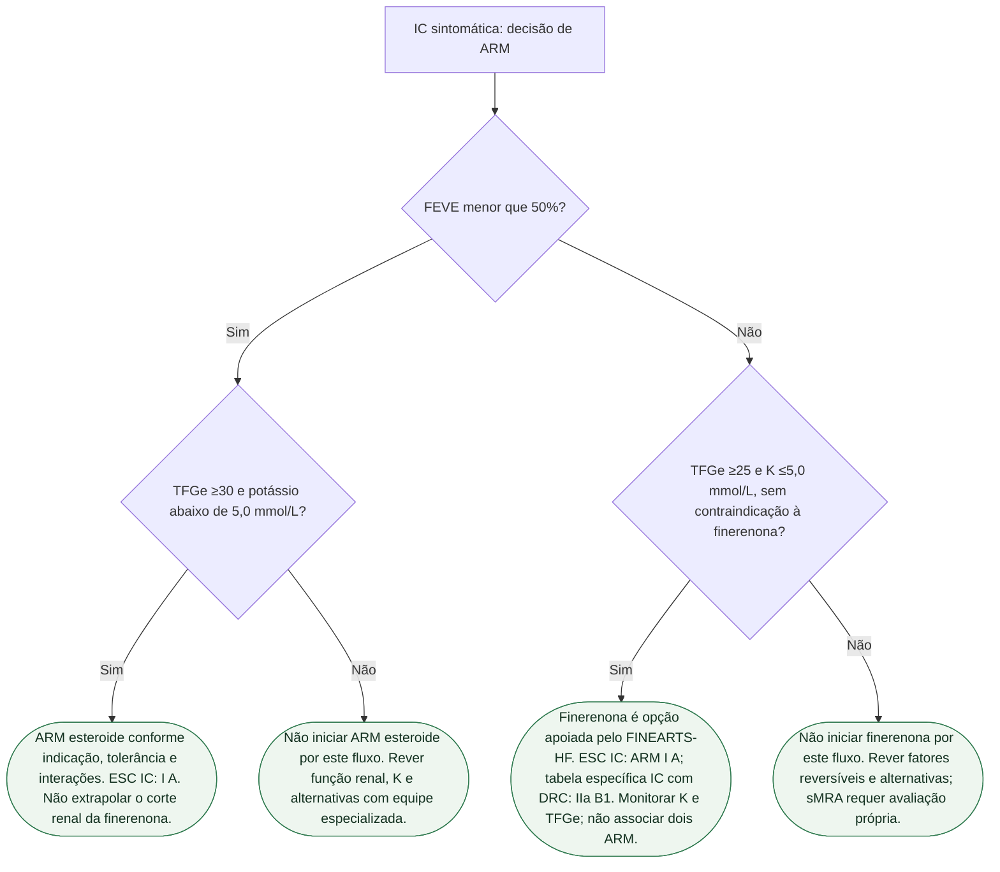

# Fluxograma: ARM independente da FEVE — ESC 2026

Pergunta desta árvore: **neste paciente com IC sintomática, a ESC 2026 autoriza ARM independente da FEVE — e o FINEARTS-HF informa a finerenona na ICFEP?** Folhas verdes são condutas. Não inventa classe para espironolactona isolada na ICFEP. Não promete redução de morte cardiovascular com 8,1% versus 8,7%. Não funde o composto renal do FIDELIO-DKD com os eventos de IC.

A ESC 2026 de IC (Køber, PMID 42661420) recomenda ARM na IC sintomática **independente da FEVE**, **Classe I A**: **sMRA na ICFER** e **sMRA/nsMRA na ICFEP**. Finerenona é o nsMRA **nomeado** para ICFEP. Fenótipos da mesma diretriz: ICFER se FEVE **<50%**; ICFEP se FEVE **≥50%**. O FINEARTS-HF entrou com FEVE **≥40%** — o recorte do ensaio e o fenótipo da diretriz não são idênticos.

## Árvore de decisão

## Limites da escolha
O RR 0,84 é do conjunto FINEARTS-HF com FEVE ≥40%; não é estimativa exclusiva de nenhum subgrupo da árvore. A ausência de redução significativa da morte CV isolada deve permanecer explícita.

O ramo de FEVE <50% usa a nomenclatura ESC 2026. O FINEARTS-HF também incluiu FEVE 40–49%, mas não demonstra intercambialidade entre finerenona, espironolactona e eplerenona. Diabetes com DRC pode constituir outra indicação de finerenona, com regime único e segurança individualizada.

## Números que cabem nas folhas

- FINEARTS-HF (PMID 39225278): n=3.003 versus 2.998; mediana 32 meses; eventos totais 1.083 em 624/3.003 versus 1.283 em 719/2.998; RR 0,84 (0,74–0,95); P=0,007. Piora de IC 842 versus 1.024; RR 0,82 (0,71–0,94); P=0,006. Morte CV 8,1% versus 8,7%; HR 0,93 (0,78–1,11), não significativa. K >6,0: 3,0% versus 1,4%. 
- ESC 2026 IC (PMID 42661420): ARM I A independente da FEVE; sMRA na ICFER; sMRA/nsMRA na ICFEP; finerenona nomeada na ICFEP.
- ESC 2026 CVD-CKD (PMID 42661426): finerenona I A em DRC + DM2 com TFGe ≥25 e RAC ≥3 mg/mmol (≥30 mg/g).

## Dose e segurança
No FINEARTS-HF e na bula FDA de IC com FEVE ≥40%: TFGe inicial ≥60 mL/min/1,73 m² corresponde a início de 20 mg/dia e alvo de 40 mg/dia; TFGe de 25 a <60, início de 10 mg/dia e alvo de 20 mg/dia. Reavaliar K e TFGe em quatro semanas após início ou ajuste, com monitoramento adicional conforme risco. Não iniciar se K >5,0 mmol/L ou TFGe <25; verificar interações, especialmente inibidores fortes de CYP3A4. Essa é a referência do estudo/bula norte-americana, sem afirmar aprovação local de todas as doses ou indicações.

A recomendação geral de IC (I A) e a tabela específica de IC com DRC não são idênticas: nesta última, ARM esteroide na ICFEr com TFGe ≥30 é I A; ARM na IC com FEVE ≥40% e DRC com TFGe ≥25 é IIa B1. Não transferir o limite renal da finerenona para espironolactona ou eplerenona, nem associar dois ARM.

## Tudo com Tudo

Insuficiência cardíaca · Cardiorrenal · Farmacologia · Diabetes e cardiologia · Comunicação clínica.
