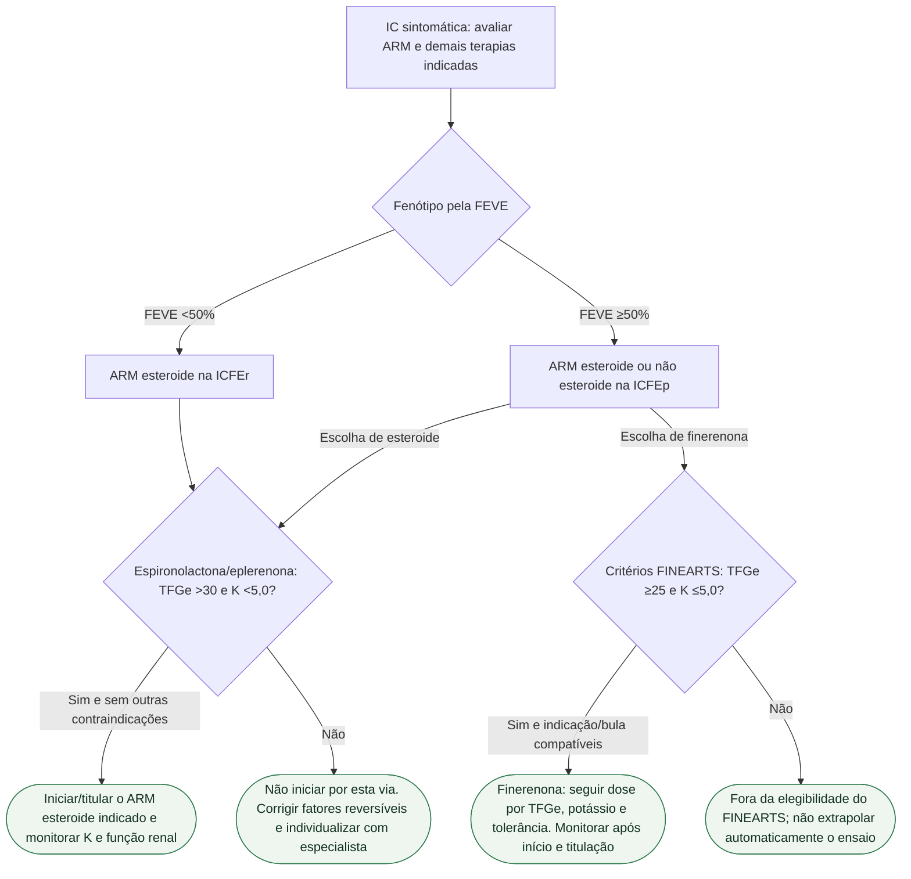

# Fluxograma: ARM independente da FEVE — ESC 2026

A ESC 2026 recomenda antagonista do receptor mineralocorticoide (ARM) na **IC sintomática independentemente da FEVE, Classe I A**: ARM esteroide na ICFEr e esteroide ou não esteroide na ICFEp. Na nomenclatura da diretriz, ICFEr corresponde a FEVE <50% e ICFEp a FEVE ≥50%. A escolha da molécula exige verificar sua evidência, indicação e segurança próprias.

## Árvore de decisão

Os critérios de início de espironolactona/eplerenona acima são os de segurança da diretriz AHA/ACC/HFSA: **TFGe >30 mL/min/1,73 m² e K <5,0 mmol/L**. O corte renal ≥25 do FINEARTS **não deve ser aplicado a todo ARM**. Rever interações, suplementação de potássio, hipovolemia e função renal; não associar dois ARM. A monitorização acompanha o início e cada ajuste.

## O que FINEARTS-HF demonstrou

O ensaio incluiu **FEVE ≥40%**, portanto atravessa os dois fenótipos da nomenclatura ESC 2026. Seus números representam a população total, e não um subgrupo exclusivo de FEVE ≥50%: 6.001 participantes, seguimento mediano de 32 meses; 1.083 eventos primários em 624/3.003 com finerenona versus 1.283 em 719/2.998 com placebo. Razão de taxas **0,84 (IC95% 0,74–0,95), P=0,007**, para eventos totais de piora de IC ou morte cardiovascular. Morte CV isolada **8,1% vs 8,7%; HR 0,93 (0,78–1,11)**, sem redução estatisticamente demonstrada.

**Dose no protocolo:** TFGe ≤60: 10 mg/dia inicialmente e máximo 20 mg/dia; TFGe >60: 20 mg/dia inicialmente e máximo 40 mg/dia, condicionados a potássio e tolerância. O regime da indicação de DRC diabética é diferente; não transferir automaticamente a dose de 40 mg. Hipercalemia >6,0 mmol/L ocorreu em 3,0% vs 1,4%; hospitalização por hipercalemia em 0,5% vs 0,2%.

## Quando também existe DRC diabética

A ESC 2026 CVD-CKD recomenda finerenona em DM2 com DRC, TFGe ≥25 e RAC ≥30 mg/g (I A), respeitando potássio, bloqueio do SRAA indicado e segurança. Esta é a evidência cardiorrenal do FIDELIO/FIGARO, com critérios e doses próprios; não se funde seu composto renal com os eventos do FINEARTS. Finerenona não substitui iSGLT2.

## Tudo com Tudo

- [FINEARTS-HF: finerenona na IC com FEVE ≥40%](/biblioteca/finearts-hf-finerenona-ic-feve-maior-igual-40)
- [DAPA-HF não é DELIVER: FEVE reduzida não é preservada](/biblioteca/dapa-hf-nao-e-deliver-feve-reduzida-nao-e-preservada)
- [PARAGON-HF não é PARADIGM e não é PARADISE-MI](/biblioteca/paragon-hf-nao-e-paradigm-nem-e-paradise)
