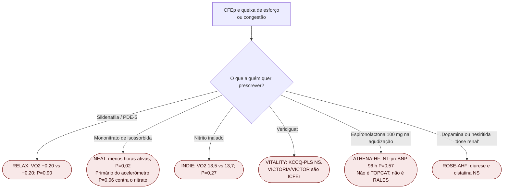

# Fluxograma: ICFEp — o que o esforço **não** pede

## Mensagem prática

**A via NO/cGMP na ICFEp de esforço acumulou negativos (RELAX, NEAT, INDIE, VITALITY).** Não improvisar vasodilatador, nitrato ou MRA de 100 mg na agudização com esses papers na gaveta.
