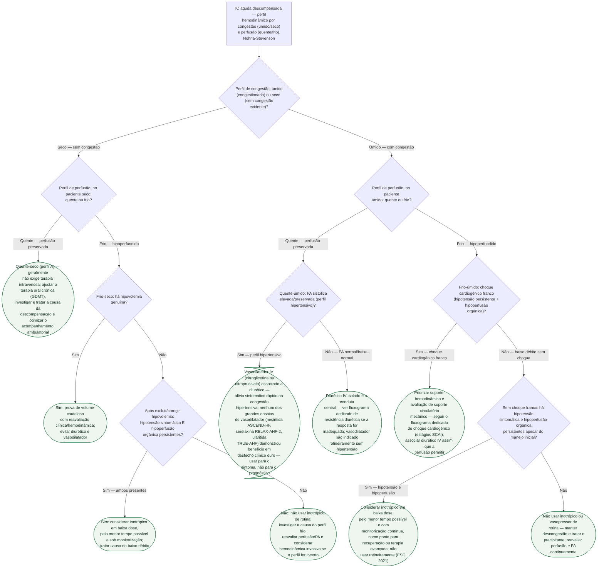

# Fluxograma: Perfis Hemodinâmicos na IC Aguda e Escolha entre Vasodilatador e Inotrópico

O fluxograma geral de IC aguda descompensada, já publicado nesta pasta,
detalha a escalada diurética no eixo quente-frio associado à congestão
("úmido"). Este documento faz o zoom que faltava: os **quatro perfis
completos** de Nohria-Stevenson — cruzando congestão (úmido/seco) com
perfusão (quente/frio) — e a escolha entre **vasodilatador** e **inotrópico**
dentro de cada um. O ponto mais importante para não repetir aqui é o que os
três grandes ensaios de vasodilatador (nesiritida, serelaxina, ularitida)
ensinaram: nenhum demonstrou benefício em desfecho clínico duro — o
vasodilatador tem lugar para **alívio sintomático em congestão hipertensiva**,
não como terapia que muda prognóstico.

## Árvore de decisão

## O que a árvore não mostra

**Dose e titulação de cada vasoativo** — não são objeto deste fluxograma. Ver
`content/Farmacologia/choque-cardiogenico-vasoativos-acc-2025-arvore-de-dose.md`
para dose de vasopressor/inotrópico no choque.

**Estágios SCAI do choque cardiogênico**, incluindo o resultado negativo do
ECLS-SHOCK para ECMO venoarterial precoce de rotina, não são repetidos aqui —
ver `content/Terapia_intensiva/fluxograma-choque-cardiogenico-estagios-scai.md`.

**Escalada da estratégia diurética quando a resposta é inadequada** também não
é repetida — ver `fluxograma-resistencia-diuretica-e-congestao-refrataria-na-ic-aguda.md`,
nesta mesma pasta.

**Não há corte numérico validado** de PA sistólica que defina "perfil
hipertensivo" em D4 — a distinção é clínica, apoiada em tendência e sintoma,
não em um limiar único fixado pelas fontes revisadas.

**Perfil frio-seco não é sinônimo de indicação de inotrópico.** Depois de
excluir hipovolemia, a ESC 2021 restringe essa opção à combinação de hipotensão
sintomática com hipoperfusão orgânica persistente; disfunção sistólica grave ou
baixo débito presumido, isoladamente, não bastam.

**A subanálise isquêmica do OPTIME-CHF não seleciona quem deve receber
inotrópico.** O ensaio avaliou milrinona de rotina em pacientes nos quais o
inotrópico não era considerado obrigatório; o sinal desfavorável na etiologia
isquêmica é alerta de segurança, não justificativa para antecipar vasopressor
ou suporte mecânico fora de choque.

**Monitorização hemodinâmica invasiva (cateter de artéria pulmonar)** para
confirmar o perfil quando o exame clínico é ambíguo não é discutida aqui — ver
`cateter-de-arteria-pulmonar-no-choque-cardiogenico-escape-e-o-limite-do-dado-observacional.md`
em Terapia Intensiva.
