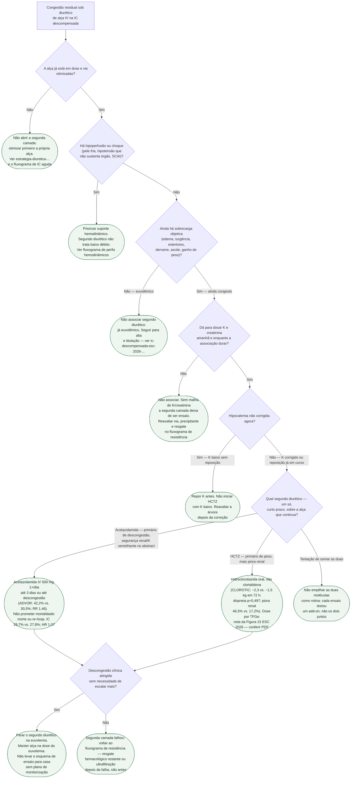

# Fluxograma: próxima camada diurética após o diurético de alça

Aplica-se ao adulto internado por IC descompensada (vocabulário ESC 2026) **já em diurético de alça IV**, com congestão que não cedeu. Não começa na admissão. Não escolhe bolus versus infusão. Não mede o sódio urinário — se o serviço usa esse gatilho, o protocolo é `natriurese-guiada-por-sodio-urinario-na-descongestao-da-ic-aguda-push-ahf-e-enact-hf.md`. A prosa desta decisão está em `acetazolamida-e-tiazidico-na-resistencia-diuretica-advor-e-clorotic.md`. Se a segunda camada falhar, o resgate (incluindo ultrafiltração) volta para `fluxograma-resistencia-diuretica-e-congestao-refrataria-na-ic-aguda.md`.

A ESC 2026 (Recommendation Table 9, extraída da página oficial): acetazolamida IV **ou** hidroclorotiazida oral de **curto prazo** **devem ser consideradas** na sobrecarga previamente tratada com alça, para reduzir congestão — **IIa B1**. Não é Classe I. Não é redução de morte.

Não há corte numérico validado, nestes dois ensaios, de débito urinário ou de quilos para declarar “resposta inadequada à alça”. Os nós abaixo são qualitativos de propósito. Não inventar um gatilho que o abstract não traz.

## Árvore de decisão

## Como ler as duas folhas de escolha

**Acetazolamida (ADVOR, PMID 36027559).** N=519 randomizados. Primário: ausência de sinais de sobrecarga em 3 dias sem escalonar. 108/256 (42,2%) vs. 79/259 (30,5%); RR 1,46 (IC95% 1,17–1,82; p<0,001). Morte ou re-hospitalização por IC em 3 meses: 29,7% vs. 27,8%; HR 1,07 (IC95% 0,78–1,48) — **não** usar descongestão como mortalidade. Abstract: piora renal, hipocalemia, hipotensão e eventos **semelhantes** (sem porcentagem). Dose no abstract: **500 mg IV 1×/dia** sobre alça equivalente ao dobro da manutenção oral. FEVE ≤40% ou >40% — o ensaio não é só ICFEr.

**Hidroclorotiazida (CLOROTIC, PMID 36423214).** N=230. Coprimários em 72 h: peso venceu (2,3 vs. 1,5 kg; diferença ajustada 1,14 kg; p=0,002); dispneia **não** (AUC 960 vs. 720; p=0,497). Diurese 24 h: 1775 vs. 1400 mL (p=0,05). Piora renal (↑ creatinina 26,5 µmol/L ou ↓ eGFR 50%): **46,5% vs. 17,2%** (p=0,001). Mortalidade/reinternação: sem diferença. O XML MEDLINE corrompe a frase de hipocalemia; a ESC 2026 descreve mais hipocalemia com HCTZ e pede cautela. **Não** substituir HCTZ por clortalidona nesta folha.

**Classe da diretriz.** IIa B1 para **reduzir congestão**, curto prazo, depois de alça. A folha C6/C7 é “considerar”, não “obrigatório em todo congesto”.

## O que esta árvore recusa fazer

- Inventar um número de diurese ou de sódio urinário como porta de entrada — o corte de 70 mmol/L pertence ao PUSH-AHF, outro documento.
- Tratar clortalidona, metolazona ou clorotiazida IV como o braço do CLOROTIC.
- Empilhar acetazolamida + HCTZ porque “os dois ensaios foram positivos”.
- Levar o segundo diurético para o domicílio no esquema do ensaio sem malha de K e creatinina.
- Pular para ultrafiltração **antes** de tentar a camada farmacológica — isso é o CARRESS-HF no fluxograma de resistência, não nesta árvore.

## Relação com o acervo

- Prosa desta decisão: `acetazolamida-e-tiazidico-na-resistencia-diuretica-advor-e-clorotic.md`
- Mecanismos e texto integral do CLOROTIC já revisado: `resistencia-diuretica-na-insuficiencia-cardiaca-aguda-mecanismos-e-bloqueio-sequencial-do-nefron.md`
- Resistência completa, incluindo ultrafiltração: `fluxograma-resistencia-diuretica-e-congestao-refrataria-na-ic-aguda.md`
- Sódio urinário: `natriurese-guiada-por-sodio-urinario-na-descongestao-da-ic-aguda-push-ahf-e-enact-hf.md`
- Depois da euvolemia: `ic-descompensada-esc-2026-e-titulacao-pos-alta.md`
