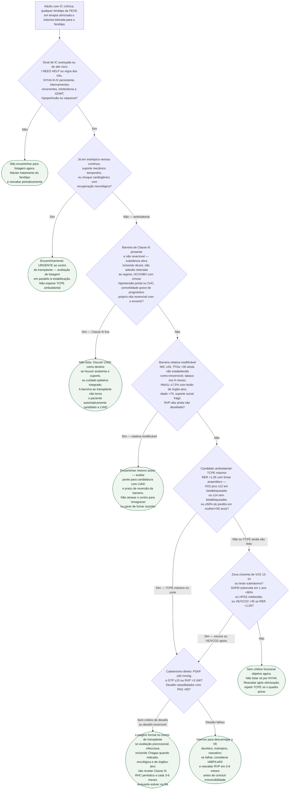

# Fluxograma: Quando Encaminhar para Listagem de Transplante Cardíaco no Adulto

O fluxograma já publicado nesta pasta (`fluxograma-encaminhamento-ic-avancada-lvad-transplante.md`) responde **quando mandar o paciente a um centro de IC avançada**. Este responde a pergunta seguinte: **quando esse adulto deve ser formalmente avaliado para entrar na fila de transplante**. Encaminhar abre a porta; listar ocupa um órgão. Os dois atos não coincidem no tempo nem nos critérios.

A árvore começa no paciente com IC crônica em tratamento otimizado para o fenótipo e pergunta se há sinal de IC avançada. Não exige FEVE reduzida. Não espera o teste cardiopulmonar no paciente já em inotrópico ou em suporte mecânico temporário. Não transforma VO₂, SHFM ou RVP em único número decisivo — a ISHLT 2016 dedica duas recomendações de Classe III exatamente a listar só com VO₂ ou só com escore.

## Árvore de decisão

## Como ler os nós, na ordem em que o erro costuma acontecer

**O nó D1 não é listagem.** É o mesmo sinal de estágio D que a ESC 2026 pede para consultar o centro cedo (Classe I, A): I NEED HELP, regra dos três, internamentos recorrentes, intolerância à terapia, hipoperfusão, caquexia. Mulher e minoria sociocultural tendem a ser encaminhadas mais tarde — o nó não deve ser aplicado com barra mais alta nesses grupos.

**O nó D2 existe para não transformar o TCPE em pedágio.** Paciente em inotrópico contínuo, em ECMO ou Impella, ou em choque com recuperação neurológica, vai ao centro agora. A ISHLT 2016 construiu os cortes de VO₂ para o **ambulatorial**. Esperar um teste máximo num paciente que não consegue andar até o corredor é o atraso clássico.

**O nó D3 é o “não listar” verdadeiro**, não a relativa que o plantonista chama de absoluta. Abuso ativo de substância inclusive álcool, não adesão reiterada, hepatopatia crônica viral **com** cirrose/hipertensão portal/CHC, e comorbidade grave cujo prognóstico o enxerto não reverte são Classe III da ISHLT 2016 ou absolutos da Tabela 17 da ESC 2026. Demência com incapacidade permanente de cooperar entra aqui. HIV selecionado **não** entra: CD4 >200, RNA indetectável, cART estável >3 meses e sem oportunista específica podem ser considerados (Classe IIa, C).

**O nó D4 é o mais mal usado na prática.** IMC ≥35, TFGe <30 ainda não crônica irreversível, cigarro nos últimos 6 meses, HbA1c ≥7,5% com lesão de órgão-alvo, idade >70 selecionada, suporte social frágil e RVP alta ainda não desafiada são relativas. A conduta é encaminhar e discutir **ponte para candidatura**, não mandar o paciente “resolver em casa” e voltar daqui a um ano. A ISHLT 2016 dá Classe IIb, C exatamente para LVAD nesse papel.

**Os nós D5 e D6 separam corte de TCPE de zona cinzenta.** Corte de listagem no teste máximo: ≤12 mL/kg/min com betabloqueador, ≤14 sem betabloqueador; em mulher ou <50 anos, ≤50% do predito entra como IIa. Zona cinzenta: SHFM com sobrevida em 1 ano <80% (mortalidade estimada >20%) ou HFSS médio/alto, ou VE/VCO₂ >35 se o teste foi submáximo. Listar só com VO₂ ou só com escore é Classe III.

**O nó D7 é hemodinâmica pulmonar, não um número mágico de RVP.** Desafio vasodilatador quando PSAP ≥50 mmHg e (GTP ≥15 ou RVP >3 UW), com PAS >85 mmHg. Irreversibilidade só depois de falha da terapia médica **e** de não conseguir descarregar o VE com IABP/LVAD, com reavaliação 3 a 6 meses após LVAD. A árvore **não** aplica o corte brasileiro de RVP >5 da SBC 2018 como nó — esse número é do documento nacional, não da ISHLT 2016, e a decisão fina é do centro.

## O que a árvore não mostra

**Status de fila do sistema nacional de transplantes** (urgência, prioridade, critérios de alocação) não é ISHLT e não cabe neste fluxograma.

**Escolha entre LVAD de ponte e LVAD de destino**, e entre modelos de dispositivo, não é ramo desta árvore — ver o fluxograma de encaminhamento a IC avançada e o documento do MOMENTUM 3.

**INTERMACS** não lista. Não aparece como nó de propósito: não é critério de listagem na ISHLT 2016 nem na 2024.

**Criança e adolescente** têm documento próprio. Não usar estes cortes de VO₂, idade 70 ou IMC 35 na pediatria.

**Critérios completos de infecção, neoplasia e psicossocial** (Chagas, TB latente, HIV selecionado, tempo de remissão oncológica sem quarentena arbitrária, avaliação de suporte) estão no documento-irmão `indicacoes-de-transplante-cardiaco-adulto-ishlt-2016.md`. A árvore só pergunta se a barreira é Classe III fixa ou relativa modificável.

**Sobrevida do enxerto** depois de transplantado também não está aqui — calibra a conversa com a família, não o nó de listar.
